# 🧠 Frontend Interview Visual Handbook
### For Engineers with 3–5 Years Experience

> **Philosophy:** Systems understood visually are systems understood deeply.

---

## 📋 Table of Contents

1. [Frontend System Design](#1-frontend-system-design)
2. [React Rendering Mechanism](#2-react-rendering-mechanism)
3. [Browser & Code Execution](#3-browser--code-execution)
4. [Babel, ES Modules & Compilation](#4-babel-es-modules--compilation)
5. [Webpack vs Vite](#5-webpack-vs-vite)
6. [Web Performance & Web Vitals](#6-web-performance--web-vitals)
7. [DOM & Rendering Performance](#7-dom--rendering-performance)

---

# 1. Frontend System Design

## 1.1 — Data Flow in a Large Frontend App

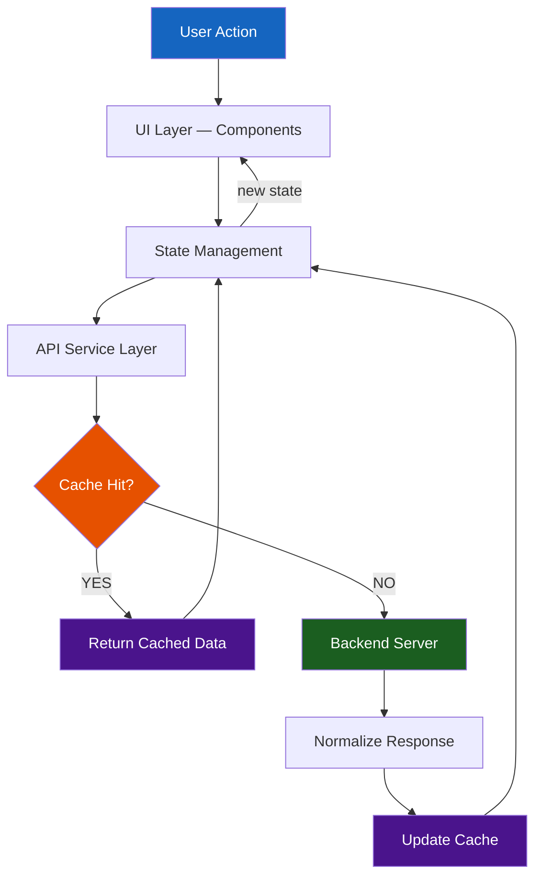
```mermaid
flowchart TD
    A["User Action"]
    B["UI Layer — Components"]
    C["State Management"]
    D["API Service Layer"]
    E{"Cache Hit?"}
    F["Return Cached Data"]
    G["Backend Server"]
    H["Normalize Response"]
    I["Update Cache"]

    A --> B --> C --> D --> E
    E -->|YES| F --> C
    E -->|NO| G --> H --> I --> C
    C -->|new state| B

    style A fill:#1565c0,color:#ffffff
    style E fill:#e65100,color:#ffffff
    style G fill:#1b5e20,color:#ffffff
    style F fill:#4a148c,color:#ffffff
    style I fill:#4a148c,color:#ffffff
```

**Short explanation:** Every user interaction flows down through state → API → cache → back to UI. The cache layer is the performance gatekeeper.

**Real-world example:** In a dashboard app, clicking "Refresh" triggers an action → checks React Query cache → if stale, fetches from API → normalizes response → updates Redux store → React re-renders affected components.

> 💡 **Interview Insight:** Interviewers want to see that you understand *separation of concerns* — UI never talks to APIs directly. Always route through state management and a dedicated service/API layer.

---

## 1.2 — Component Hierarchy

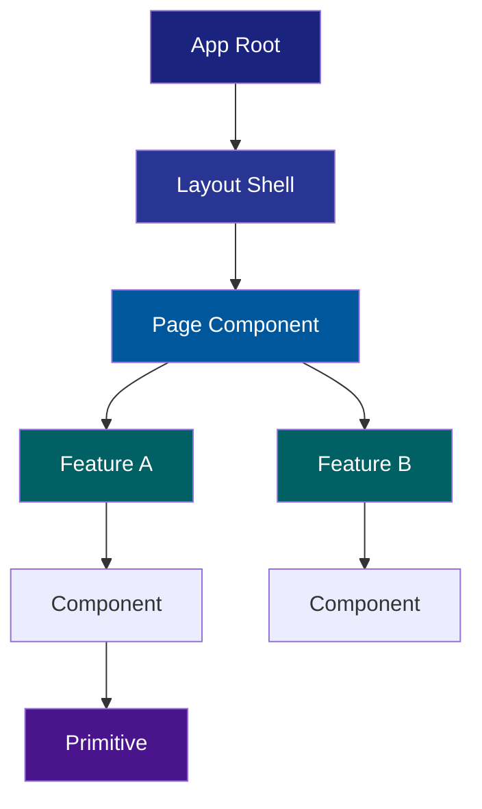
```mermaid
flowchart TD
    A["App Root"]
    B["Layout Shell"]
    C["Page Component"]
    D1["Feature A"]
    D2["Feature B"]
    E1["Component"]
    E2["Component"]
    F["Primitive"]

    A --> B --> C
    C --> D1
    C --> D2
    D1 --> E1
    D2 --> E2
    E1 --> F

    style A fill:#1a237e,color:#ffffff
    style B fill:#283593,color:#ffffff
    style C fill:#01579b,color:#ffffff
    style D1 fill:#006064,color:#ffffff
    style D2 fill:#006064,color:#ffffff
    style F fill:#4a148c,color:#ffffff
```

**Layer responsibilities:**

| Layer | Role | Example |
|---|---|---|
| **App Root** | Providers: theme, auth, store | `<App />` |
| **Layout Shell** | Structural slots: nav, sidebar, content | `<DashboardLayout />` |
| **Page** | Route-level, connects to state | `<DashboardPage />` |
| **Feature** | Domain-specific, owns business logic | `<AnalyticsWidget />` |
| **Component** | Reusable, takes props | `<DataTable />` |
| **Primitive** | Pure, dumb, fully reusable | `<Button />` |

> 💡 **Interview Insight:** Know the Atomic Design principle — atoms → molecules → organisms → templates → pages. Know *why* you separate them: testability, reusability, and predictable data flow.

---

## 1.3 — State Management: When to Use What

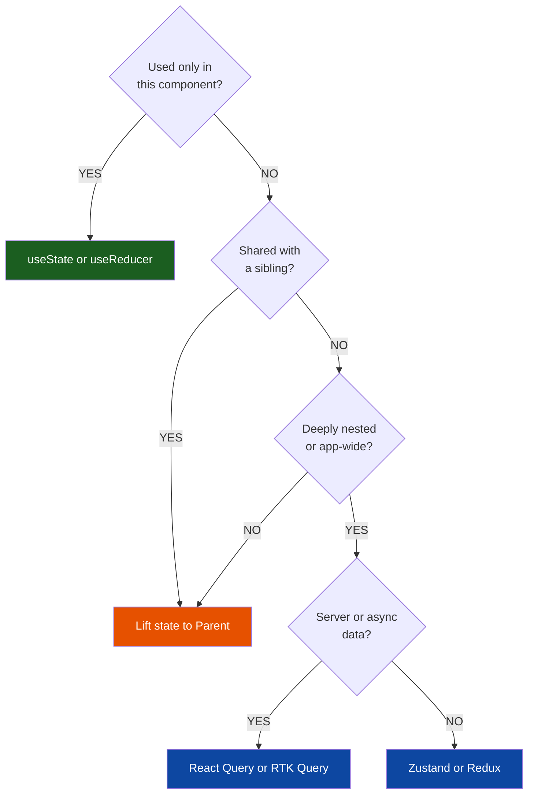
```mermaid
flowchart TD
    A{"Used only in\nthis component?"}
    B["useState or useReducer"]
    C{"Shared with\na sibling?"}
    D["Lift state to Parent"]
    E{"Deeply nested\nor app-wide?"}
    F{"Server or async\ndata?"}
    G["React Query or RTK Query"]
    H["Zustand or Redux"]

    A -->|YES| B
    A -->|NO| C
    C -->|YES| D
    C -->|NO| E
    E -->|NO| D
    E -->|YES| F
    F -->|YES| G
    F -->|NO| H

    style B fill:#1b5e20,color:#ffffff
    style D fill:#e65100,color:#ffffff
    style G fill:#0d47a1,color:#ffffff
    style H fill:#0d47a1,color:#ffffff
```

**State tool reference:**

| Type | Tool | When to use |
|---|---|---|
| Local UI state | `useState` | Toggle, form input, modal open |
| Complex local state | `useReducer` | Multi-step forms, undo/redo |
| Lifted state | Parent + props | Sibling communication |
| Server state | React Query | Fetched data, caching, sync |
| Client global state | Zustand or Redux | Auth user, cart, theme |
| Cross-tree UI | Context API | Theme, locale — low-frequency updates only |

> 💡 **Interview Insight:** The golden rule — *state should live as close to where it is needed as possible*. Know how to mitigate re-render cost with `useMemo`, `useCallback`, and selectors.

---

## 1.4 — API Data Flow: Request → Cache → UI

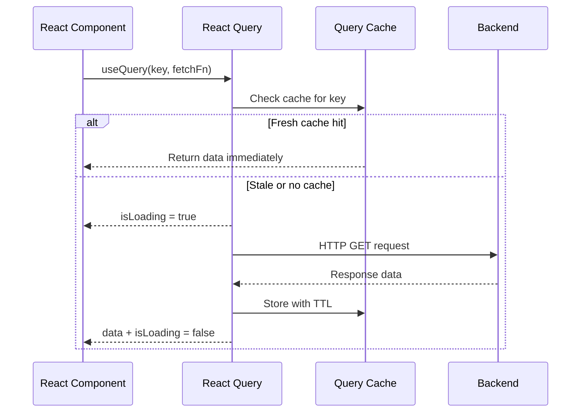
```mermaid
sequenceDiagram
    participant UI as React Component
    participant RQ as React Query
    participant Cache as Query Cache
    participant API as Backend

    UI->>RQ: useQuery(key, fetchFn)
    RQ->>Cache: Check cache for key

    alt Fresh cache hit
        Cache-->>UI: Return data immediately
    else Stale or no cache
        RQ-->>UI: isLoading = true
        RQ->>API: HTTP GET request
        API-->>RQ: Response data
        RQ->>Cache: Store with TTL
        RQ-->>UI: data + isLoading = false
    end
```

**Query state reference:**

| State | Meaning | UI pattern |
|---|---|---|
| `isLoading` | First fetch, no cache exists | Full skeleton screen |
| `isFetching` | Background refetch of stale data | Subtle spinner in corner |
| `isStale` | Data exists but needs refresh | Show stale data + refetch |
| `isError` | Fetch failed | Error boundary or retry button |

> 💡 **Interview Insight:** Explain cache invalidation strategies: `staleTime`, `cacheTime`, `invalidateQueries`. Mention optimistic updates for perceived performance.

---

## 1.5 — Large Data Handling: Virtualization

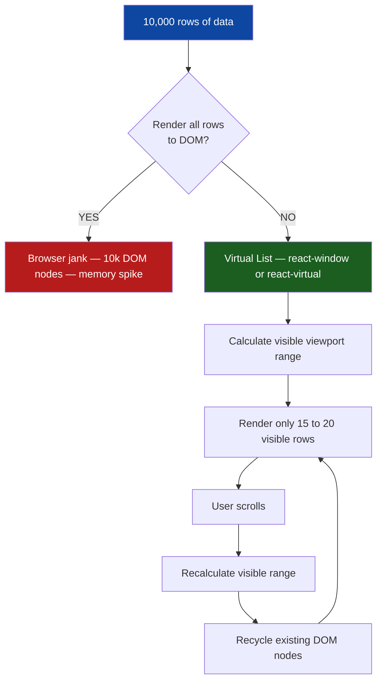
```mermaid
flowchart TD
    A["10,000 rows of data"]
    B{"Render all rows\nto DOM?"}
    C["Browser jank — 10k DOM nodes — memory spike"]
    D["Virtual List — react-window or react-virtual"]
    E["Calculate visible viewport range"]
    F["Render only 15 to 20 visible rows"]
    G["User scrolls"]
    H["Recalculate visible range"]
    I["Recycle existing DOM nodes"]

    A --> B
    B -->|YES| C
    B -->|NO| D --> E --> F --> G --> H --> I --> F

    style C fill:#b71c1c,color:#ffffff
    style D fill:#1b5e20,color:#ffffff
    style A fill:#0d47a1,color:#ffffff
```

**Real-world example:** A trading dashboard with 50,000 transactions uses `react-window`'s `FixedSizeList`. Only 20 rows render at any time, keeping scroll performance at 60fps.

> 💡 **Interview Insight:** Windowing (only render visible) vs pagination (only load chunks). Windowing is better UX for infinite scroll. Mention row height calculation challenges for dynamic content.

---

# 2. React Rendering Mechanism

## 2.1 — Virtual DOM Diffing

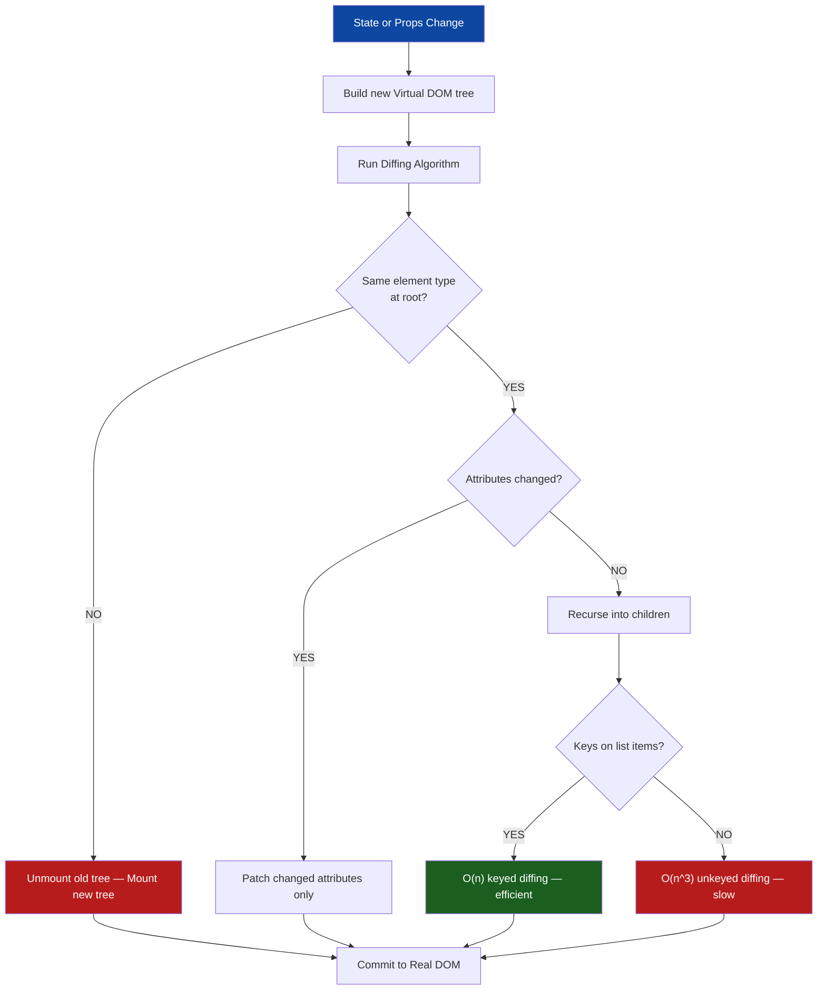
```mermaid
flowchart TD
    A["State or Props Change"]
    B["Build new Virtual DOM tree"]
    C["Run Diffing Algorithm"]
    D{"Same element type\nat root?"}
    E["Unmount old tree — Mount new tree"]
    F{"Attributes changed?"}
    G["Patch changed attributes only"]
    H["Recurse into children"]
    I{"Keys on list items?"}
    J["O(n) keyed diffing — efficient"]
    K["O(n^3) unkeyed diffing — slow"]
    L["Commit to Real DOM"]

    A --> B --> C --> D
    D -->|NO| E --> L
    D -->|YES| F
    F -->|YES| G --> L
    F -->|NO| H --> I
    I -->|YES| J --> L
    I -->|NO| K --> L

    style E fill:#b71c1c,color:#ffffff
    style K fill:#b71c1c,color:#ffffff
    style J fill:#1b5e20,color:#ffffff
    style A fill:#0d47a1,color:#ffffff
```

> ⚠️ **Common Mistake:** Using array index as `key` in lists that reorder. Keys must be stable, unique, and predictable.

---

## 2.2 — Render Phase vs Commit Phase

| Aspect | Render Phase | Commit Phase |
|---|---|---|
| **What happens** | Component functions run, fiber tree builds, diff runs | React applies changes to the real DOM |
| **Interruptible?** | Yes — React 18 can pause and resume | No — always runs to completion |
| **Side effects allowed?** | No — must be pure | Yes — DOM mutations, effects fire here |
| **Hooks that run** | — | `useLayoutEffect` (sync), `useEffect` (async) |
| **Mental model** | "What should the UI look like?" | "Make it happen" |


```mermaid
flowchart LR
    A["Component renders"]
    B["Fiber tree builds"]
    C["Diffing runs"]
    D["Before Mutation"]
    E["DOM Mutation"]
    F["useLayoutEffect fires"]
    G["useEffect fires"]

    A --> B --> C --> D --> E --> F --> G

    style A fill:#283593,color:#ffffff
    style B fill:#283593,color:#ffffff
    style C fill:#283593,color:#ffffff
    style D fill:#880e4f,color:#ffffff
    style E fill:#880e4f,color:#ffffff
    style F fill:#880e4f,color:#ffffff
    style G fill:#880e4f,color:#ffffff
```

> 💡 **Interview Insight:** With React 18 Concurrent Mode, the render phase can be interrupted and restarted. This is why render functions must be pure. `useLayoutEffect` runs synchronously after DOM mutation — use it only for DOM measurements.

---

## 2.3 — Re-render Trigger Flow

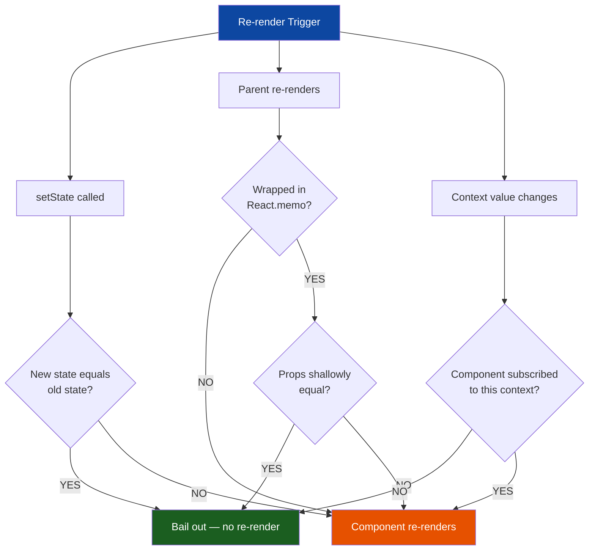
```mermaid
flowchart TD
    A["Re-render Trigger"]
    B["setState called"]
    C["Parent re-renders"]
    D["Context value changes"]
    E{"New state equals\nold state?"}
    F["Bail out — no re-render"]
    G["Component re-renders"]
    H{"Wrapped in\nReact.memo?"}
    I{"Props shallowly\nequal?"}
    J{"Component subscribed\nto this context?"}

    A --> B & C & D
    B --> E
    E -->|YES| F
    E -->|NO| G
    C --> H
    H -->|NO| G
    H -->|YES| I
    I -->|YES| F
    I -->|NO| G
    D --> J
    J -->|NO| F
    J -->|YES| G

    style F fill:#1b5e20,color:#ffffff
    style G fill:#e65100,color:#ffffff
    style A fill:#0d47a1,color:#ffffff
```

> 💡 **Interview Insight:** Know all 4 triggers cold. Pivot to prevention: `React.memo`, `useMemo`, `useCallback`, and splitting context into separate providers.

---

## 2.4 — useEffect Lifecycle

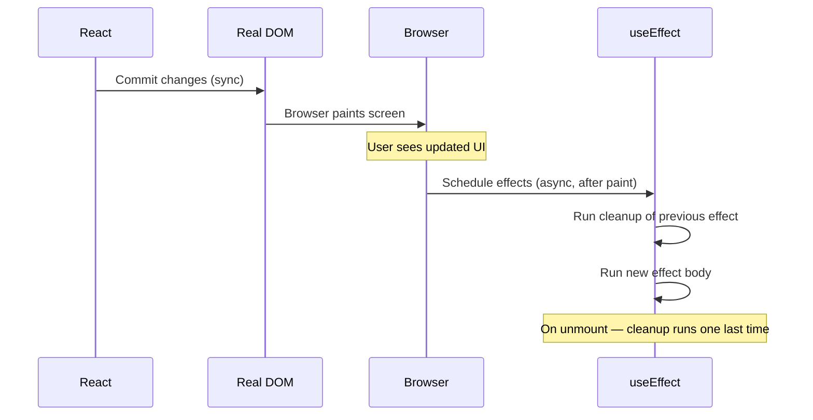
```mermaid
sequenceDiagram
    participant React
    participant DOM as Real DOM
    participant Browser
    participant Effect as useEffect

    React->>DOM: Commit changes (sync)
    DOM->>Browser: Browser paints screen
    Note over Browser: User sees updated UI
    Browser->>Effect: Schedule effects (async, after paint)
    Effect->>Effect: Run cleanup of previous effect
    Effect->>Effect: Run new effect body
    Note over Effect: On unmount — cleanup runs one last time
```

**Dependency array behaviour:**

| Syntax | When it runs |
|---|---|
| `useEffect(fn)` | After **every** render — almost always wrong |
| `useEffect(fn, [])` | Once on **mount** only |
| `useEffect(fn, [a, b])` | Whenever `a` or `b` changes |
| Return `() => cleanup` | On unmount or before next effect run |

> ⚠️ **Common Mistake:** Forgetting to return a cleanup function for subscriptions, timers, or event listeners — causes memory leaks.

---

## 2.5 — Memoization Decision Flow

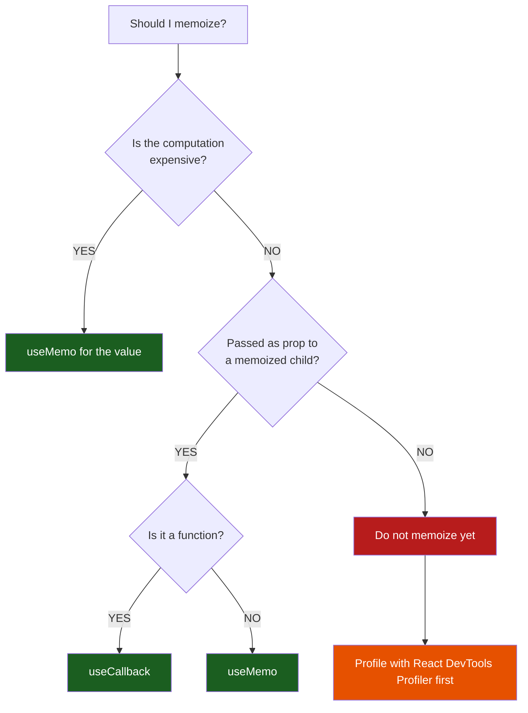
```mermaid
flowchart TD
    A["Should I memoize?"]
    B{"Is the computation\nexpensive?"}
    C["useMemo for the value"]
    D{"Passed as prop to\na memoized child?"}
    E{"Is it a function?"}
    F["useCallback"]
    G["useMemo"]
    H["Do not memoize yet"]
    I["Profile with React DevTools Profiler first"]

    A --> B
    B -->|YES| C
    B -->|NO| D
    D -->|YES| E
    D -->|NO| H --> I
    E -->|YES| F
    E -->|NO| G

    style C fill:#1b5e20,color:#ffffff
    style F fill:#1b5e20,color:#ffffff
    style G fill:#1b5e20,color:#ffffff
    style H fill:#b71c1c,color:#ffffff
    style I fill:#e65100,color:#ffffff
```

**Memoization cost vs benefit:**

| Hook | Saves | Costs | Use when |
|---|---|---|---|
| `useMemo` | Re-running expensive function | Memory + dep comparison each render | Heavy computation confirmed by profiler |
| `useCallback` | New function reference each render | Memory + dep comparison each render | Prop passed to `React.memo` child |
| `React.memo` | Re-render of child component | Shallow prop comparison | Pure presentational components |

> 💡 **Interview Insight:** Over-memoizing is the number one mistake. `useMemo` still runs every render to compare deps — the saved computation must exceed that overhead. Profile first, optimize second.

---

# 3. Browser & Code Execution

## 3.1 — JavaScript Execution: Event Loop

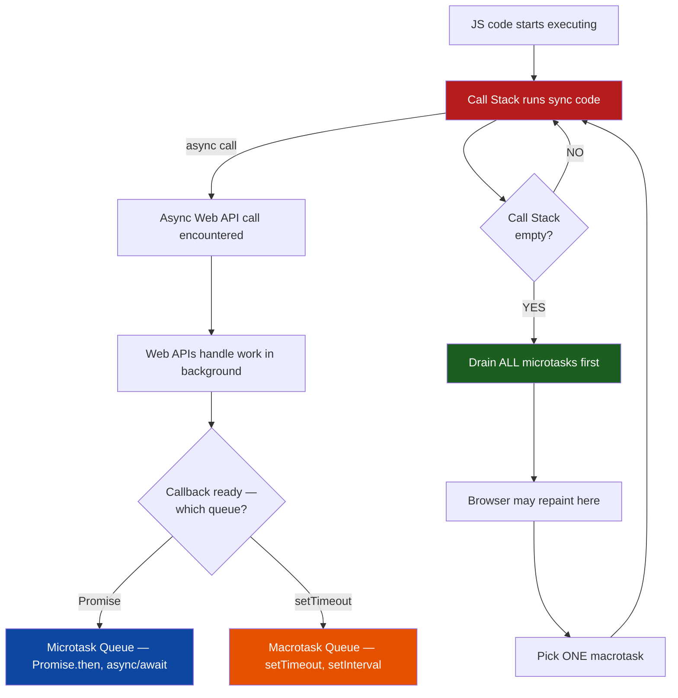
```mermaid
flowchart TD
    A["JS code starts executing"]
    B["Call Stack runs sync code"]
    C["Async Web API call encountered"]
    D["Web APIs handle work in background"]
    E{"Callback ready —\nwhich queue?"}
    F["Microtask Queue — Promise.then, async/await"]
    G["Macrotask Queue — setTimeout, setInterval"]
    H{"Call Stack\nempty?"}
    I["Drain ALL microtasks first"]
    J["Browser may repaint here"]
    K["Pick ONE macrotask"]

    A --> B
    B -->|async call| C --> D --> E
    E -->|Promise| F
    E -->|setTimeout| G
    B --> H
    H -->|YES| I --> J --> K --> B
    H -->|NO| B

    style F fill:#0d47a1,color:#ffffff
    style G fill:#e65100,color:#ffffff
    style B fill:#b71c1c,color:#ffffff
    style I fill:#1b5e20,color:#ffffff
```

**Code trace example:**
```javascript
console.log('1');                               // Call Stack — sync
setTimeout(() => console.log('2'), 0);          // Macrotask Queue
Promise.resolve().then(() => console.log('3')); // Microtask Queue
console.log('4');                               // Call Stack — sync

// Output order: 1 → 4 → 3 → 2
```

> 💡 **Interview Insight:** All microtasks drain completely before the next macrotask runs. This is why `Promise.then` always resolves before `setTimeout(fn, 0)`.

---

## 3.2 — Microtask vs Macrotask Reference

| | Microtasks | Macrotasks |
|---|---|---|
| **Priority** | Higher — drains completely before any macrotask | Lower — one task per event loop tick |
| **Examples** | `Promise.then`, `Promise.catch`, `async/await`, `queueMicrotask`, `MutationObserver` | `setTimeout`, `setInterval`, `setImmediate`, I/O callbacks, UI events |
| **Blocks render?** | Yes — browser will not paint until queue is empty | No — render can happen between tasks |
| **Risk** | Infinite microtask loop starves the page | Long macrotask freezes UI for that duration |


```mermaid
flowchart LR
    A["Call Stack empties"]
    B["Drain ALL microtasks"]
    C["Browser may repaint"]
    D["Run ONE macrotask"]

    A --> B --> C --> D --> A

    style B fill:#0d47a1,color:#ffffff
    style D fill:#e65100,color:#ffffff
    style C fill:#1b5e20,color:#ffffff
```

> ⚠️ **Common Mistake:** Recursive `Promise.resolve().then()` chains flood the microtask queue and block all rendering indefinitely.

---

## 3.3 — Critical Rendering Path

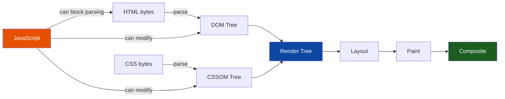
```mermaid
flowchart LR
    A["HTML bytes"]
    B["DOM Tree"]
    C["CSS bytes"]
    D["CSSOM Tree"]
    E["Render Tree"]
    F["Layout"]
    G["Paint"]
    H["Composite"]
    J["JavaScript"]

    A -->|parse| B
    C -->|parse| D
    B --> E
    D --> E
    E --> F --> G --> H
    J -->|can block parsing| A
    J -->|can modify| B
    J -->|can modify| D

    style J fill:#e65100,color:#ffffff
    style H fill:#1b5e20,color:#ffffff
    style E fill:#0d47a1,color:#ffffff
```

**What blocks what:**

| Resource | Blocks HTML parsing? | Blocks rendering? | Fix |
|---|---|---|---|
| CSS in `<head>` | No | Yes — CSSOM must complete | Inline critical CSS |
| `<script>` without attributes | Yes | Yes | Use `defer` or `async` |
| `<script defer>` | No | No | Runs after DOM ready |
| `<script async>` | No (during download) | Briefly (during execute) | Use for independent scripts |
| Web font | No | Partial — causes FOUT | `font-display: swap` + preload |

> 💡 **Interview Insight:** The goal is to reach First Contentful Paint as fast as possible by eliminating anything that blocks parsing or rendering.

---

## 3.4 — Script Loading: async vs defer

| Mode | HTML Parsing | Download | Executes | Order Guaranteed? |
|---|---|---|---|---|
| `<script>` (normal) | Paused | Inline — blocks | Immediately | Yes |
| `<script async>` | Continues during download | Parallel | As soon as downloaded | No |
| `<script defer>` | Continues | Parallel | After HTML fully parsed | Yes |
| `<script type="module">` | Continues | Parallel | After HTML parsed | Yes |

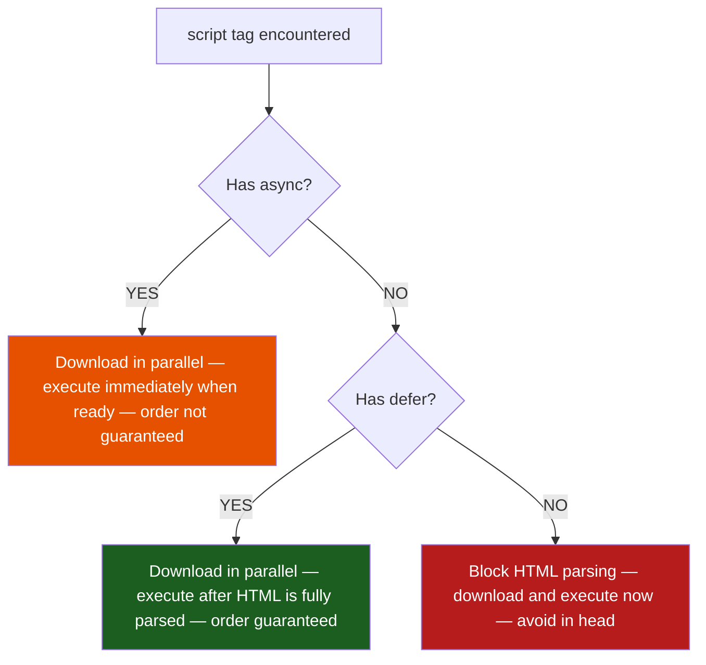
```mermaid
flowchart TD
    A["script tag encountered"]
    B{"Has async?"}
    C["Download in parallel — execute immediately when ready — order not guaranteed"]
    D{"Has defer?"}
    E["Download in parallel — execute after HTML is fully parsed — order guaranteed"]
    F["Block HTML parsing — download and execute now — avoid in head"]

    A --> B
    B -->|YES| C
    B -->|NO| D
    D -->|YES| E
    D -->|NO| F

    style F fill:#b71c1c,color:#ffffff
    style C fill:#e65100,color:#ffffff
    style E fill:#1b5e20,color:#ffffff
```

> 💡 **Interview Insight:** Use `defer` for scripts that need DOM. Use `async` for independent scripts like analytics. `type="module"` is deferred by default in all modern bundlers.

---

# 4. Babel, ES Modules & Compilation

## 4.1 — Code Transformation Pipeline


```mermaid
flowchart LR
    A["Source Code — ES2024 + JSX + TypeScript"]
    B["AST — Abstract Syntax Tree"]
    C["Babel Plugins and Presets"]
    D["Transformed AST"]
    E["ES5 Output — browser compatible"]

    A -->|parse| B -->|analyze| C -->|transform| D -->|generate| E

    style A fill:#0d47a1,color:#ffffff
    style B fill:#e65100,color:#ffffff
    style C fill:#4a148c,color:#ffffff
    style D fill:#e65100,color:#ffffff
    style E fill:#1b5e20,color:#ffffff
```

**What each Babel preset transforms:**

| Preset | Input | Output |
|---|---|---|
| `@babel/preset-env` | Arrow functions, `const/let`, optional chaining | ES5 equivalents |
| `@babel/preset-react` | `<Button onClick={fn} />` | `React.createElement(Button, { onClick: fn })` |
| `@babel/preset-typescript` | TypeScript types | Stripped — types removed, no type checking |

**Babel vs Polyfills:**

| | Babel | Polyfills (core-js) |
|---|---|---|
| **Handles** | Syntax transformation | Missing runtime APIs |
| **When it runs** | Build time | Runtime in browser |
| **Example** | `?.` → ternary chain | `Promise`, `Array.from`, `Map` |

> 💡 **Interview Insight:** Babel transpiles syntax but cannot polyfill. You need `core-js` + `regenerator-runtime` for missing APIs like `Promise` or `fetch`.

---

## 4.2 — ES Module Resolution Flow

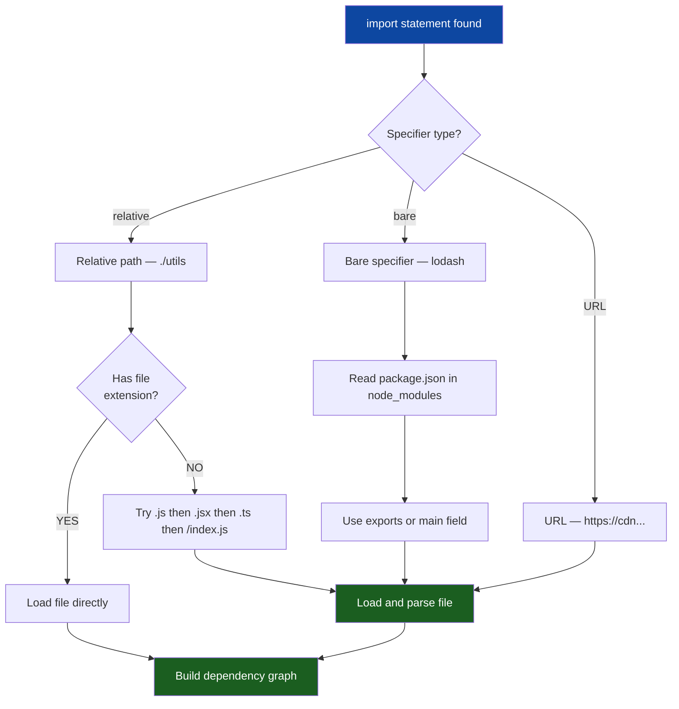
```mermaid
flowchart TD
    A["import statement found"]
    B{"Specifier type?"}
    C["Relative path — ./utils"]
    D["Bare specifier — lodash"]
    E["URL — https://cdn..."]
    F{"Has file\nextension?"}
    G["Load file directly"]
    H["Try .js then .jsx then .ts then /index.js"]
    I["Read package.json in node_modules"]
    J["Use exports or main field"]
    K["Load and parse file"]
    L["Build dependency graph"]

    A --> B
    B -->|relative| C --> F
    B -->|bare| D --> I --> J --> K
    B -->|URL| E --> K
    F -->|YES| G --> L
    F -->|NO| H --> K --> L

    style A fill:#0d47a1,color:#ffffff
    style K fill:#1b5e20,color:#ffffff
    style L fill:#1b5e20,color:#ffffff
```

---

## 4.3 — Tree Shaking

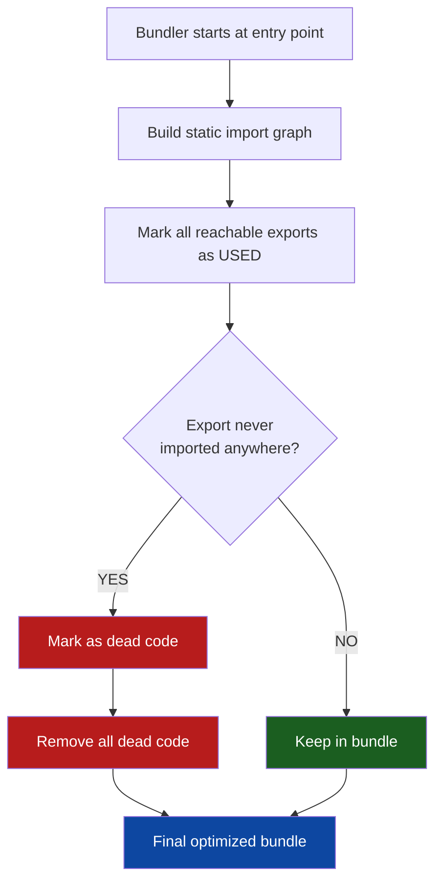
```mermaid
flowchart TD
    A["Bundler starts at entry point"]
    B["Build static import graph"]
    C["Mark all reachable exports as USED"]
    D{"Export never\nimported anywhere?"}
    E["Mark as dead code"]
    F["Keep in bundle"]
    G["Remove all dead code"]
    H["Final optimized bundle"]

    A --> B --> C --> D
    D -->|YES| E --> G --> H
    D -->|NO| F --> H

    style E fill:#b71c1c,color:#ffffff
    style G fill:#b71c1c,color:#ffffff
    style F fill:#1b5e20,color:#ffffff
    style H fill:#0d47a1,color:#ffffff
```

**Requirements for tree shaking to work:**

| Condition | Required? | Why |
|---|---|---|
| ES Module syntax (`import`/`export`) | Yes | Static analysis requires build-time knowledge of imports |
| CommonJS (`require`) | Breaks it | `require()` is dynamic — bundler cannot know what is used |
| `"sideEffects": false` in `package.json` | Strongly recommended | Tells bundler it is safe to drop unused modules |
| Webpack, Rollup, or Vite bundler | Yes | Must support dead code elimination |

> 💡 **Interview Insight:** `import { debounce } from 'lodash'` imports the whole library. `import debounce from 'lodash/debounce'` does not. Use `lodash-es` for a fully tree-shakeable version.

---

# 5. Webpack vs Vite

## 5.1 — Build Pipeline Comparison

**Webpack build pipeline:**


```mermaid
flowchart LR
    A["Entry point"]
    B["Resolve all imports and build module graph"]
    C["Apply Loaders — babel-loader, css-loader"]
    D["Apply Plugins — HTMLWebpackPlugin"]
    E["Chunk splitting — SplitChunksPlugin"]
    F["Output — main.js and vendor.js"]

    A --> B --> C --> D --> E --> F

    style A fill:#0d47a1,color:#ffffff
    style F fill:#1b5e20,color:#ffffff
```

**Vite build pipeline:**


```mermaid
flowchart LR
    A["Entry point"]
    B["Pre-bundle node_modules with esbuild — done once"]
    C["Rollup bundles app source code"]
    D["Vite plugins run — e.g. plugin-react"]
    E["Native ESM chunk output"]

    A --> B --> C --> D --> E

    style A fill:#f57f17,color:#ffffff
    style E fill:#1b5e20,color:#ffffff
```

---

## 5.2 — Dev Server Comparison

| Aspect | Webpack Dev Server | Vite Dev Server |
|---|---|---|
| **Startup strategy** | Bundle entire app first, then serve | Serve immediately, transform files on request |
| **Cold start time** | Slow — grows with app size | Fast — constant regardless of app size |
| **How modules are served** | From in-memory bundle | As native ES modules directly |
| **HMR mechanism** | Re-bundle affected module subgraph | Invalidate only the changed module |
| **HMR speed** | Slower on large apps | Near-instant due to ESM boundary isolation |
| **Production bundler** | Webpack | Rollup — smaller output, better tree-shaking |
| **Config complexity** | High — explicit loader and plugin config | Low — sensible defaults out of the box |

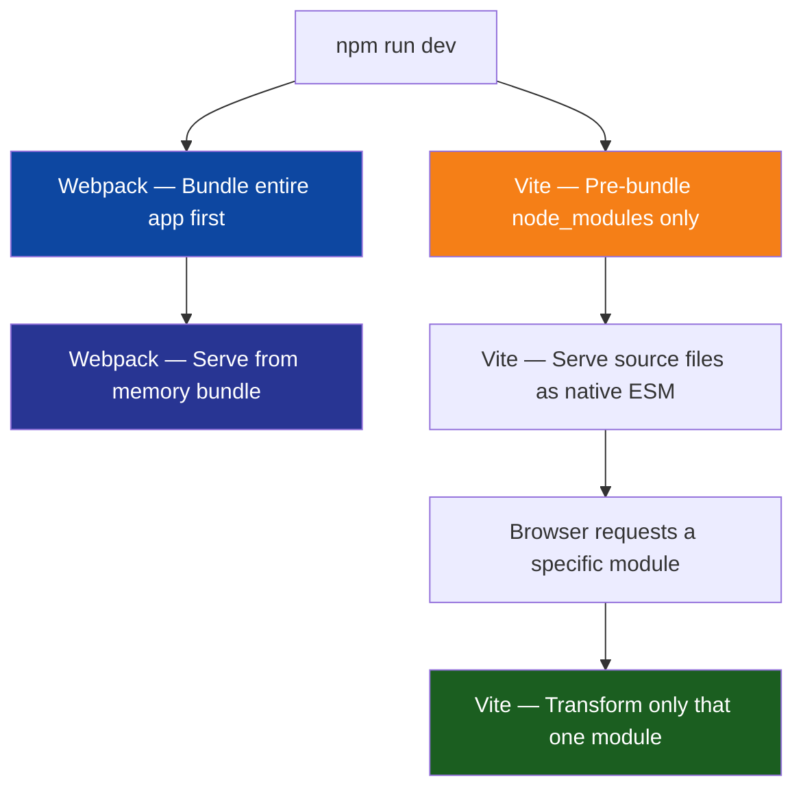
```mermaid
flowchart TD
    A["npm run dev"]
    B["Webpack — Bundle entire app first"]
    C["Vite — Pre-bundle node_modules only"]
    D["Webpack — Serve from memory bundle"]
    E["Vite — Serve source files as native ESM"]
    F["Browser requests a specific module"]
    G["Vite — Transform only that one module"]

    A --> B --> D
    A --> C --> E --> F --> G

    style B fill:#0d47a1,color:#ffffff
    style C fill:#f57f17,color:#ffffff
    style D fill:#283593,color:#ffffff
    style G fill:#1b5e20,color:#ffffff
```

---

## 5.3 — Code Splitting and Chunk Loading

```mermaid
flowchart TD
    A["main.js — entry point"]
    B["Initial Chunk — App shell and critical code"]
    C["Route Chunk — /dashboard — loads on navigation"]
    D["Route Chunk — /settings — loads on navigation"]
    E["Vendor Chunk — React and ReactDOM"]
    F["Async Chunk — Chart.js — loads on demand"]

    A --> B
    B -->|React.lazy| C
    B -->|React.lazy| D
    B -->|SplitChunksPlugin| E
    C -->|dynamic import| F

    style B fill:#0d47a1,color:#ffffff
    style E fill:#4a148c,color:#ffffff
    style C fill:#1b5e20,color:#ffffff
    style D fill:#1b5e20,color:#ffffff
    style F fill:#880e4f,color:#ffffff
```

**Splitting strategies:**

| Strategy | How | Benefit |
|---|---|---|
| Route-based | `React.lazy(() => import('./Page'))` | Smaller initial bundle |
| Vendor splitting | `SplitChunksPlugin` or Vite auto-splitting | Long-term cache for libraries |
| Component-based | `React.lazy` on heavy components | Defer non-critical UI |
| Prefetch | `<link rel="prefetch">` | Load future routes during browser idle time |

> 💡 **Interview Insight:** Code splitting is the single biggest lever for initial load time. Explain the tradeoff: smaller initial bundle vs. waterfall requests on navigation. Prefetching bridges this gap.

---

# 6. Web Performance & Web Vitals

## 6.1 — Core Web Vitals Reference

| Metric | Full Name | Target | Measures | Caused by |
|---|---|---|---|---|
| **LCP** | Largest Contentful Paint | ≤ 2.5s | Loading speed | Slow server, large images, render-blocking JS |
| **CLS** | Cumulative Layout Shift | ≤ 0.1 | Visual stability | Images without dimensions, late-injected content |
| **INP** | Interaction to Next Paint | ≤ 200ms | Responsiveness | Long JS tasks blocking the main thread |

```mermaid
flowchart LR
    A["LCP — How fast does the page load?"]
    B["CLS — Does layout jump around?"]
    C["INP — Does it respond to clicks fast?"]
    D["Google Page Experience Score"]

    A --> D
    B --> D
    C --> D

    style A fill:#1b5e20,color:#ffffff
    style B fill:#e65100,color:#ffffff
    style C fill:#0d47a1,color:#ffffff
    style D fill:#4a148c,color:#ffffff
```

---

## 6.2 — LCP: Largest Contentful Paint

```mermaid
sequenceDiagram
    participant User
    participant Browser
    participant Server
    participant Screen

    User->>Browser: Navigate to URL
    Browser->>Server: Request HTML
    Server-->>Browser: HTML response — TTFB measured here
    Note over Browser: Parse HTML, discover linked resources
    Browser->>Server: Request hero image
    Server-->>Browser: Image bytes received
    Note over Browser: Decode and layout image
    Browser->>Screen: First Contentful Paint
    Browser->>Screen: LCP element painted — LCP measured here
    User->>Browser: First click or tap — INP timer starts
```

**LCP optimization by root cause:**

| Root cause | Diagnosis | Fix |
|---|---|---|
| Slow TTFB | Server takes too long to respond | CDN, edge caching, optimize server query |
| Render-blocking resources | Resources delay HTML parsing | `defer` scripts, inline critical CSS |
| Slow image load | Hero image arrives late | `fetchpriority="high"`, WebP format, correct `width`/`height` |
| Client-side rendering | Page is blank until JS executes | SSR or SSG, streaming HTML |

---

## 6.3 — CLS: Cumulative Layout Shift

**What causes a layout shift:**

```mermaid
flowchart TD
    A["Page loads — text is visible"]
    B["Image loads — no width or height set"]
    C["Browser inserts image — layout shifts down"]
    D["User was mid-click on a button"]
    E["User clicks wrong element — CLS score increases"]

    A --> B --> C --> D --> E

    style E fill:#b71c1c,color:#ffffff
    style B fill:#e65100,color:#ffffff
```

**How to prevent layout shift:**

```mermaid
flowchart TD
    F["Page loads — placeholder reserves exact space"]
    G["Image loads — fills reserved space perfectly"]
    H["No layout shift — CLS score stays at zero"]

    F --> G --> H

    style H fill:#1b5e20,color:#ffffff
    style F fill:#0d47a1,color:#ffffff
```

**CLS causes and fixes:**

| Cause | Fix |
|---|---|
| Images without `width` and `height` | Always set explicit dimensions or `aspect-ratio` |
| Late-injected ads or banners | Reserve space with `min-height` container |
| Web font causing flash of unstyled text | `font-display: swap` + `<link rel="preload">` for font |
| Animations that change layout properties | Use `transform` not `top` or `left` |

> 💡 **Interview Insight:** CLS is a score, not a time. It is the sum of (impact_fraction × distance_fraction) for every unexpected shift. Even small shifts from ads can tank the score.

---

## 6.4 — INP: Interaction to Next Paint

```mermaid
sequenceDiagram
    participant User
    participant Browser
    participant JS as JavaScript
    participant Screen

    User->>Browser: Click or Key or Tap
    Note over Browser: INP timer starts
    Browser->>JS: Dispatch event handlers
    JS->>JS: Run handler logic
    Note over JS: Long task here equals bad INP
    JS->>Browser: State updates complete
    Browser->>Browser: Style recalculation
    Browser->>Browser: Layout calculation
    Browser->>Screen: Next paint committed — INP measured here
    Note over Screen: Target is under 200ms total
```

**INP optimization strategies:**

| Problem | Symptom | Fix |
|---|---|---|
| Long JS task in handler | Main thread blocked | Break up with `scheduler.yield()` |
| Forced layout in handler | Read then write DOM interleaved | Batch all reads first, then all writes |
| Too much work per interaction | Heavy computation in handler | Move to Web Worker |
| Synchronous blocking code | No time for browser to paint | Use `requestAnimationFrame` for visual updates |

---

## 6.5 — Performance Optimization Master Reference

**Always measure before optimizing:**

```mermaid
flowchart TD
    A["Performance issue reported"]
    B["Measure — Lighthouse, DevTools, WebPageTest"]
    C{"Which metric\nis failing?"}
    D["LCP — Loading"]
    E["CLS — Stability"]
    F["INP — Responsiveness"]
    G["Bundle size or TTI"]

    A --> B --> C
    C --> D
    C --> E
    C --> F
    C --> G

    style A fill:#b71c1c,color:#ffffff
    style B fill:#0d47a1,color:#ffffff
    style D fill:#1b5e20,color:#ffffff
    style E fill:#e65100,color:#ffffff
    style F fill:#0d47a1,color:#ffffff
    style G fill:#4a148c,color:#ffffff
```

**Fix lookup by metric:**

| Metric | Optimization | Impact |
|---|---|---|
| **LCP** | `fetchpriority="high"` on LCP image | High |
| **LCP** | Convert images to WebP or AVIF | Medium |
| **LCP** | Inline critical CSS, defer the rest | High |
| **LCP** | SSR or static site generation | High |
| **CLS** | Set `width` and `height` on all images | High |
| **CLS** | Reserve ad slot space with `min-height` | Medium |
| **CLS** | Preload fonts and use `font-display: swap` | Medium |
| **INP** | Break long tasks with `scheduler.yield` | High |
| **INP** | Move heavy computation to Web Worker | High |
| **Bundle** | Route-based code splitting with `React.lazy` | High |
| **Bundle** | Tree shake unused library imports | Medium |
| **Bundle** | Replace heavy libs — e.g. moment.js with date-fns | Medium |

> 💡 **Interview Insight:** Cite the **RAIL model**: Response (100ms), Animation (16ms per frame for 60fps), Idle (50ms max task chunks), Load (under 5s on 3G). This framework shows depth beyond just "use lazy loading."

---

# 7. DOM & Rendering Performance

## 7.1 — Reflow vs Repaint vs Composite

| Operation | Triggered By | Pipeline Steps | Cost |
|---|---|---|---|
| **Reflow (Layout)** | Changing `width`, `height`, `margin`, `font-size`, adding or removing DOM nodes | Style → Layout → Paint → Composite | Most expensive |
| **Repaint** | Changing `color`, `background`, `visibility`, `box-shadow` | Style → Paint → Composite | Medium |
| **Composite only** | Changing `transform` or `opacity`, using `will-change` | Composite on GPU | Cheapest |

```mermaid
flowchart LR
    A["JavaScript change"]
    B["Style calculation"]
    C["Layout — Reflow"]
    D["Paint — Repaint"]
    E["Composite — GPU"]

    A --> B --> C --> D --> E

    style C fill:#b71c1c,color:#ffffff
    style D fill:#e65100,color:#ffffff
    style E fill:#1b5e20,color:#ffffff
```

**Which properties to use for animation:**

| Property | Triggers | Use for animation? |
|---|---|---|
| `top`, `left`, `width`, `height` | Reflow + Repaint | Never |
| `color`, `background-color` | Repaint | Only for colour transitions |
| `transform: translate / scale / rotate` | Composite only | Always prefer this |
| `opacity` | Composite only | Always prefer this |
| `will-change: transform` | Promotes element to GPU layer | Use on elements you know will animate |

---

## 7.2 — Layout Thrashing

**The bad pattern — reads and writes interleaved:**

```mermaid
flowchart TD
    A["Read — el.offsetWidth — forces layout flush"]
    B["Write — el.style.width — invalidates layout"]
    C["Next read forces another flush"]
    D["Hundreds of reflows per frame — jank"]

    A --> B --> C --> A
    C --> D

    style D fill:#b71c1c,color:#ffffff
    style A fill:#e65100,color:#ffffff
    style B fill:#e65100,color:#ffffff
```

**The correct pattern — batch all reads then all writes:**

```mermaid
flowchart LR
    A["Read ALL measurements first"]
    B["Store values in variables"]
    C["Write ALL style changes"]
    D["One layout flush — smooth"]

    A --> B --> C --> D

    style D fill:#1b5e20,color:#ffffff
    style A fill:#0d47a1,color:#ffffff
    style C fill:#0d47a1,color:#ffffff
```

```javascript
// ❌ Layout Thrashing — reads and writes interleaved
elements.forEach(el => {
  const width = el.offsetWidth;        // READ — forces reflow
  el.style.width = width * 2 + 'px';  // WRITE — invalidates layout
});

// ✅ Batched — all reads first, then all writes
const widths = elements.map(el => el.offsetWidth); // READ all
elements.forEach((el, i) => {
  el.style.width = widths[i] * 2 + 'px';           // WRITE all
});
```

**Properties that force a layout flush when read:**

| Property | Forces |
|---|---|
| `offsetWidth`, `offsetHeight` | Layout sync |
| `scrollTop`, `scrollLeft` | Layout sync |
| `clientWidth`, `clientHeight` | Layout sync |
| `getBoundingClientRect()` | Layout sync |
| `getComputedStyle()` | Style recalculation |

> 💡 **Interview Insight:** The library `fastdom` formalizes the batch read/write pattern. In React this is largely handled for you, but third-party DOM integrations inside `useLayoutEffect` can still thrash.

---

## 7.3 — Event Delegation

**Without delegation — expensive at scale:**

| Problem | Detail |
|---|---|
| 1,000 list items | 1,000 separate event listeners attached to DOM |
| Memory usage | Each listener holds a reference and closure |
| Dynamic items added | Every new item needs a listener attached manually |
| Items removed | Every removed item needs listener detached or it leaks |

**With delegation — one listener handles everything:**

```mermaid
flowchart TD
    A["User clicks a list item"]
    B["Click event fires on item"]
    C["Event bubbles up to parent container"]
    D["Single listener on parent fires"]
    E["event.target.closest identifies which item"]
    F["Handle the click correctly"]

    A --> B --> C --> D --> E --> F

    style D fill:#1b5e20,color:#ffffff
    style A fill:#0d47a1,color:#ffffff
```

**Event propagation phases:**

| Phase | Direction | Use case |
|---|---|---|
| **Capture** | Window → target, going down | Intercept before target |
| **Target** | The element that received the event | Direct handler |
| **Bubble** | Target → Window, going up | Delegation — default behaviour |

```javascript
// Single listener on parent handles all current and future items
document.querySelector('.list').addEventListener('click', (e) => {
  const item = e.target.closest('.list-item');
  if (!item) return;
  handleItemClick(item.dataset.id);
});
```

> 💡 **Interview Insight:** React uses synthetic event delegation at the root `div` (not `document`) since React 17. This is why `e.nativeEvent.stopPropagation()` behaves differently from `e.stopPropagation()` in React.

---

## 🎯 Interview Answer Framework

For any frontend system design question, use this structure:

| Step | What to cover | Example |
|---|---|---|
| **1. Draw the flow** | How does data or control move? | Sketch component → state → API path |
| **2. Explain the why** | What problem does this design solve? | "Context avoids prop drilling but has re-render cost" |
| **3. State tradeoffs** | What does this approach cost? | "Redux adds boilerplate but gives predictability and devtools" |
| **4. Real example** | From your own experience | "In my last project we used Zustand because..." |
| **5. Optimization or gotchas** | Show depth | "We later noticed context was causing wide re-renders so we split it into two providers" |

---

## ⚠️ Common Mistakes Cheat Sheet

| Area | Mistake | Correct Approach |
|---|---|---|
| **React** | Over-memoizing with `useMemo` and `useCallback` everywhere | Profile first, memoize only confirmed bottlenecks |
| **React** | Missing `useEffect` cleanup for subscriptions and timers | Always return `() => subscription.unsubscribe()` |
| **React** | Array index as `key` in lists that reorder | Use stable unique IDs as keys |
| **React** | All state dumped into global store | Colocate state with the component that uses it |
| **React** | Storing derived state in `useState` | Compute inline or with `useMemo` |
| **Performance** | Optimizing before measuring | Run Lighthouse first — target the actual bottleneck |
| **Performance** | Animating `top`, `left`, or `width` | Use `transform` and `opacity` for GPU compositing |
| **Performance** | Reading layout properties inside a write loop | Batch all reads first, then all writes |
| **Browser** | `<script>` in `<head>` without `defer` | Always use `defer` or move scripts to end of body |
| **Browser** | Images without `width` and `height` attributes | Always set dimensions to prevent CLS |
| **Browser** | Infinite recursive `Promise` chains | Will starve rendering — use `setTimeout` to yield to browser |
| **Bundling** | `import _ from 'lodash'` — imports whole library | `import debounce from 'lodash/debounce'` or use `lodash-es` |
| **Bundling** | No route-based code splitting | `React.lazy` + `Suspense` on every page component |
| **Bundling** | CommonJS `require()` in library code | Use ES Module `import`/`export` for tree shaking to work |
| **State** | Lifting state too high — causes wide re-renders | Keep state as low in the tree as possible |

---

*This handbook covers the visual architecture of the frontend web platform. Study the flows, understand the direction of arrows, and you will be able to reconstruct these systems from memory in any interview.*

---
**Version 2.0 — Frontend Visual Interview Handbook**
*Rebuilt for accessibility and readability*
