# ⚙️ JavaScript Internals Interview Handbook
### Senior Engineer Edition — 4–5 Years Experience Level

> **Philosophy:** Know the engine, not just the syntax.
> Every concept here is explained through execution, memory, and flow — the way an interviewer at a product-based company thinks about it.

---

## 📋 Table of Contents

1. [Execution Context & Call Stack](#1-execution-context--call-stack)
2. [Closures](#2-closures)
3. [Event Loop](#3-event-loop)
4. [Promises & Async/Await](#4-promises--asyncawait)
5. [Concurrency & Parallelism](#5-concurrency--parallelism)
6. [The `this` Keyword](#6-the-this-keyword)
7. [Prototypes & Inheritance](#7-prototypes--inheritance)
8. [Memory Management](#8-memory-management)
9. [Debounce & Throttle](#9-debounce--throttle)
10. [Hoisting & Temporal Dead Zone](#10-hoisting--temporal-dead-zone)
11. [ES Modules vs CommonJS](#11-es-modules-vs-commonjs)
12. [Advanced Interview Questions](#12-advanced-interview-questions)

---

# 1. Execution Context & Call Stack

## 1.1 — What Is an Execution Context?

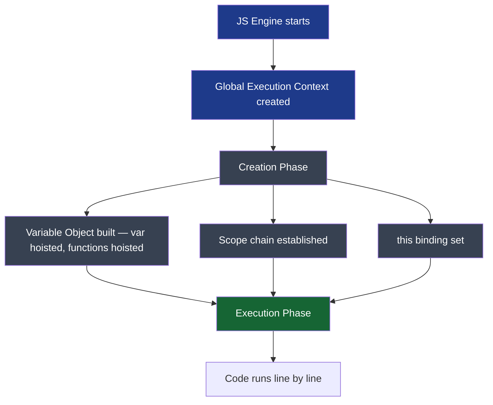

**How it works:**
- Every time JS runs, a **Global Execution Context (GEC)** is created first
- Every function call creates a new **Function Execution Context (FEC)**
- Each context has two phases: **Creation** (set up memory) and **Execution** (run code)
- Contexts are managed by the **Call Stack** — LIFO order

**Code Example:**
```javascript
var name = 'Alice';

function greet() {
  var msg = 'Hello';
  function inner() {
    console.log(msg + ' ' + name); // Hello Alice
  }
  inner();
}

greet();
```

**Real-world use case:** Understanding why `console.log` in a deeply nested callback still has access to outer variables — the execution context and scope chain are set up at definition time, not call time.

> 💡 **Interview Insight:** Interviewers ask "what is an execution context?" expecting you to describe creation phase (variable hoisting, function hoisting, `this` binding) vs execution phase. Mention the **Variable Environment**, **Lexical Environment**, and **this binding** as the three components of every context.

**Common Mistakes:**
- Confusing scope chain (lexical, set at definition) with the call stack (dynamic, set at runtime)
- Thinking `this` is part of the scope chain — it is not; it is a separate binding on the context

---

## 1.2 — Call Stack Push / Pop Flow

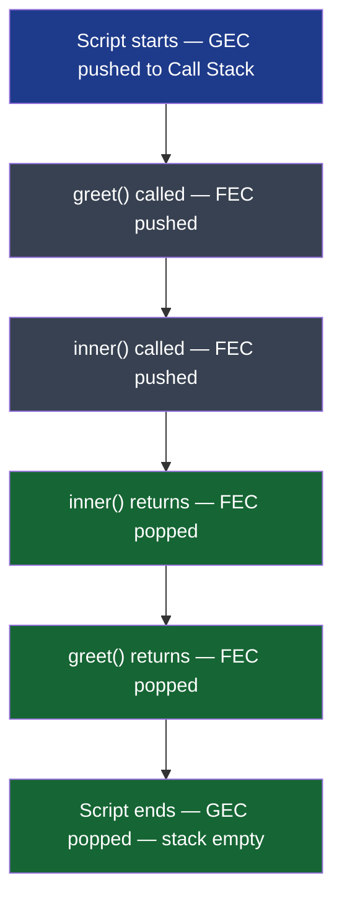

**Call Stack at peak depth (during `inner()`):**

```
┌──────────────────┐
│  inner()  FEC    │  ← top of stack (currently executing)
├──────────────────┤
│  greet()  FEC    │
├──────────────────┤
│  Global   GEC    │  ← always at bottom
└──────────────────┘
```

**Code Example — Stack Overflow:**
```javascript
function recurse() {
  return recurse(); // No base case — stack fills up
}
recurse(); // RangeError: Maximum call stack size exceeded
```

> 💡 **Interview Insight:** "What is a stack overflow in JS?" — The call stack has a fixed size (typically ~10,000–15,000 frames). Infinite recursion without a base case fills it. The fix is either a base case or converting to an iterative approach using an explicit stack data structure.

---

## 1.3 — Scope Chain & Lexical Environment

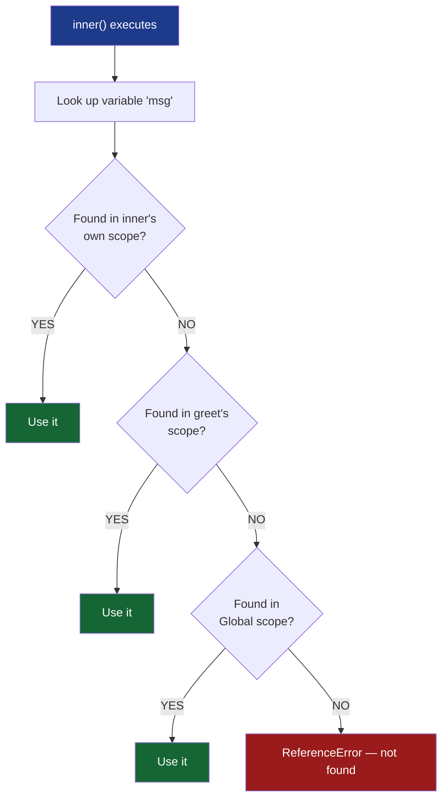

**Key principle:** The scope chain is determined by **where functions are defined** (lexical scope), not where they are called.

```javascript
function outer() {
  let x = 10;
  function inner() {
    console.log(x); // 10 — found in outer's scope via scope chain
  }
  return inner;
}

const fn = outer();
fn(); // Still prints 10 — scope chain preserved at definition time
```

> 💡 **Interview Insight:** This is the foundation of closures. The scope chain walks up the **Lexical Environment** chain — each context holds a reference to its outer environment. This is set when the function is **defined**, making JS lexically (statically) scoped.

---

# 2. Closures

## 2.1 — How Closures Work Internally

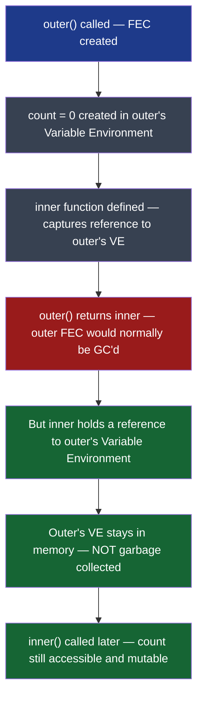

**The canonical closure — counter:**
```javascript
function makeCounter() {
  let count = 0; // Lives in makeCounter's Variable Environment

  return {
    increment() { count++; },
    decrement() { count--; },
    value()     { return count; }
  };
}

const counter = makeCounter();
counter.increment();
counter.increment();
console.log(counter.value()); // 2

// count is private — not accessible from outside
console.log(counter.count);  // undefined
```

**Real-world use case:** Module pattern, private state, memoization, event handlers that remember configuration.

> 💡 **Interview Insight:** Define a closure as: "A function that retains access to its **lexical scope** even when executed outside that scope." Interviewers want you to explain the **Variable Environment reference** being kept alive — not just "inner functions remember outer variables."

---

## 2.2 — The Classic Closure Trap: Loop + var

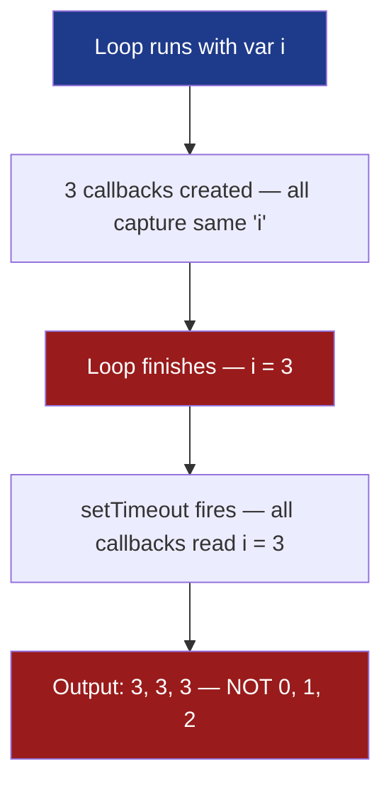

```javascript
// ❌ Classic trap — var is function-scoped, not block-scoped
for (var i = 0; i < 3; i++) {
  setTimeout(() => console.log(i), 100);
}
// Output: 3 3 3

// ✅ Fix 1 — use let (block-scoped, new binding per iteration)
for (let i = 0; i < 3; i++) {
  setTimeout(() => console.log(i), 100);
}
// Output: 0 1 2

// ✅ Fix 2 — IIFE to create a new scope per iteration
for (var i = 0; i < 3; i++) {
  ((j) => setTimeout(() => console.log(j), 100))(i);
}
// Output: 0 1 2
```

> 💡 **Interview Insight:** This is one of the most common interview questions. The answer is: `var` creates one binding shared across all iterations. `let` creates a new binding per iteration because each loop iteration gets its own block scope. The IIFE fix works by creating a new function scope, capturing the current value of `i` as parameter `j`.

---

## 2.3 — Closure Memory Retention

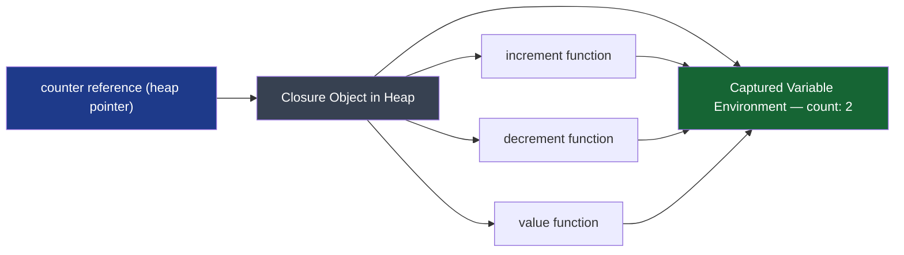

**Memory leak via closure:**
```javascript
function attachHandler() {
  const largeData = new Array(1_000_000).fill('x'); // 1M items

  document.getElementById('btn').addEventListener('click', () => {
    console.log(largeData.length); // closure keeps largeData alive
  });
}

// ⚠️ Even if the button is removed from DOM,
// largeData stays in memory as long as the handler is attached
// Fix: remove event listener when done, or don't capture largeData in closure
```

---

# 3. Event Loop

## 3.1 — The Full Event Loop Architecture

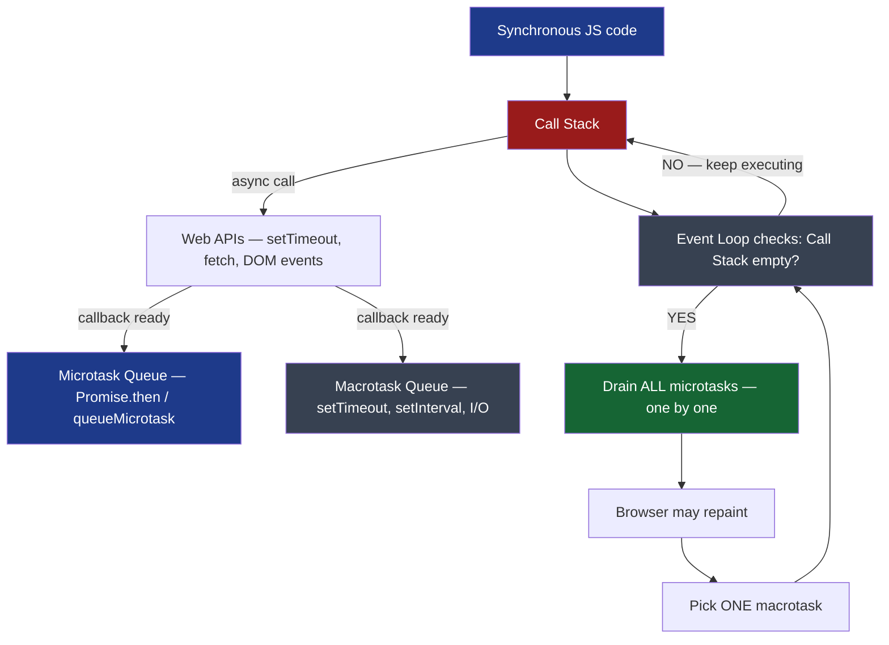

**The critical rule:** Microtasks drain **completely** before any macrotask runs. And microtasks can queue more microtasks — they all run before the next macrotask.

---

## 3.2 — Promise vs setTimeout Execution Order

```mermaid
sequenceDiagram
    participant Stack as Call Stack
    participant Micro as Microtask Queue
    participant Macro as Macrotask Queue
    participant Loop as Event Loop

    Stack->>Stack: console.log("1") — executes
    Stack->>Macro: setTimeout cb — scheduled
    Stack->>Micro: Promise.then cb — scheduled
    Stack->>Stack: console.log("4") — executes
    Stack->>Loop: Stack empty — signal
    Loop->>Micro: Drain — run Promise.then cb
    Micro->>Stack: console.log("3") — executes
    Loop->>Macro: Pick one — run setTimeout cb
    Macro->>Stack: console.log("2") — executes
```

```javascript
console.log('1');

setTimeout(() => console.log('2'), 0);

Promise.resolve().then(() => console.log('3'));

console.log('4');

// Output: 1 → 4 → 3 → 2
```

> 💡 **Interview Insight:** The key is that the microtask queue is checked **after every task** (including the initial script execution), not just after macrotasks. Promise callbacks always beat setTimeout, no matter what delay you give setTimeout.

---

## 3.3 — Nested Microtasks and Macrotasks

```javascript
// Can you predict this output?
setTimeout(() => console.log('timeout 1'), 0);

Promise.resolve()
  .then(() => {
    console.log('promise 1');
    setTimeout(() => console.log('timeout 2'), 0); // queues new macrotask
  })
  .then(() => console.log('promise 2'));

setTimeout(() => console.log('timeout 3'), 0);

// Output:
// promise 1
// promise 2
// timeout 1
// timeout 3
// timeout 2
```

**Execution walkthrough:**
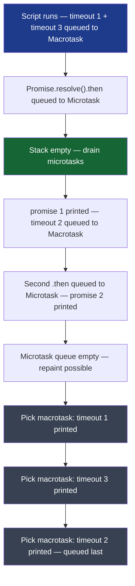

> 💡 **Interview Insight:** The output of `timeout 2` coming *after* `timeout 3` trips most engineers. Even though `timeout 2` is created "before" `timeout 3` in terms of nesting, it is *registered* later — after `timeout 3` was already in the queue. Queue ordering is determined by **when you register**, not where it appears in source.

---

# 4. Promises & Async/Await

## 4.1 — Promise Lifecycle

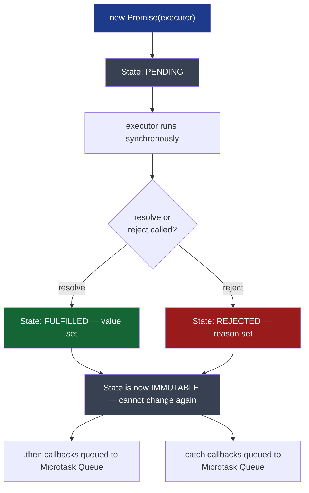

**Key facts about promises:**
- The executor function runs **synchronously** when `new Promise()` is called
- Once settled (fulfilled or rejected), a promise **cannot change state** — ever
- `.then()` / `.catch()` callbacks always run **asynchronously** — even if the promise is already settled
- `.then()` always returns a **new promise**, enabling chaining

```javascript
const p = new Promise((resolve, reject) => {
  console.log('1 — executor runs sync'); // Runs immediately
  resolve(42);
  reject('error'); // Ignored — already resolved
  console.log('2 — still runs after resolve'); // Also runs
});

p.then(v => console.log('4 — value:', v)); // Async — microtask

console.log('3 — sync continues');

// Output: 1 → 2 → 3 → 4
```

---

## 4.2 — Promise Chaining & Error Propagation

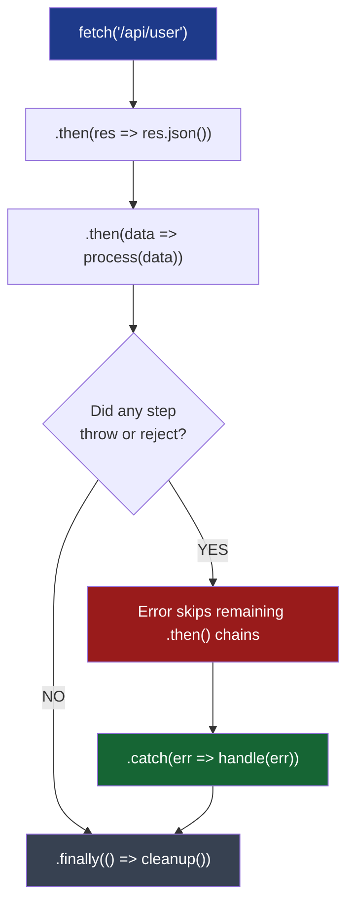

```javascript
fetch('/api/user')
  .then(res => {
    if (!res.ok) throw new Error(`HTTP ${res.status}`); // Rejected promise
    return res.json();
  })
  .then(data => {
    // Skipped if previous step threw
    return processUser(data);
  })
  .catch(err => {
    // Catches errors from ANY step above
    console.error('Failed:', err.message);
    return null; // Recovers — next .then gets null
  })
  .then(result => {
    // Runs even after .catch — promise chain continues
    console.log('Result:', result);
  })
  .finally(() => {
    // Always runs — perfect for cleanup like hiding loading spinner
    hideSpinner();
  });
```

> 💡 **Interview Insight:** `.catch(fn)` is sugar for `.then(undefined, fn)`. A `.catch()` that returns a value *recovers* the chain — subsequent `.then()` calls receive that value. A `.catch()` that throws *re-rejects* — the chain stays rejected.

---

## 4.3 — Async/Await Desugaring

**Every `async/await` is compiled to Promise chains. Understanding the desugaring is the key to predicting behavior.**

```javascript
// async/await version
async function fetchUser(id) {
  try {
    const res = await fetch(`/api/users/${id}`);
    const data = await res.json();
    return data;
  } catch (err) {
    console.error(err);
    throw err;
  }
}

// Desugared to — what JS engine actually runs:
function fetchUser(id) {
  return fetch(`/api/users/${id}`)
    .then(res => res.json())
    .then(data => data)
    .catch(err => {
      console.error(err);
      return Promise.reject(err);
    });
}
```

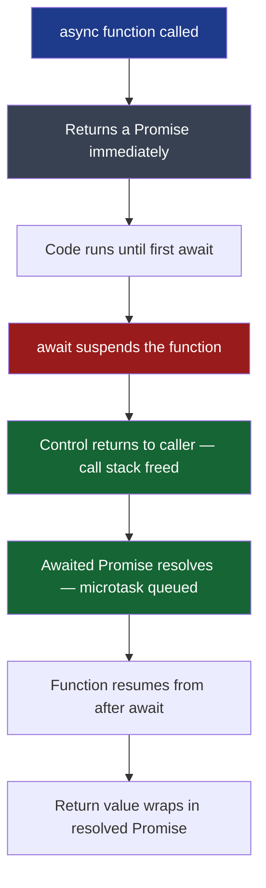

**Critical insight — await suspends, not blocks:**
```javascript
async function main() {
  console.log('1 — before await');
  const result = await Promise.resolve('hello');
  console.log('3 — after await:', result); // Runs as microtask
}

main();
console.log('2 — after calling main()'); // Runs before line 3

// Output: 1 → 2 → 3
```

---

## 4.4 — Promise Combinators Compared

| Method | Resolves when | Rejects when | Use case |
|---|---|---|---|
| `Promise.all` | ALL resolve | ANY rejects | All required — parallel required data |
| `Promise.allSettled` | ALL settle (either way) | Never | Log all results regardless of failures |
| `Promise.race` | FIRST settles (resolve or reject) | FIRST settles with rejection | Timeout pattern |
| `Promise.any` | FIRST resolves | ALL reject | Try multiple sources, use fastest |

```javascript
const p1 = fetch('/api/users');
const p2 = fetch('/api/posts');
const p3 = fetch('/api/comments');

// All three must succeed — if one fails, the whole thing fails
const [users, posts, comments] = await Promise.all([p1, p2, p3]);

// Get all results even if some fail
const results = await Promise.allSettled([p1, p2, p3]);
results.forEach(r => {
  if (r.status === 'fulfilled') console.log(r.value);
  else console.error(r.reason);
});

// Timeout pattern with Promise.race
const timeout = new Promise((_, reject) =>
  setTimeout(() => reject(new Error('Timeout')), 5000)
);
const data = await Promise.race([fetch('/api/data'), timeout]);

// Try CDN1, CDN2, CDN3 — use whichever responds first successfully
const asset = await Promise.any([
  fetch('https://cdn1.example.com/image.png'),
  fetch('https://cdn2.example.com/image.png'),
  fetch('https://cdn3.example.com/image.png'),
]);
```

> 💡 **Interview Insight:** The difference between `race` and `any` is subtle but critical. `race` short-circuits on the first *settlement* (resolve OR reject). `any` short-circuits on the first *resolution* (resolve only), ignoring rejections unless all reject, in which case it throws an `AggregateError`.

---

# 5. Concurrency & Parallelism

## 5.1 — Sequential vs Parallel Execution

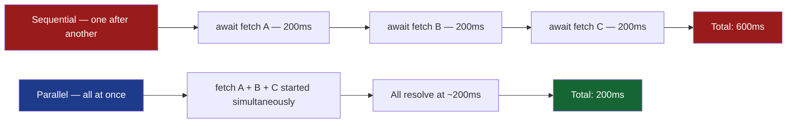

```javascript
// ❌ Sequential — 600ms total (each awaited before next starts)
async function sequential() {
  const a = await fetchA(); // starts and waits
  const b = await fetchB(); // starts AFTER a completes
  const c = await fetchC(); // starts AFTER b completes
  return [a, b, c];
}

// ✅ Parallel — ~200ms total (all started together)
async function parallel() {
  const [a, b, c] = await Promise.all([
    fetchA(), // All three fetches start simultaneously
    fetchB(),
    fetchC(),
  ]);
  return [a, b, c];
}

// ✅ Also parallel — explicitly start all, then await
async function alsoParallel() {
  const pA = fetchA(); // Starts immediately — no await yet
  const pB = fetchB(); // Starts immediately
  const pC = fetchC(); // Starts immediately
  return [await pA, await pB, await pC]; // Now collect results
}
```

---

## 5.2 — Concurrency Limiting: Task Queue Implementation

**Real-world scenario:** You have 100 URLs to fetch, but hitting the server with 100 concurrent requests would rate-limit you. You want to run at most N requests at a time.

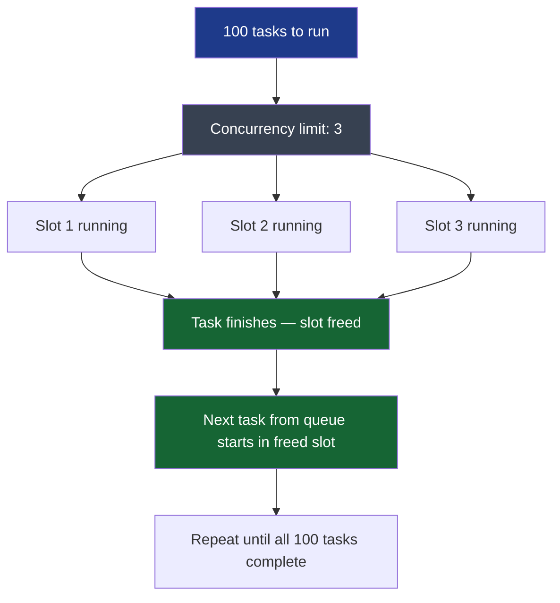

```javascript
/**
 * Runs async tasks with a concurrency limit.
 * @param {Array<() => Promise>} tasks - Array of task-producing functions
 * @param {number} limit - Max concurrent tasks
 * @returns {Promise<Array>} - Results in original order
 */
async function runWithConcurrencyLimit(tasks, limit) {
  const results = new Array(tasks.length);
  let index = 0; // Next task to start

  async function worker() {
    while (index < tasks.length) {
      const taskIndex = index++; // Grab next slot atomically
      results[taskIndex] = await tasks[taskIndex]();
    }
  }

  // Spin up `limit` workers — each grabs tasks as they finish
  const workers = Array.from({ length: limit }, () => worker());
  await Promise.all(workers);

  return results;
}

// Usage
const urls = Array.from({ length: 100 }, (_, i) => `https://api.example.com/item/${i}`);
const tasks = urls.map(url => () => fetch(url).then(r => r.json()));

const results = await runWithConcurrencyLimit(tasks, 5); // Max 5 concurrent
```

**How the worker pattern works:**
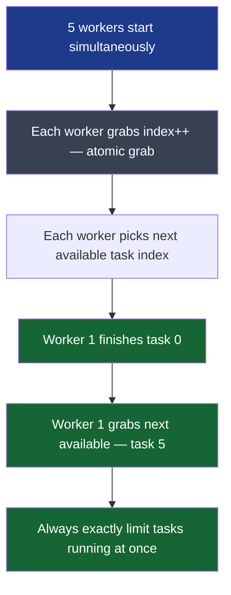

> 💡 **Interview Insight:** This is a real engineering pattern. The `index++` increment is critical — it acts as an atomic counter in single-threaded JS, ensuring no two workers pick the same task. The interviewer wants you to explain *why* this is safe in JS (single-threaded, no race conditions) but would need a mutex in multi-threaded languages.

---

## 5.3 — Rate Limiting with Delay Between Batches

```javascript
/**
 * Process items in batches with a delay between each batch.
 * Use case: sending emails, calling a rate-limited 3rd-party API.
 */
async function processBatched(items, batchSize, delayMs) {
  const results = [];

  for (let i = 0; i < items.length; i += batchSize) {
    const batch = items.slice(i, i + batchSize);

    // Process entire batch in parallel
    const batchResults = await Promise.all(
      batch.map(item => processItem(item))
    );
    results.push(...batchResults);

    // Wait between batches (skip delay after last batch)
    if (i + batchSize < items.length) {
      await new Promise(resolve => setTimeout(resolve, delayMs));
    }
  }

  return results;
}

// Usage: process 100 items, 10 at a time, 1 second between batches
await processBatched(items, 10, 1000);
```

---

# 6. The `this` Keyword

## 6.1 — How `this` Is Determined

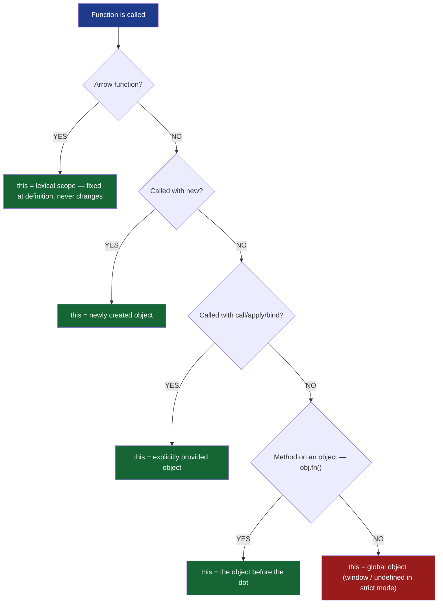

---

## 6.2 — `this` in Different Contexts

```javascript
// 1. Global context
console.log(this); // window (browser) / {} (Node module)

// 2. Regular function — standalone call
function regular() {
  console.log(this); // window (sloppy) / undefined (strict)
}
regular();

// 3. Method call — this = object before the dot
const obj = {
  name: 'Alice',
  greet() { console.log(this.name); }
};
obj.greet(); // 'Alice' — this = obj

// ⚠️ Trap: method detached from object loses this
const fn = obj.greet;
fn(); // undefined — this lost

// 4. Arrow function — inherits this from enclosing scope
const obj2 = {
  name: 'Bob',
  greet: () => console.log(this.name) // this = window/undefined
};
obj2.greet(); // undefined — NOT 'Bob'

// 5. Constructor call with new
function Person(name) {
  this.name = name; // this = new empty object
}
const p = new Person('Carol');
console.log(p.name); // 'Carol'
```

---

## 6.3 — call, apply, bind

```javascript
function introduce(greeting, punctuation) {
  console.log(`${greeting}, I'm ${this.name}${punctuation}`);
}

const person = { name: 'Dave' };

// call — invoke immediately, args as comma-separated
introduce.call(person, 'Hello', '!');       // "Hello, I'm Dave!"

// apply — invoke immediately, args as array
introduce.apply(person, ['Hi', '.']);        // "Hi, I'm Dave."

// bind — returns NEW function with this permanently bound
const boundFn = introduce.bind(person, 'Hey');
boundFn('?');                                // "Hey, I'm Dave?"

// Real use case: preserving this in callbacks
class Timer {
  constructor() {
    this.count = 0;
  }
  start() {
    // ❌ Without bind: this = undefined in strict or window in sloppy
    // setInterval(function() { this.count++; }, 1000);

    // ✅ Option 1: bind
    setInterval(function() { this.count++; }.bind(this), 1000);

    // ✅ Option 2: arrow function (preferred)
    setInterval(() => { this.count++; }, 1000);
  }
}
```

> 💡 **Interview Insight:** Arrow functions do not have their own `this` — they look up the scope chain for `this` at **definition time**. This is why they are ideal for callbacks inside methods. The interviewer may ask "can you `bind` an arrow function?" — the answer is no, `bind` returns the arrow function unchanged because its `this` is fixed lexically and cannot be overridden.

---

## 6.4 — The `new` Keyword Under the Hood

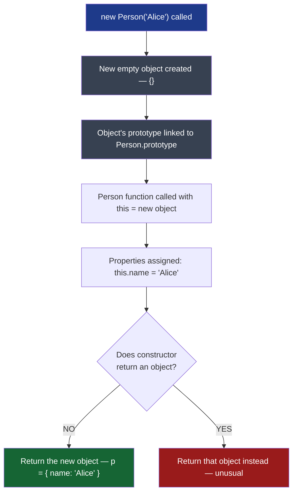

```javascript
// Simulating what 'new' does:
function myNew(Constructor, ...args) {
  const obj = Object.create(Constructor.prototype); // Steps 1+2
  const result = Constructor.apply(obj, args);       // Steps 3+4
  return typeof result === 'object' && result !== null
    ? result   // Constructor returned an object — use it
    : obj;     // Normal case — return the new object
}

const p = myNew(Person, 'Alice');
console.log(p instanceof Person); // true
```

# 7. Prototypes & Inheritance

## 7.1 — The Prototype Chain

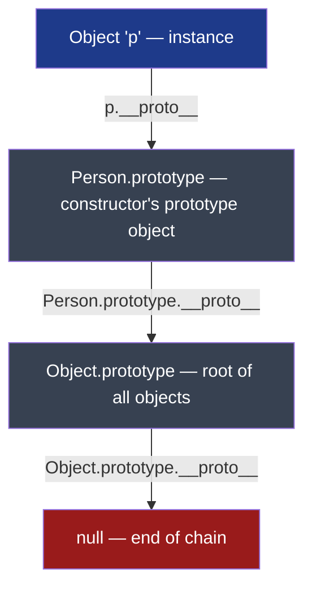

- Every object has an internal `[[Prototype]]` slot — accessible via `__proto__` or `Object.getPrototypeOf()`
- Property lookup walks the chain upward until found or `null` is reached
- `prototype` is a property on **functions** (used when `new` creates instances)
- `__proto__` is a property on **objects** (the actual chain link)

```javascript
function Animal(name) {
  this.name = name;
}
Animal.prototype.speak = function () {
  return `${this.name} makes a sound.`;
};

function Dog(name, breed) {
  Animal.call(this, name); // Inherit instance properties
  this.breed = breed;
}
Dog.prototype = Object.create(Animal.prototype); // Set up prototype chain
Dog.prototype.constructor = Dog;                 // Restore constructor reference
Dog.prototype.bark = function () {
  return `${this.name} barks!`;
};

const d = new Dog('Rex', 'Lab');
console.log(d.speak()); // "Rex makes a sound." — found on Animal.prototype
console.log(d.bark());  // "Rex barks!" — found on Dog.prototype

// Chain: d → Dog.prototype → Animal.prototype → Object.prototype → null
console.log(d instanceof Dog);    // true
console.log(d instanceof Animal); // true
```

---

## 7.2 — `__proto__` vs `prototype` — The Clearest Distinction

| Property | Lives on | Points to | Used by |
|---|---|---|---|
| `prototype` | Functions only | The object that will become `__proto__` of instances | `new` keyword during construction |
| `__proto__` | All objects | The object's actual prototype (parent in chain) | Property lookup at runtime |

```javascript
function Foo() {}
const f = new Foo();

Foo.prototype === f.__proto__; // true — they are the same object
Foo.__proto__ === Function.prototype; // true — Foo is itself an object
```

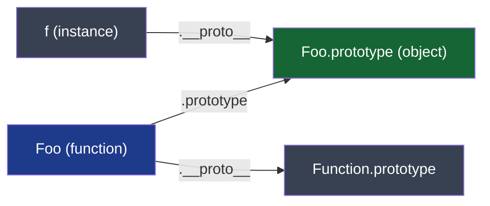

> 💡 **Interview Insight:** Most engineers confuse these. The interviewer wants: "`.prototype` is a property on constructor functions that becomes the `[[Prototype]]` of new instances. `.__proto__` is the actual chain link on every object instance." Draw the triangle: function → `.prototype` object ← `.__proto__` from instance.

---

## 7.3 — Class Syntax is Syntactic Sugar

```javascript
// ES6 class
class Animal {
  constructor(name) {
    this.name = name;
  }
  speak() {
    return `${this.name} makes a sound.`;
  }
}

class Dog extends Animal {
  constructor(name, breed) {
    super(name);         // Calls Animal constructor — required before this
    this.breed = breed;
  }
  bark() {
    return `${this.name} barks!`;
  }
}

// Under the hood this is IDENTICAL to the prototype code above.
// typeof Animal === 'function' — classes are just functions
// Dog.prototype.__proto__ === Animal.prototype — same chain
```

---

# 8. Memory Management

## 8.1 — Stack vs Heap

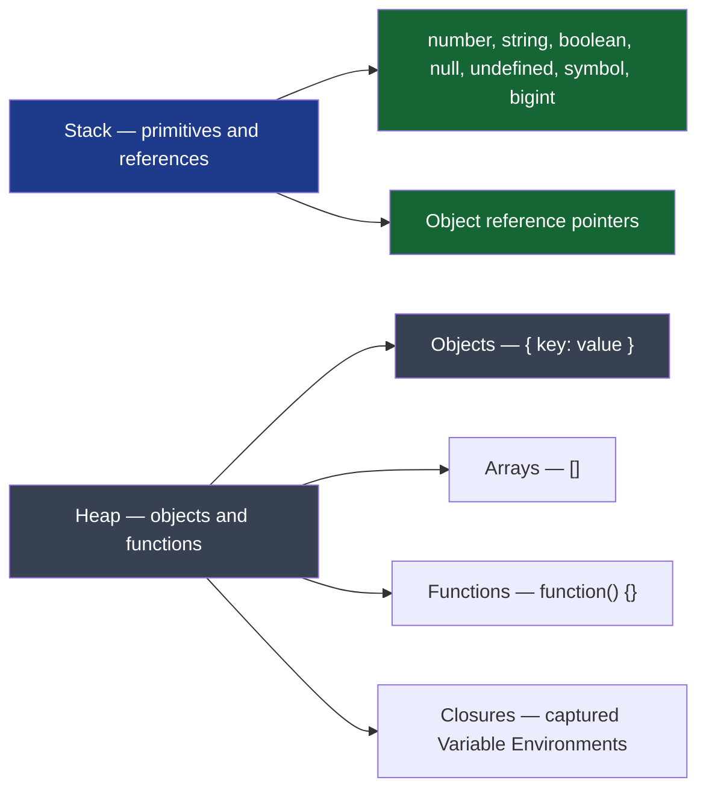

```javascript
let x = 42;       // Primitive — value 42 stored directly on stack
let y = x;        // Copy of value — y = 42, independent
y = 100;
console.log(x);   // 42 — unchanged

let obj1 = { name: 'Alice' }; // Object in heap, obj1 holds reference on stack
let obj2 = obj1;              // Reference copied — both point to SAME heap object
obj2.name = 'Bob';
console.log(obj1.name);       // 'Bob' — both see the mutation
```

---

## 8.2 — Garbage Collection

```mermaid
flowchart TD
    A["Object created in Heap"]
    B["At least one reachable reference exists"]
    C{"Any reachable reference\nto this object?"}
    D["Object is LIVE — not collected"]
    E["Object is UNREACHABLE — eligible for GC"]
    F["Mark-and-Sweep GC — frees memory"]

    A --> B --> C
    C -->|YES| D
    C -->|NO| E --> F

    style D fill:#166534,color:#ffffff
    style E fill:#991b1b,color:#ffffff
    style F fill:#374151,color:#ffffff
    style A fill:#1e3a8a,color:#ffffff
```

**Mark-and-sweep algorithm (used by V8):**
1. Start from **roots** (global variables, call stack references)
2. **Mark** all objects reachable from roots
3. **Sweep** — free all unmarked objects
4. Modern V8 uses **generational GC** — young objects collected frequently (minor GC), old objects less often (major GC)

---

## 8.3 — Common Memory Leaks

```javascript
// Leak 1: Forgotten timers — timer holds reference to callback and its closure
function startLeak() {
  const data = new Array(100_000).fill('leak');
  setInterval(() => {
    console.log(data.length); // data never freed while timer runs
  }, 1000);
  // Fix: store interval ID and clearInterval when component unmounts
}

// Leak 2: DOM references kept in JS after element removed
const elements = {};
function cacheElement() {
  elements['header'] = document.querySelector('#header');
  // Even if #header is removed from DOM, JS still holds reference
  // Fix: set elements['header'] = null when done
}

// Leak 3: Closure retaining large data unintentionally
function processData() {
  const bigBuffer = new ArrayBuffer(1_000_000);
  const view = new Uint8Array(bigBuffer);
  // ... do work ...
  return function check() {
    return view[0] === 0; // Closure captures entire bigBuffer
  };
}
// Fix: only capture the minimum data needed
function processDataFixed() {
  const bigBuffer = new ArrayBuffer(1_000_000);
  const view = new Uint8Array(bigBuffer);
  const firstByte = view[0]; // Extract only what's needed
  // bigBuffer can now be GC'd
  return function check() {
    return firstByte === 0;
  };
}

// Leak 4: Event listeners not removed
class Component {
  mount() {
    this.handler = () => this.update();
    window.addEventListener('resize', this.handler);
  }
  unmount() {
    window.removeEventListener('resize', this.handler); // Must remove
  }
}
```

> 💡 **Interview Insight:** Interviewers expect you to name at least 3 leak sources. The key insight is that GC cannot collect anything that remains **reachable** — even if you will never use it again. The word "reachable" is the entire explanation.

---

# 9. Debounce & Throttle

## 9.1 — Debounce: Wait Until Quiet

```mermaid
flowchart TD
    A["User types keystroke"]
    B["Debounce timer starts — 300ms"]
    C{"Another keystroke\nbefore 300ms?"}
    D["Reset timer — start 300ms again"]
    E["300ms of silence — timer fires"]
    F["API call made once"]

    A --> B --> C
    C -->|YES| D --> C
    C -->|NO| E --> F

    style A fill:#1e3a8a,color:#ffffff
    style D fill:#991b1b,color:#ffffff
    style F fill:#166534,color:#ffffff
```

**Visual timing:**
```
Keystrokes:   k  e  y  s  t  r  o  k  e
Timers:       |→ reset → reset → reset → reset → 300ms → FIRE!
API calls:                                                  ↑ once
```

**Implementation:**
```javascript
function debounce(fn, delay) {
  let timerId = null;

  return function (...args) {
    clearTimeout(timerId);           // Cancel any pending call
    timerId = setTimeout(() => {
      fn.apply(this, args);          // Call with correct this + args
    }, delay);
  };
}

// Usage — search input
const searchInput = document.querySelector('#search');
const search = debounce(async (query) => {
  const results = await fetch(`/api/search?q=${query}`).then(r => r.json());
  renderResults(results);
}, 300);

searchInput.addEventListener('input', e => search(e.target.value));
```

---

## 9.2 — Throttle: Fire at Most Once Per Interval

```mermaid
flowchart TD
    A["User scrolls — event fires continuously"]
    B{"Throttle window\nactive?"}
    C["Call ignored — window still open"]
    D["Call executes — window opens for 200ms"]
    E["200ms passes — window closes"]
    F["Next call can execute"]

    A --> B
    B -->|YES| C
    B -->|NO| D --> E --> F --> B

    style A fill:#1e3a8a,color:#ffffff
    style C fill:#991b1b,color:#ffffff
    style D fill:#166534,color:#ffffff
```

**Visual timing:**
```
Scroll events: ||||||||||||||||||||||||||||||||||||||||
Throttle 200ms: ↑         ↑         ↑         ↑
Handler fires:  call      call      call      call
```

**Implementation:**
```javascript
function throttle(fn, interval) {
  let lastCall = 0;

  return function (...args) {
    const now = Date.now();
    if (now - lastCall >= interval) {
      lastCall = now;
      fn.apply(this, args);
    }
  };
}

// Usage — scroll position tracker
const trackScroll = throttle(() => {
  updateScrollIndicator(window.scrollY);
}, 200);

window.addEventListener('scroll', trackScroll);
```

**Debounce vs Throttle side by side:**

| | Debounce | Throttle |
|---|---|---|
| **Fires when** | After a quiet period ends | At most once per interval |
| **Typical delay** | 200–500ms | 100–200ms |
| **Use case** | Search input, form validation, resize | Scroll handler, mouse move, game loop |
| **Risk** | May never fire if events are constant | First and last events may be missed |

---

## 9.3 — Leading vs Trailing Edge

```javascript
// Leading edge debounce — fires IMMEDIATELY, then waits
function debounceLeading(fn, delay) {
  let timerId = null;

  return function (...args) {
    const shouldFire = !timerId; // Fire if no pending timer
    clearTimeout(timerId);
    timerId = setTimeout(() => { timerId = null; }, delay);
    if (shouldFire) fn.apply(this, args);
  };
}

// Use case: button click that should respond immediately
// but prevents rapid double-submits
const submitOrder = debounceLeading(sendOrderToAPI, 2000);
```

---

# 10. Hoisting & Temporal Dead Zone

## 10.1 — Hoisting Flow

```mermaid
flowchart TD
    A["Creation Phase begins"]
    B["var declarations — hoisted, initialized to undefined"]
    C["function declarations — fully hoisted, immediately usable"]
    D["let and const declarations — hoisted but NOT initialized"]
    E["Execution Phase begins"]
    F["var assignments — value set when line executes"]
    G["let and const — initialized at their declaration line"]
    H["Accessing let/const before line — ReferenceError: TDZ"]

    A --> B & C & D --> E --> F & G
    D --> H

    style A fill:#1e3a8a,color:#ffffff
    style B fill:#374151,color:#ffffff
    style C fill:#166534,color:#ffffff
    style D fill:#991b1b,color:#ffffff
    style H fill:#991b1b,color:#ffffff
    style G fill:#166534,color:#ffffff
```

```javascript
// What JS sees after hoisting (mental model):

// --- Creation Phase ---
// var x → hoisted, x = undefined
// greet → hoisted, full function body available
// let y → hoisted into TDZ, cannot be accessed

// --- Execution Phase ---
console.log(x);      // undefined — hoisted but not yet assigned
console.log(greet);  // [Function: greet] — fully hoisted
// console.log(y);   // ❌ ReferenceError — TDZ

var x = 10;
console.log(x);      // 10

function greet() { return 'hello'; }

let y = 20;
console.log(y);      // 20 — TDZ ends here
```

---

## 10.2 — Temporal Dead Zone (TDZ) Deep Dive

```mermaid
flowchart LR
    A["Script start"]
    B["TDZ begins for 'y'"]
    C["Any access to 'y' here = ReferenceError"]
    D["let y = 42 — TDZ ends"]
    E["y accessible and usable"]

    A --> B --> C --> D --> E

    style A fill:#1e3a8a,color:#ffffff
    style B fill:#991b1b,color:#ffffff
    style C fill:#991b1b,color:#ffffff
    style D fill:#166534,color:#ffffff
    style E fill:#166534,color:#ffffff
```

```javascript
// TDZ applies to let, const, and class

// ⚠️ TDZ trap in closures
function tricky() {
  // TDZ for 'value' starts here
  const getValue = () => value; // Closure captures 'value'
  // But accessing getValue() here would hit TDZ if value not yet init

  const value = 42; // TDZ ends
  return getValue(); // 42 — fine, value is initialized by now
}

// ⚠️ TDZ in default parameters
function defaultParamTrap(a = b, b = 1) { // ❌ 'b' is in TDZ when 'a' evaluates
  return a + b;
}
// defaultParamTrap(); // ReferenceError

function fixed(b = 1, a = b) { return a + b; } // ✅
fixed(); // 2
```

**var vs let vs const comparison:**

| | `var` | `let` | `const` |
|---|---|---|---|
| Scope | Function | Block | Block |
| Hoisted? | Yes — to `undefined` | Yes — to TDZ | Yes — to TDZ |
| Re-declarable? | Yes | No | No |
| Re-assignable? | Yes | Yes | No |
| Global property? | Yes (`window.x`) | No | No |

---

# 11. ES Modules vs CommonJS

## 11.1 — Module System Comparison Flow

```mermaid
flowchart TD
    A["ES Modules (ESM)"]
    B["Static import/export — parse time analysis"]
    C["Live bindings — exported values stay linked"]
    D["Async loading — supports top-level await"]
    E["Always strict mode"]

    F["CommonJS (CJS)"]
    G["Dynamic require() — resolved at runtime"]
    H["Value copies — snapshot at require() time"]
    I["Sync loading — blocks until module loaded"]
    J["Not strict by default"]

    A --> B & C & D & E
    F --> G & H & I & J

    style A fill:#1e3a8a,color:#ffffff
    style F fill:#374151,color:#ffffff
    style B fill:#166534,color:#ffffff
    style C fill:#166534,color:#ffffff
    style G fill:#991b1b,color:#ffffff
    style H fill:#991b1b,color:#ffffff
```

---

## 11.2 — Live Bindings vs Value Copies

**This is the most important difference and the most commonly tested.**

```javascript
// counter.mjs — ES Module
export let count = 0;
export function increment() { count++; }

// main.mjs
import { count, increment } from './counter.mjs';
console.log(count); // 0
increment();
console.log(count); // 1 ← LIVE BINDING — reflects the change
```

```javascript
// counter.js — CommonJS
let count = 0;
function increment() { count++; }
module.exports = { count, increment };

// main.js
const { count, increment } = require('./counter.js');
console.log(count); // 0
increment();
console.log(count); // 0 ← COPY — does NOT reflect the change
// count was copied by value at require() time
```

```mermaid
flowchart LR
    A["ESM: import count"]
    B["Live reference to count in module's memory"]
    C["Module updates count to 1"]
    D["Importer sees 1 automatically"]

    E["CJS: require count"]
    F["count = 0 copied by value into local variable"]
    G["Module updates internal count to 1"]
    H["Local copy stays 0 — no link"]

    A --> B --> C --> D
    E --> F --> G --> H

    style A fill:#1e3a8a,color:#ffffff
    style D fill:#166534,color:#ffffff
    style E fill:#374151,color:#ffffff
    style H fill:#991b1b,color:#ffffff
```

---

## 11.3 — Import/Export Patterns

```javascript
// Named exports — multiple per file
export const PI = 3.14159;
export function add(a, b) { return a + b; }
export class Vector { /* ... */ }

// Default export — one per file
export default function main() { /* ... */ }

// Re-export (barrel file pattern)
export { PI, add } from './math.js';
export { default as Vector } from './vector.js';

// Dynamic import — lazy loading, returns Promise
async function loadHeavyModule() {
  const { HeavyComponent } = await import('./HeavyComponent.js');
  return HeavyComponent;
}

// CommonJS equivalents
const { PI, add } = require('./math');
module.exports = { main };
const mod = require('./heavy'); // Always synchronous
```

| | ESM | CommonJS |
|---|---|---|
| Syntax | `import` / `export` | `require()` / `module.exports` |
| When resolved | Parse time (static) | Runtime (dynamic) |
| Circular deps | Handled via live bindings | Can cause `undefined` exports |
| Tree-shaking | ✅ Yes — static analysis possible | ❌ No — dynamic |
| Top-level await | ✅ Yes | ❌ No |
| Browser native | ✅ Yes (`type="module"`) | ❌ No — needs bundler |

---

# 12. Advanced Interview Questions

## 12.1 — Output Question: Classic Promise Trap

**Question:**
```javascript
console.log('start');

setTimeout(() => console.log('timeout'), 0);

Promise.resolve()
  .then(() => {
    console.log('p1');
    return Promise.resolve('inner');
  })
  .then(v => console.log('p2', v));

console.log('end');
```

**Step-by-step execution:**
```mermaid
flowchart TD
    A["'start' — sync — logged"]
    B["setTimeout cb → Macrotask Queue"]
    C["Promise.resolve().then(p1cb) → Microtask Queue"]
    D["'end' — sync — logged"]
    E["Stack empty — drain microtasks"]
    F["p1cb runs — 'p1' logged"]
    G["return Promise.resolve('inner') — new Promise"]
    H["Two microtasks to unwrap — PromiseResolveThenableJob"]
    I["Then p2cb runs — 'p2 inner' logged"]
    J["Microtask queue empty"]
    K["Macrotask: setTimeout — 'timeout' logged"]

    A --> B --> C --> D --> E --> F --> G --> H --> I --> J --> K

    style A fill:#1e3a8a,color:#ffffff
    style E fill:#166534,color:#ffffff
    style H fill:#991b1b,color:#ffffff
    style K fill:#374151,color:#ffffff
```

**Output:**
```
start
end
p1
p2 inner
timeout
```

> 💡 **The trap:** `return Promise.resolve('inner')` inside a `.then` causes an *extra* microtask tick because the engine must schedule a `PromiseResolveThenableJob` to unwrap the inner promise. So `p2` comes after two microtask ticks, not one.

---

## 12.2 — Output Question: Async/Await Ordering

**Question:**
```javascript
async function asyncFn() {
  console.log('2');
  const result = await Promise.resolve('hello');
  console.log('4', result);
}

console.log('1');
asyncFn();
console.log('3');
```

**Execution trace:**
```mermaid
sequenceDiagram
    participant Stack as Call Stack
    participant Micro as Microtask Queue

    Stack->>Stack: console.log('1')
    Stack->>Stack: asyncFn() called — enters function
    Stack->>Stack: console.log('2')
    Stack->>Stack: await hit — suspends asyncFn
    Stack->>Micro: Resume-after-await queued as microtask
    Stack->>Stack: asyncFn() returns implicit Promise — control back to caller
    Stack->>Stack: console.log('3')
    Stack->>Micro: Stack empty — drain microtask
    Micro->>Stack: asyncFn resumes
    Stack->>Stack: console.log('4', 'hello')
```

**Output:** `1 → 2 → 3 → 4 hello`

---

## 12.3 — Output Question: Closure in Loop (Classic)

**Question:**
```javascript
const funcs = [];
for (var i = 0; i < 3; i++) {
  funcs.push(function () { return i; });
}
console.log(funcs[0]()); // ?
console.log(funcs[1]()); // ?
console.log(funcs[2]()); // ?
```

**Why all return 3:**
```mermaid
flowchart TD
    A["var i declared — function scoped, ONE binding"]
    B["Loop body: push closure that captures reference to i"]
    C["All 3 closures share the SAME 'i' variable"]
    D["Loop ends — i = 3"]
    E["funcs[0]() called — reads i — returns 3"]
    F["funcs[1]() called — reads i — returns 3"]
    G["funcs[2]() called — reads i — returns 3"]

    A --> B --> C --> D --> E & F & G

    style A fill:#1e3a8a,color:#ffffff
    style C fill:#991b1b,color:#ffffff
    style D fill:#991b1b,color:#ffffff
```

**Output:** `3, 3, 3`

**Fixes:**
```javascript
// Fix 1: let — new binding per iteration
for (let i = 0; i < 3; i++) {
  funcs.push(() => i);
}
// Output: 0, 1, 2

// Fix 2: IIFE to freeze current i
for (var i = 0; i < 3; i++) {
  funcs.push(((j) => () => j)(i));
}
// Output: 0, 1, 2
```

---

## 12.4 — Tricky Promise Question: Error Recovery

**Question:**
```javascript
Promise.reject('error')
  .then(v => {
    console.log('then1:', v); // Does this run?
  })
  .catch(e => {
    console.log('catch:', e); // Does this run?
    return 'recovered';
  })
  .then(v => {
    console.log('then2:', v); // Does this run?
  })
  .catch(e => {
    console.log('catch2:', e); // Does this run?
  });
```

```mermaid
flowchart TD
    A["Promise.reject('error') — rejected"]
    B[".then() — SKIPPED — rejection passes through"]
    C[".catch(e => ...) — RUNS — logs 'catch: error'"]
    D["catch returns value — chain recovers to fulfilled"]
    E[".then(v => ...) — RUNS — logs 'then2: recovered'"]
    F[".catch — SKIPPED — chain is fulfilled"]

    A --> B --> C --> D --> E --> F

    style A fill:#991b1b,color:#ffffff
    style B fill:#374151,color:#ffffff
    style C fill:#166534,color:#ffffff
    style D fill:#166534,color:#ffffff
    style E fill:#166534,color:#ffffff
    style F fill:#374151,color:#ffffff
```

**Output:**
```
catch: error
then2: recovered
```

> 💡 **Key rule:** A `.catch()` that returns a non-rejected value *heals* the chain. Subsequent `.then()` handlers receive that returned value. The chain only stays rejected if `.catch()` either throws or returns `Promise.reject()`.

---

## 12.5 — Event Loop Puzzle: queueMicrotask

**Question:**
```javascript
setTimeout(() => console.log('A'), 0);

queueMicrotask(() => {
  console.log('B');
  queueMicrotask(() => console.log('C'));
});

Promise.resolve().then(() => console.log('D'));

console.log('E');
```

**Trace:**
```mermaid
flowchart TD
    A["Sync: 'E' logged"]
    B["Macro queue: setTimeout(A)"]
    C["Micro queue: queueMicrotask(B), Promise.then(D)"]
    D["Drain microtasks: run B — logs 'B'"]
    E["B queues new microtask C — added to end of micro queue"]
    F["Run D — logs 'D'"]
    G["Run C — logs 'C'"]
    H["Micro queue empty — pick macrotask — logs 'A'"]

    A --> B & C --> D --> E --> F --> G --> H

    style A fill:#1e3a8a,color:#ffffff
    style D fill:#166534,color:#ffffff
    style H fill:#374151,color:#ffffff
```

**Output:** `E → B → D → C → A`

> 💡 **The trap:** `C` is queued by `B` at runtime — while draining the microtask queue. Since microtasks are drained completely before macrotasks, `C` still runs before `A`. And `D` runs before `C` because `D` was already in the queue when `B` started running, while `C` was added *during* `B`'s execution.

---

## 12.6 — `this` Edge Case in Class Methods

**Question:**
```javascript
class Counter {
  count = 0;

  increment() {
    this.count++;
  }

  delayedIncrement() {
    setTimeout(function () {
      this.increment(); // What happens?
    }, 100);
  }

  safeDelayedIncrement() {
    setTimeout(() => {
      this.increment(); // What happens?
    }, 100);
  }
}

const c = new Counter();
c.delayedIncrement();      // ❌ TypeError: this.increment is not a function
c.safeDelayedIncrement();  // ✅ Works correctly
```

```mermaid
flowchart TD
    A["delayedIncrement called — this = Counter instance"]
    B["setTimeout schedules regular function"]
    C["Timer fires regular fn — this = undefined or window"]
    D["this.increment() throws TypeError — wrong this"]

    E["safeDelayedIncrement called — this = Counter instance"]
    F["setTimeout schedules arrow function"]
    G["Arrow fn has no own this — inherits outer scope this"]
    H["this = Counter instance — this.increment() works"]

    A --> B --> C --> D
    E --> F --> G --> H

    style D fill:#991b1b,color:#ffffff
    style H fill:#166534,color:#ffffff
    style A fill:#1e3a8a,color:#ffffff
    style E fill:#1e3a8a,color:#ffffff
```

---

## 12.7 — Async Trap: Sequential await in a Loop

**Question: What's the performance problem?**
```javascript
const ids = [1, 2, 3, 4, 5];

// ❌ This is SEQUENTIAL — each awaits before next starts
async function slow() {
  const results = [];
  for (const id of ids) {
    const data = await fetch(`/api/item/${id}`); // Waits before next
    results.push(await data.json());
  }
  return results; // Total: sum of all individual fetch times
}

// ✅ This is PARALLEL — all fetches start simultaneously
async function fast() {
  const results = await Promise.all(
    ids.map(id => fetch(`/api/item/${id}`).then(r => r.json()))
  );
  return results; // Total: max of all individual fetch times
}

// ✅ Also correct using for...of with pre-started promises
async function alsoFast() {
  const promises = ids.map(id => fetch(`/api/item/${id}`).then(r => r.json()));
  const results = [];
  for (const p of promises) {
    results.push(await p); // Awaits in order, but all fetches already started
  }
  return results;
}
```

> 💡 **Interview Insight:** The question "what's wrong with `await` inside a `for...of`?" is extremely common. The fix is either `Promise.all` (true parallel) or starting all promises before awaiting them. If order matters but you still want parallelism, `alsoFast()` is the pattern — start all, then await in sequence.

---

## 12.8 — Prototype Chain Gotcha

**Question:**
```javascript
function Foo() {}
Foo.prototype.x = 1;

const a = new Foo();
const b = new Foo();

a.x = 2; // Does this affect b?

console.log(a.x); // ?
console.log(b.x); // ?

delete a.x;

console.log(a.x); // ?
```

```mermaid
flowchart TD
    A["a.x = 2 — creates OWN property on 'a'"]
    B["Shadows Foo.prototype.x = 1 for 'a' only"]
    C["b has no own 'x' — still reads from prototype"]
    D["a.x = 2, b.x = 1"]

    E["delete a.x — removes OWN property from 'a'"]
    F["Property lookup falls through to prototype again"]
    G["a.x = 1 — reads from Foo.prototype.x"]

    A --> B --> C --> D
    D --> E --> F --> G

    style A fill:#1e3a8a,color:#ffffff
    style B fill:#374151,color:#ffffff
    style D fill:#166534,color:#ffffff
    style G fill:#166534,color:#ffffff
```

**Output:**
```
2   // a.x — own property
1   // b.x — from prototype
1   // a.x after delete — falls back to prototype
```

---

## 12.9 — Concurrency Question: Promise.all Failure

**Question:**
```javascript
async function run() {
  try {
    const results = await Promise.all([
      Promise.resolve(1),
      Promise.reject(new Error('Oops')),
      Promise.resolve(3),
    ]);
    console.log('Results:', results);
  } catch (err) {
    console.log('Error:', err.message);
  }
}
run();
```

```mermaid
flowchart TD
    A["Promise.all starts 3 promises"]
    B["Promise 1 resolves: 1"]
    C["Promise 2 rejects: Error('Oops')"]
    D["Promise 3 resolves: 3"]
    E["Promise.all detects ANY rejection"]
    F["Immediately rejects with that error"]
    G["Results from 1 and 3 are DISCARDED"]
    H["catch block runs — 'Error: Oops'"]

    A --> B & C & D
    C --> E --> F --> G --> H

    style C fill:#991b1b,color:#ffffff
    style F fill:#991b1b,color:#ffffff
    style G fill:#991b1b,color:#ffffff
    style H fill:#374151,color:#ffffff
```

**Output:** `Error: Oops`

**Follow-up:** If you need all results regardless of failures, use `Promise.allSettled`:
```javascript
const results = await Promise.allSettled([p1, p2, p3]);
// [
//   { status: 'fulfilled', value: 1 },
//   { status: 'rejected',  reason: Error('Oops') },
//   { status: 'fulfilled', value: 3 },
// ]
```

---

## 12.10 — Deep Closure + Async Trap

**Question: What does this print and why?**
```javascript
async function main() {
  let value = 0;

  const increment = async () => {
    const current = value;       // Read current value
    await new Promise(r => setTimeout(r, 10)); // Simulated async work
    value = current + 1;         // Write back
  };

  await Promise.all([increment(), increment(), increment()]);
  console.log(value); // Expected 3? Actual?
}
main();
```

```mermaid
flowchart TD
    A["3 increment() calls start simultaneously"]
    B["All three read current = 0 at the same time"]
    C["All three await — suspend for 10ms"]
    D["All three resume — each sets value = 0 + 1 = 1"]
    E["Final value = 1 — NOT 3"]

    A --> B --> C --> D --> E

    style A fill:#1e3a8a,color:#ffffff
    style B fill:#991b1b,color:#ffffff
    style E fill:#991b1b,color:#ffffff
```

**Output:** `1`

**Why:** This is a **race condition** in JavaScript. Even though JS is single-threaded, async functions *interleave* at `await` points. All three read `value = 0`, all three suspend, all three resume and write `1`. The last write wins and all writes are `1`.

**Fix — serialize the operations:**
```javascript
// Option 1: sequential (safe but slow)
for (const _ of [0, 1, 2]) await increment();

// Option 2: atomic update pattern (read-modify inside single sync block)
const atomicIncrement = async () => {
  await new Promise(r => setTimeout(r, 10));
  value++; // ✅ Read + write in one synchronous operation — no interleave risk
};
```

> 💡 **Interview Insight:** This demonstrates that JavaScript's single-threaded nature does NOT mean you are safe from race conditions when using async/await. Race conditions occur whenever state is read and written across `await` boundaries. The fix is to ensure read + modify + write happens atomically in a single synchronous step.

---

## 12.11 — Implement: Memoize Function

```javascript
/**
 * Memoize a function — cache results by arguments.
 * Uses a nested Map for multi-argument support.
 */
function memoize(fn) {
  const cache = new Map();

  return function (...args) {
    // Build a cache key — simple JSON.stringify for primitives
    const key = JSON.stringify(args);

    if (cache.has(key)) {
      return cache.get(key);
    }

    const result = fn.apply(this, args);
    cache.set(key, result);
    return result;
  };
}

// Usage
const expensiveCalc = memoize((n) => {
  console.log('Computing...');
  return n * n;
});

console.log(expensiveCalc(5)); // Computing... 25
console.log(expensiveCalc(5)); // 25 — from cache, no log
console.log(expensiveCalc(6)); // Computing... 36

// Recursive memoization (Fibonacci)
const fib = memoize(function (n) {
  if (n <= 1) return n;
  return fib(n - 1) + fib(n - 2); // Uses memoized version recursively
});

console.log(fib(40)); // Fast — each value computed only once
```

---

## 12.12 — Implement: pipe and compose

```javascript
// pipe — left to right application: pipe(f, g, h)(x) = h(g(f(x)))
const pipe = (...fns) => (x) => fns.reduce((v, f) => f(v), x);

// compose — right to left application: compose(f, g, h)(x) = f(g(h(x)))
const compose = (...fns) => (x) => fns.reduceRight((v, f) => f(v), x);

// Usage
const double  = x => x * 2;
const addTen  = x => x + 10;
const square  = x => x * x;

const transform = pipe(double, addTen, square);
console.log(transform(3)); // square(addTen(double(3))) = square(16) = 256

// Real-world: data transformation pipeline
const processUser = pipe(
  user => ({ ...user, name: user.name.trim() }),
  user => ({ ...user, email: user.email.toLowerCase() }),
  user => ({ ...user, createdAt: new Date().toISOString() }),
);

const cleanUser = processUser({ name: '  Alice ', email: 'ALICE@EXAMPLE.COM' });
```

---

## 12.13 — Quick Reference: Output Prediction Checklist

When predicting output in an interview, always ask:

```mermaid
flowchart TD
    A["Read the code"]
    B{"Any sync code?\nRun it first in order"}
    C{"Any async calls?\nIdentify: macro or micro?"}
    D["Macrotasks: setTimeout setInterval"]
    E["Microtasks: Promise.then async/await queueMicrotask"]
    F{"Stack empty after sync?"}
    G["Drain ALL microtasks completely"]
    H{"More microtasks queued during drain?"}
    I["Run those too — before any macrotask"]
    J["Pick ONE macrotask — repeat"]

    A --> B --> C --> D & E --> F
    F -->|YES| G --> H
    H -->|YES| I --> G
    H -->|NO| J --> F

    style A fill:#1e3a8a,color:#ffffff
    style G fill:#166534,color:#ffffff
    style D fill:#374151,color:#ffffff
    style E fill:#374151,color:#ffffff
    style J fill:#374151,color:#ffffff
```

**The checklist:**
1. Run all synchronous code top to bottom
2. Everything that hits a Web API goes to the appropriate queue
3. When stack empties: drain **all** microtasks (and any microtasks they spawn)
4. Browser may repaint
5. Pick **one** macrotask — run it — repeat from step 3
6. `return Promise.resolve(x)` inside `.then()` adds an extra microtask tick

---

## 📌 Final Cheat Sheet

### Execution Model
| Concept | Rule |
|---|---|
| Call stack | LIFO — last in, first out |
| Microtask queue | Drained completely after each task, before repaint |
| Macrotask queue | One task per event loop iteration |
| `async` function | Returns Promise, suspends at `await`, resumes as microtask |

### Closure Rules
| Scenario | Result |
|---|---|
| `var` in loop with setTimeout | All callbacks share one binding — all see final value |
| `let` in loop | New binding per iteration — each sees its own value |
| Returning inner function | Outer scope's Variable Environment stays alive |
| Closure capturing large object | Memory leak risk — GC cannot collect the object |

### `this` Binding Priority (Highest → Lowest)
1. `new` keyword
2. `call` / `apply` / `bind`
3. Method call — `obj.fn()`
4. Default — global or `undefined` in strict mode
5. Arrow function — lexical (ignores all of the above)

### Promise Combinators
| Method | Short-circuits on | Error behavior |
|---|---|---|
| `Promise.all` | First rejection | Throws immediately |
| `Promise.allSettled` | Never | Returns all statuses |
| `Promise.race` | First settlement | Throws if first rejects |
| `Promise.any` | First fulfillment | Throws `AggregateError` only if all reject |

---

*This handbook is built for engineers who want to understand JavaScript at the engine level — not just pass interviews, but reason confidently about any code they encounter.*

---
**JavaScript Internals Interview Handbook — Senior Edition**
*Complete: Topics 1–12 with 13 interview questions*