# 🏗️ System Design Handbook
**Visual Architecture Playbook — Production-Grade Frontend Systems**
*Senior Engineer's Interview Preparation Guide | 3–5 YOE Focus*

> This document is a production-grade visual architecture reference built on real project experience.
> Each system is explained with diagrams, tradeoffs, failure modes, and interview-ready answers.

---

## Table of Contents

| # | System | Core Challenge | Key Technologies |
|---|--------|---------------|-----------------|
| 1 | [DICOM Viewer System (Image + Document + Unified Platform)](#system-1-multi-viewport-dicom-viewer-system) | PACS, pixel rendering, memory management, PDF virtualization | React, Zustand, Canvas, WebGL, WADO-RS, PDF.js, S3 |
| 2 | [Real-time Collaborative Locking](#system-2-real-time-collaborative-locking-system) | Concurrent edit prevention, distributed locks | WebSockets, Redis, RBAC, Heartbeat |
| 3 | [ElasticSearch + MongoDB Search](#system-3-elasticsearch--mongodb-search-architecture) | Sub-100ms search on millions of records | MongoDB Change Streams, ES, Edge N-gram |
| 4 | [AI Speech-to-Text Pipeline](#system-4-ai-driven-speech-to-text-refinement-pipeline) | Hallucination prevention, streaming, cost | OpenAI, Whisper, Prompt Engineering |
| 5 | [HTML → PDF Processing Pipeline](#system-5-html--pdf-processing-pipeline) | Async document generation at scale | BullMQ, Puppeteer, S3, Worker Queues |
| 6 | [Micro-Frontend Architecture](#system-6-micro-frontend-architecture) | Independent deployability, shared auth/state | Webpack Module Federation, Shell App |

---

---

# System 1: Multi-Viewport DICOM Viewer System

---

## ⚠️ IMPORTANT ARCHITECTURAL CORRECTION

The DICOM viewer is **NOT** a single system. It comprises two distinct subsystems that share PACS/storage infrastructure but differ fundamentally in rendering strategy, caching, memory management, and frontend architecture:

| System | Content Types | Rendering Engine | Primary Challenge |
|--------|--------------|-----------------|------------------|
| **DICOM Image Viewer** | CT, MRI, X-ray, Ultrasound, Mammography, multi-frame | Canvas / WebGL pixel pipeline | 16-bit decode, windowing, memory, 60fps scroll |
| **DICOM Document Viewer** | PDF reports, discharge summaries, structured reports, CDA | PDF.js page rasterizer | Page virtualization, text search, blob streaming |

Both are explained in full below, followed by a Unified Healthcare Viewer Platform design.

---

---

## PART A — DICOM IMAGE VIEWER SYSTEM

---

## 1.1 What is PACS?

**PACS (Picture Archiving and Communication System)** is the enterprise infrastructure backbone of radiology. It is responsible for:

- **Acquiring** images from modality devices (CT scanners, MRI machines, X-ray units) via DICOM C-STORE
- **Archiving** DICOM files in long-term object storage (petabyte-scale)
- **Communicating** images to radiologists, clinicians, and EMR systems via DICOMweb
- **Querying** studies by patient, date, modality, or accession number (QIDO-RS)

**Why healthcare systems use PACS:**
- A single CT study = 50–500MB of pixel data — requires dedicated streaming infrastructure
- HIPAA mandates audit trails for every PHI access
- Radiologists need sub-second retrieval from archives spanning millions of studies
- Multi-site hospital networks need centralized, protocol-compliant study distribution

**PACS Communication Flow:**
1. Patient undergoes CT scan → modality sends DICOM files to PACS via DICOM C-STORE protocol
2. PACS parses the DICOM file: stores pixel data in object storage, indexes metadata in database
3. Radiologist opens viewer → viewer queries PACS via QIDO-RS for the study tree
4. Viewer fetches individual frames on demand via WADO-RS
5. Web Workers decode and apply windowing; Canvas renders the result

- **Volume:** A single CT study = 512 slices × 512×512px each = ~134MB raw pixel data
- **Synchronization:** Multiple viewports (axial, sagittal, coronal) must stay in sync during scroll/pan/zoom
- **Memory:** Browser's JS heap is limited; loading all slices at once crashes the tab
- **Performance:** Interactions must feel instant (60fps), but image decoding is CPU-heavy
- **LCP Regression:** Initial implementation had 6s LCP because it waited for all images to load before rendering

**Production Solution Stack:**
- Zustand store with per-viewport selectors (avoids global re-renders)
- Canvas API for pixel-level rendering (not DOM-based)
- WADO-RS for DICOM-over-HTTP streaming
- LRU cache (512MB budget) for decoded frame data
- Web Workers for decoding + windowing operations off the main thread
- requestAnimationFrame scheduler to batch renders

---

## 1.2 PACS Architecture Diagram

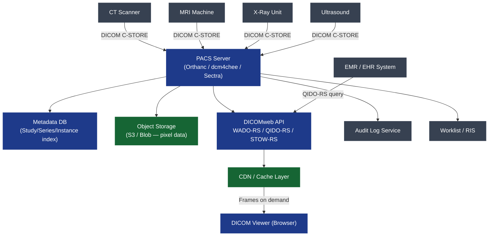
```mermaid
flowchart TD
    classDef darkBlue fill:#1e3a8a,stroke:#1e3a8a,color:#ffffff
    classDef green fill:#166534,stroke:#166534,color:#ffffff
    classDef red fill:#991b1b,stroke:#991b1b,color:#ffffff
    classDef gray fill:#374151,stroke:#374151,color:#ffffff
    classDef orange fill:#92400e,stroke:#92400e,color:#ffffff

    CT["CT Scanner"]:::gray
    MRI["MRI Machine"]:::gray
    XR["X-Ray Unit"]:::gray
    US["Ultrasound"]:::gray

    PACS["PACS Server\n(Orthanc / dcm4chee / Sectra)"]:::darkBlue
    META["Metadata DB\n(Study/Series/Instance index)"]:::darkBlue
    OBJ["Object Storage\n(S3 / Blob — pixel data)"]:::green
    WADORI["DICOMweb API\nWADO-RS / QIDO-RS / STOW-RS"]:::darkBlue
    CDN["CDN / Cache Layer"]:::green
    VIEWER["DICOM Viewer (Browser)"]:::darkBlue
    EMR["EMR / EHR System"]:::gray
    AUDIT["Audit Log Service"]:::gray
    WORKLIST["Worklist / RIS"]:::gray

    CT -->|"DICOM C-STORE"| PACS
    MRI -->|"DICOM C-STORE"| PACS
    XR -->|"DICOM C-STORE"| PACS
    US -->|"DICOM C-STORE"| PACS
    PACS --> META
    PACS --> OBJ
    PACS --> WADORI
    WADORI --> CDN
    CDN -->|"Frames on demand"| VIEWER
    EMR -->|"QIDO-RS query"| WADORI
    PACS --> AUDIT
    PACS --> WORKLIST
```

---

## 1.3 PACS ↔ Viewer Interaction Sequence

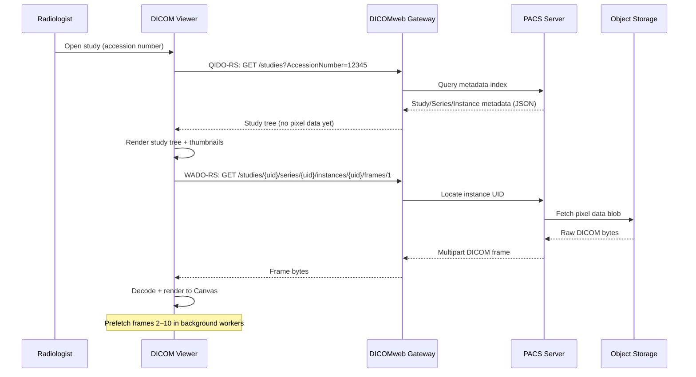
```mermaid
sequenceDiagram
    participant RAD as Radiologist
    participant VW as DICOM Viewer
    participant GW as DICOMweb Gateway
    participant PACS as PACS Server
    participant OBJ as Object Storage

    RAD->>VW: Open study (accession number)
    VW->>GW: QIDO-RS: GET /studies?AccessionNumber=12345
    GW->>PACS: Query metadata index
    PACS-->>GW: Study/Series/Instance metadata (JSON)
    GW-->>VW: Study tree (no pixel data yet)
    VW->>VW: Render study tree + thumbnails
    VW->>GW: WADO-RS: GET /studies/{uid}/series/{uid}/instances/{uid}/frames/1
    GW->>PACS: Locate instance UID
    PACS->>OBJ: Fetch pixel data blob
    OBJ-->>PACS: Raw DICOM bytes
    PACS-->>GW: Multipart DICOM frame
    GW-->>VW: Frame bytes
    VW->>VW: Decode + render to Canvas
    Note over VW: Prefetch frames 2–10 in background workers
```

---

## 1.4 Study → Series → Instance Hierarchy

DICOM organizes imaging data in a strict 4-level hierarchy. The viewer must navigate this hierarchy to load pixel data efficiently.

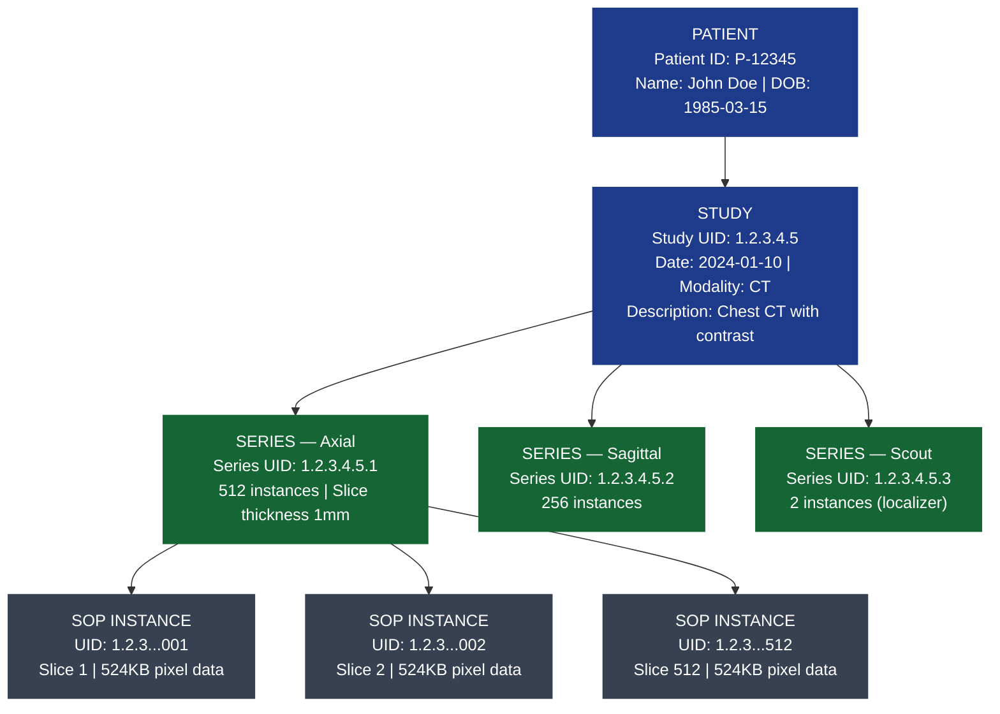
```mermaid
flowchart TD
    classDef darkBlue fill:#1e3a8a,stroke:#1e3a8a,color:#ffffff
    classDef green fill:#166534,stroke:#166534,color:#ffffff
    classDef gray fill:#374151,stroke:#374151,color:#ffffff

    PAT["PATIENT\nPatient ID: P-12345\nName: John Doe | DOB: 1985-03-15"]:::darkBlue
    STU["STUDY\nStudy UID: 1.2.3.4.5\nDate: 2024-01-10 | Modality: CT\nDescription: Chest CT with contrast"]:::darkBlue
    SER1["SERIES — Axial\nSeries UID: 1.2.3.4.5.1\n512 instances | Slice thickness 1mm"]:::green
    SER2["SERIES — Sagittal\nSeries UID: 1.2.3.4.5.2\n256 instances"]:::green
    SER3["SERIES — Scout\nSeries UID: 1.2.3.4.5.3\n2 instances (localizer)"]:::green
    I1["SOP INSTANCE\nUID: 1.2.3...001\nSlice 1 | 524KB pixel data"]:::gray
    I2["SOP INSTANCE\nUID: 1.2.3...002\nSlice 2 | 524KB pixel data"]:::gray
    IN["SOP INSTANCE\nUID: 1.2.3...512\nSlice 512 | 524KB pixel data"]:::gray

    PAT --> STU
    STU --> SER1
    STU --> SER2
    STU --> SER3
    SER1 --> I1
    SER1 --> I2
    SER1 --> IN
```

| Level | Represents | Unique Identifier | Typical Count |
|-------|-----------|------------------|---------------|
| Patient | A person in the system | Patient ID (MRN) | 1 per person |
| Study | A single exam visit (CT Chest 2024-01-10) | Study Instance UID | 1+ per patient |
| Series | A set of related images (axial stack) | Series Instance UID | 1–20 per study |
| SOP Instance | A single image frame | SOP Instance UID | 1–2000+ per series |

**Why this hierarchy matters for the viewer:**
- Metadata for the entire study tree (~50KB JSON) loads first — enables rendering the worklist panel before any pixel data arrives
- Pixel data is fetched per SOP Instance UID via WADO-RS — one HTTP request per frame
- A CT with 3 series × 512 slices = 1,536 separate WADO-RS endpoints to manage

---

## 1.5 Backend Storage Model

### Why Metadata is Separated from Pixel Data

| Data Type | Size per Instance | Access Pattern | Correct Storage |
|-----------|-----------------|---------------|----------------|
| Metadata (tags: patient, modality, pixel dimensions, windowing defaults) | 1–50 KB | Frequent, queried and filtered | Relational DB (PostgreSQL) or document DB |
| Pixel Data (raw image bytes) | 100 KB – 50 MB | Streamed on demand, one frame at a time | Object storage (S3, Azure Blob) |

**Why pixel data must NOT live in the database:**
1. A CT study = 512 slices × ~512 KB = ~262 MB — storing this in DB rows is catastrophically expensive
2. Object storage (S3) supports HTTP byte-range requests, enabling efficient per-frame streaming
3. CDN can cache S3 responses per frame key — DB queries cannot be CDN-cached
4. Databases are optimized for small, indexed records; binary blob reads block connection threads

### Backend Entity Model

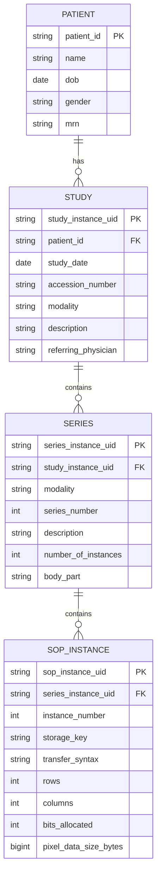
```mermaid
erDiagram
    PATIENT {
        string patient_id PK
        string name
        date dob
        string gender
        string mrn
    }
    STUDY {
        string study_instance_uid PK
        string patient_id FK
        date study_date
        string accession_number
        string modality
        string description
        string referring_physician
    }
    SERIES {
        string series_instance_uid PK
        string study_instance_uid FK
        string modality
        int series_number
        string description
        int number_of_instances
        string body_part
    }
    SOP_INSTANCE {
        string sop_instance_uid PK
        string series_instance_uid FK
        int instance_number
        string storage_key
        string transfer_syntax
        int rows
        int columns
        int bits_allocated
        bigint pixel_data_size_bytes
    }
    PATIENT ||--o{ STUDY : "has"
    STUDY ||--o{ SERIES : "contains"
    SERIES ||--o{ SOP_INSTANCE : "contains"
```

**Key fields:**
- `storage_key` — the object storage path (`s3://dicom-bucket/studies/1.2.3/instances/1.2.3.512.dcm`). This is the only link to pixel data.
- `transfer_syntax` — determines compression codec (JPEG 2000 Lossless, JPEG Baseline, RLE, Uncompressed). The viewer's decoder must negotiate this.
- `rows` / `columns` / `bits_allocated` — needed to pre-allocate the correct ImageData buffer size before streaming begins.

---

## 1.6 Backend Storage Architecture Diagram

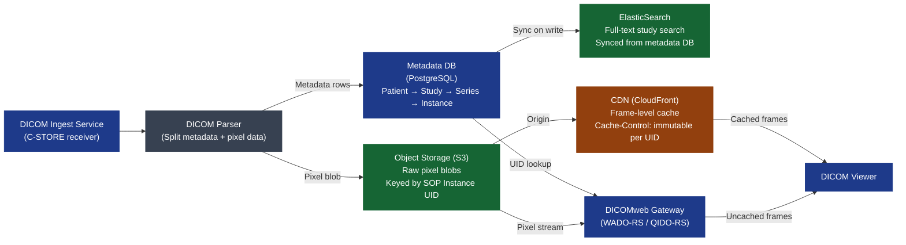
```mermaid
flowchart LR
    classDef darkBlue fill:#1e3a8a,stroke:#1e3a8a,color:#ffffff
    classDef green fill:#166534,stroke:#166534,color:#ffffff
    classDef gray fill:#374151,stroke:#374151,color:#ffffff
    classDef orange fill:#92400e,stroke:#92400e,color:#ffffff

    INGEST["DICOM Ingest Service\n(C-STORE receiver)"]:::darkBlue
    PARSE["DICOM Parser\n(Split metadata + pixel data)"]:::gray
    META["Metadata DB\n(PostgreSQL)\nPatient → Study → Series → Instance"]:::darkBlue
    PIXSTORE["Object Storage (S3)\nRaw pixel blobs\nKeyed by SOP Instance UID"]:::green
    INDEX["ElasticSearch\nFull-text study search\nSynced from metadata DB"]:::green
    CDN["CDN (CloudFront)\nFrame-level cache\nCache-Control: immutable per UID"]:::orange
    WADOGW["DICOMweb Gateway\n(WADO-RS / QIDO-RS)"]:::darkBlue
    VIEWER["DICOM Viewer"]:::darkBlue

    INGEST --> PARSE
    PARSE -->|"Metadata rows"| META
    PARSE -->|"Pixel blob"| PIXSTORE
    META -->|"Sync on write"| INDEX
    PIXSTORE -->|"Origin"| CDN
    META -->|"UID lookup"| WADOGW
    PIXSTORE -->|"Pixel stream"| WADOGW
    CDN -->|"Cached frames"| VIEWER
    WADOGW -->|"Uncached frames"| VIEWER
```

---

## 1.7 Metadata vs Pixel Data Separation Diagram

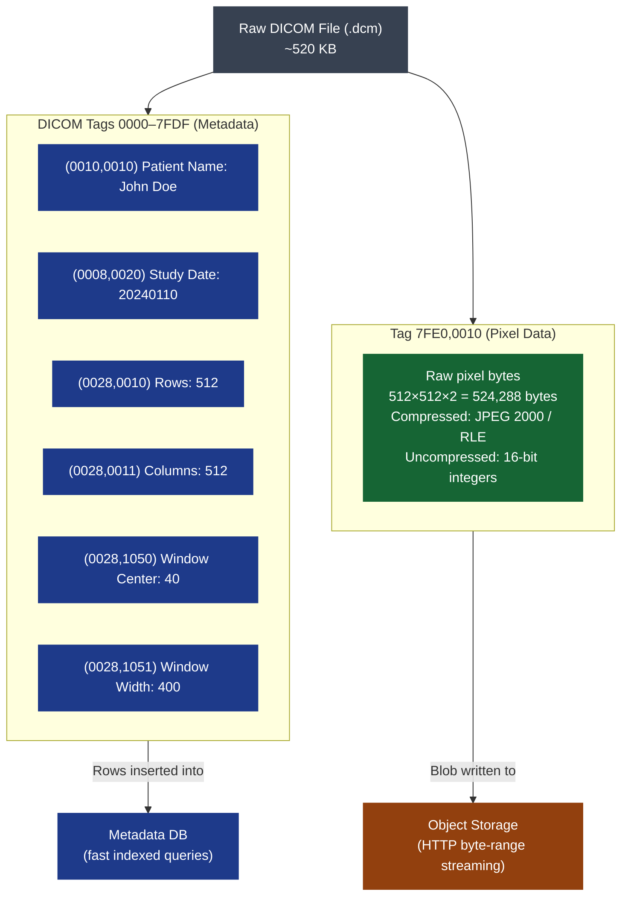
```mermaid
flowchart TD
    classDef darkBlue fill:#1e3a8a,stroke:#1e3a8a,color:#ffffff
    classDef green fill:#166534,stroke:#166534,color:#ffffff
    classDef gray fill:#374151,stroke:#374151,color:#ffffff
    classDef orange fill:#92400e,stroke:#92400e,color:#ffffff

    DICOM["Raw DICOM File (.dcm)\n~520 KB"]:::gray

    subgraph METABLOCK["DICOM Tags 0000–7FDF (Metadata)"]
        T1["(0010,0010) Patient Name: John Doe"]:::darkBlue
        T2["(0008,0020) Study Date: 20240110"]:::darkBlue
        T3["(0028,0010) Rows: 512"]:::darkBlue
        T4["(0028,0011) Columns: 512"]:::darkBlue
        T5["(0028,1050) Window Center: 40"]:::darkBlue
        T6["(0028,1051) Window Width: 400"]:::darkBlue
    end

    subgraph PIXBLOCK["Tag 7FE0,0010 (Pixel Data)"]
        PIX["Raw pixel bytes\n512×512×2 = 524,288 bytes\nCompressed: JPEG 2000 / RLE\nUncompressed: 16-bit integers"]:::green
    end

    DICOM --> METABLOCK
    DICOM --> PIXBLOCK
    METABLOCK -->|"Rows inserted into"| METADB["Metadata DB\n(fast indexed queries)"]:::darkBlue
    PIXBLOCK -->|"Blob written to"| OBJSTORE["Object Storage\n(HTTP byte-range streaming)"]:::orange
```

---

## 1.8 Pixel Data Deep Dive

**What Pixel Data means in DICOM:**

DICOM Pixel Data (tag `7FE0,0010`) is the raw binary representation of the medical image. Unlike a JPEG photo, it:
- Uses 12–16 bits per pixel (encodes Hounsfield Units for CT, signal intensity for MRI — not RGB color)
- Can be multi-frame (a single DICOM instance can contain hundreds of frames, e.g., ultrasound cine loops)
- Uses modality-specific compression (CT uses lossless JPEG 2000, ultrasound may use MPEG-4)
- Requires **windowing** before display — raw pixel values are not directly renderable

**Compressed vs Uncompressed Transfer Syntaxes:**

| Transfer Syntax UID | Compression | Relative Size | Use Case |
|--------------------|------------|---------------|----------|
| 1.2.840.10008.1.2 (Implicit VR LE) | None | 100% (largest) | Raw CT/MRI archive |
| 1.2.840.10008.1.2.4.90 (JPEG 2000 Lossless) | Lossless | ~50% | Archival CT (preferred) |
| 1.2.840.10008.1.2.4.51 (JPEG Baseline) | Lossy | ~10% | Thumbnails only |
| 1.2.840.10008.1.2.5 (RLE Lossless) | Lossless RLE | ~70% | X-ray |

**Why rendering is expensive:**
1. **Decompress** — JPEG 2000 decode is CPU-intensive (no native browser support; requires WASM codec)
2. **Window/Level transform** — every pixel goes through: `display = clamp((px - (center - width/2)) / width × 255, 0, 255)`
3. **16-bit → 8-bit RGBA** — browsers only accept 8-bit RGBA in `ImageData`; must convert all 262,144 pixels
4. **putImageData / GPU upload** — transferring the full frame buffer to GPU memory

At 60fps scroll: ~15 million arithmetic operations per second, per viewport — this is why Web Workers and WebGL are non-negotiable.

---

## 1.9 Frontend Rendering Pipeline Diagram

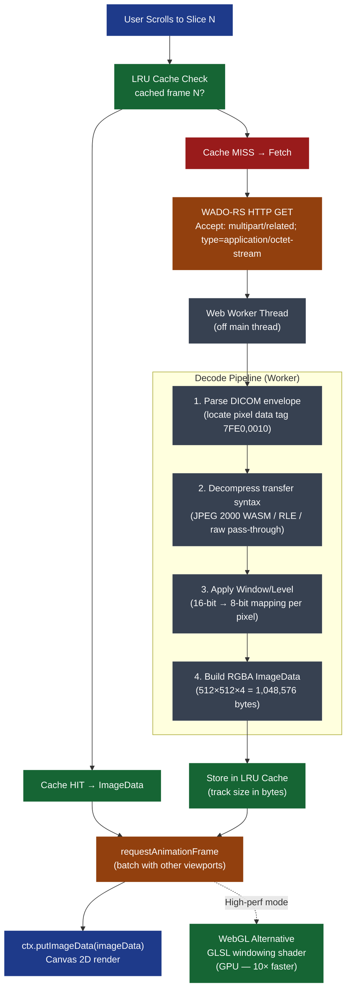
```mermaid
flowchart TD
    classDef darkBlue fill:#1e3a8a,stroke:#1e3a8a,color:#ffffff
    classDef green fill:#166534,stroke:#166534,color:#ffffff
    classDef gray fill:#374151,stroke:#374151,color:#ffffff
    classDef orange fill:#92400e,stroke:#92400e,color:#ffffff
    classDef red fill:#991b1b,stroke:#991b1b,color:#ffffff

    SCROLL["User Scrolls to Slice N"]:::darkBlue
    CACHE["LRU Cache Check\ncached frame N?"]:::green
    HIT["Cache HIT → ImageData"]:::green
    MISS["Cache MISS → Fetch"]:::red
    FETCH["WADO-RS HTTP GET\nAccept: multipart/related; type=application/octet-stream"]:::orange
    WORKER["Web Worker Thread\n(off main thread)"]:::gray

    subgraph DECODE["Decode Pipeline (Worker)"]
        D1["1. Parse DICOM envelope\n(locate pixel data tag 7FE0,0010)"]:::gray
        D2["2. Decompress transfer syntax\n(JPEG 2000 WASM / RLE / raw pass-through)"]:::gray
        D3["3. Apply Window/Level\n(16-bit → 8-bit mapping per pixel)"]:::gray
        D4["4. Build RGBA ImageData\n(512×512×4 = 1,048,576 bytes)"]:::gray
    end

    STORE["Store in LRU Cache\n(track size in bytes)"]:::green
    RAF["requestAnimationFrame\n(batch with other viewports)"]:::orange
    CANVAS["ctx.putImageData(imageData)\nCanvas 2D render"]:::darkBlue
    WEBGL["WebGL Alternative\nGLSL windowing shader\n(GPU — 10× faster)"]:::green

    SCROLL --> CACHE
    CACHE --> HIT
    CACHE --> MISS
    MISS --> FETCH
    FETCH --> WORKER
    WORKER --> D1 --> D2 --> D3 --> D4
    D4 --> STORE
    HIT --> RAF
    STORE --> RAF
    RAF --> CANVAS
    RAF -.->|"High-perf mode"| WEBGL
```

**Why Canvas/WebGL instead of `` tags:**

| Approach | 16-bit Support | Windowing | Pixel Control | Performance |
|----------|---------------|-----------|--------------|-------------|
| `` tag | None | None | None | No control |
| Canvas 2D | Via TypedArray | Manual per-pixel | Full | Good |
| WebGL GLSL | Via texture | GPU shader | Full | Best (GPU-accelerated) |

An `` tag cannot accept 16-bit pixel data, apply real-time windowing, handle DICOM-specific compression, or synchronize frame-by-frame scrolling at 60fps.

---

## 1.10 Multi-Viewport Synchronization Diagram

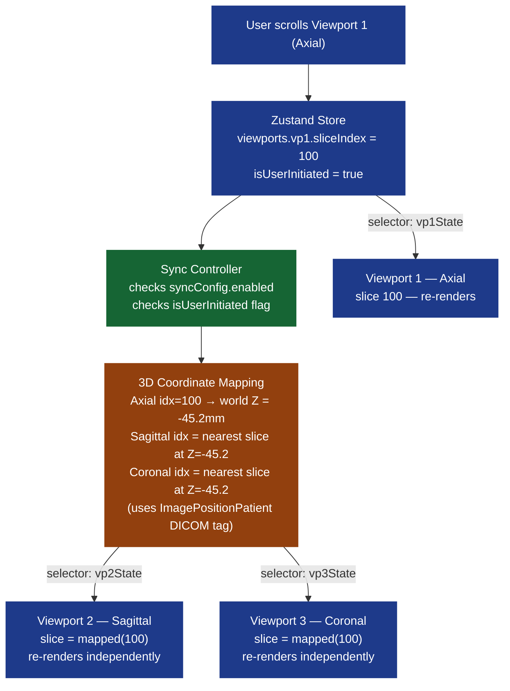
```mermaid
flowchart TD
    classDef darkBlue fill:#1e3a8a,stroke:#1e3a8a,color:#ffffff
    classDef green fill:#166534,stroke:#166534,color:#ffffff
    classDef gray fill:#374151,stroke:#374151,color:#ffffff
    classDef orange fill:#92400e,stroke:#92400e,color:#ffffff

    USER["User scrolls Viewport 1 (Axial)"]:::darkBlue
    STORE["Zustand Store\nviewports.vp1.sliceIndex = 100\nisUserInitiated = true"]:::darkBlue
    SYNC["Sync Controller\nchecks syncConfig.enabled\nchecks isUserInitiated flag"]:::green
    VP1["Viewport 1 — Axial\nslice 100 — re-renders"]:::darkBlue
    MAP["3D Coordinate Mapping\nAxial idx=100 → world Z = -45.2mm\nSagittal idx = nearest slice at Z=-45.2\nCoronal idx = nearest slice at Z=-45.2\n(uses ImagePositionPatient DICOM tag)"]:::orange
    VP2["Viewport 2 — Sagittal\nslice = mapped(100)\nre-renders independently"]:::darkBlue
    VP3["Viewport 3 — Coronal\nslice = mapped(100)\nre-renders independently"]:::darkBlue

    USER --> STORE
    STORE -->|"selector: vp1State"| VP1
    STORE --> SYNC
    SYNC --> MAP
    MAP -->|"selector: vp2State"| VP2
    MAP -->|"selector: vp3State"| VP3
```

**Why 3D coordinate mapping is needed:**
Axial, sagittal, and coronal series have different image orientations and potentially different slice spacing. DICOM tag `ImagePositionPatient` (0020,0032) encodes the 3D world coordinates of each slice origin. Mapping axial slice 100 to sagittal requires finding the sagittal slice whose world-space position most closely intersects the axial plane — it is not a simple index-to-index mapping.

**Preventing infinite sync loops:**
Only user-initiated slice changes propagate to other viewports. The `isSync: true` flag in dispatched actions marks sync-derived updates, and the Sync Controller ignores events with this flag — preventing VP2 from triggering a re-sync back to VP1.

---

## 1.11 Image Prefetching Flow

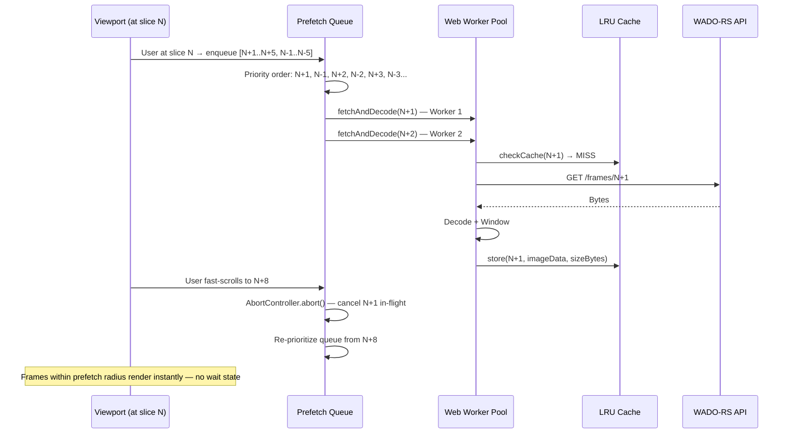
```mermaid
sequenceDiagram
    participant VP as Viewport (at slice N)
    participant PQ as Prefetch Queue
    participant WW as Web Worker Pool
    participant LRU as LRU Cache
    participant API as WADO-RS API

    VP->>PQ: User at slice N → enqueue [N+1..N+5, N-1..N-5]
    PQ->>PQ: Priority order: N+1, N-1, N+2, N-2, N+3, N-3...
    PQ->>WW: fetchAndDecode(N+1) — Worker 1
    PQ->>WW: fetchAndDecode(N+2) — Worker 2
    WW->>LRU: checkCache(N+1) → MISS
    WW->>API: GET /frames/N+1
    API-->>WW: Bytes
    WW->>WW: Decode + Window
    WW->>LRU: store(N+1, imageData, sizeBytes)
    VP->>PQ: User fast-scrolls to N+8
    PQ->>PQ: AbortController.abort() — cancel N+1 in-flight
    PQ->>PQ: Re-prioritize queue from N+8
    Note over VP: Frames within prefetch radius render instantly — no wait state
```

**Prefetch rules:**
- Radius: 5 slices ahead + 5 behind (configurable per study size)
- Max concurrent WADO-RS requests: 3 (avoids saturating the HTTP/2 connection)
- On fast scroll: abort requests for frames more than 10 positions behind current slice
- On LRU eviction pressure: cancel the lowest-priority prefetch before evicting a cached frame

---

## 1.12 Viewer Architecture Diagram

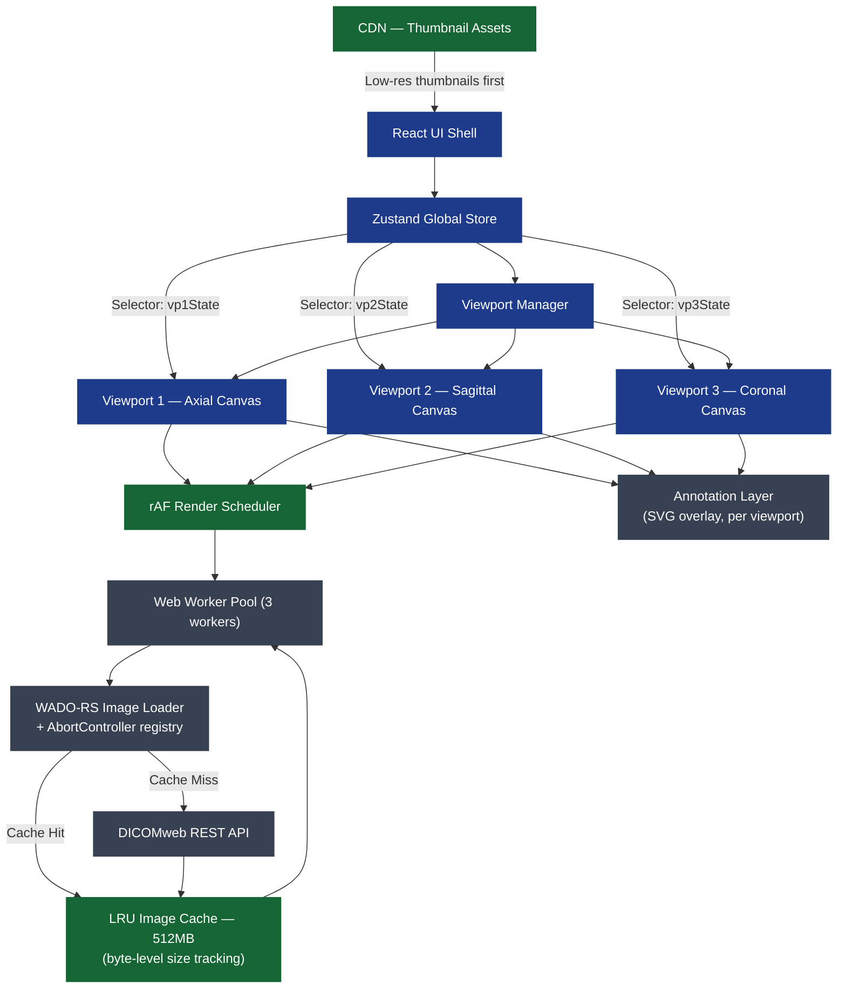
```mermaid
flowchart TD
    classDef darkBlue fill:#1e3a8a,stroke:#1e3a8a,color:#ffffff
    classDef green fill:#166534,stroke:#166534,color:#ffffff
    classDef red fill:#991b1b,stroke:#991b1b,color:#ffffff
    classDef gray fill:#374151,stroke:#374151,color:#ffffff

    UI["React UI Shell"]:::darkBlue
    ZS["Zustand Global Store"]:::darkBlue
    VPM["Viewport Manager"]:::darkBlue
    VP1["Viewport 1 — Axial Canvas"]:::darkBlue
    VP2["Viewport 2 — Sagittal Canvas"]:::darkBlue
    VP3["Viewport 3 — Coronal Canvas"]:::darkBlue
    RAF["rAF Render Scheduler"]:::green
    WW["Web Worker Pool (3 workers)"]:::gray
    IL["WADO-RS Image Loader\n+ AbortController registry"]:::gray
    LRU["LRU Image Cache — 512MB\n(byte-level size tracking)"]:::green
    API["DICOMweb REST API"]:::gray
    CDN["CDN — Thumbnail Assets"]:::green
    AN["Annotation Layer\n(SVG overlay, per viewport)"]:::gray

    UI --> ZS
    ZS -->|"Selector: vp1State"| VP1
    ZS -->|"Selector: vp2State"| VP2
    ZS -->|"Selector: vp3State"| VP3
    ZS --> VPM
    VPM --> VP1 & VP2 & VP3
    VP1 & VP2 & VP3 --> RAF
    RAF --> WW
    WW --> IL
    IL -->|"Cache Hit"| LRU
    IL -->|"Cache Miss"| API
    API --> LRU
    LRU --> WW
    CDN -->|"Low-res thumbnails first"| UI
    VP1 & VP2 & VP3 --> AN
```

---

## 1.13 Frontend State Management

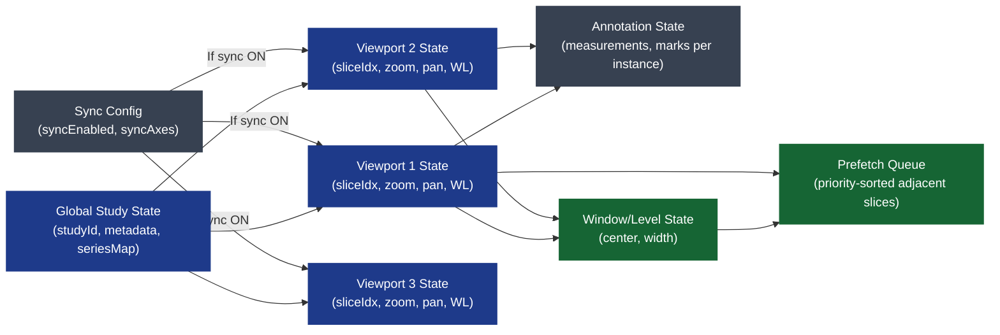
```mermaid
flowchart LR
    classDef darkBlue fill:#1e3a8a,stroke:#1e3a8a,color:#ffffff
    classDef green fill:#166534,stroke:#166534,color:#ffffff
    classDef gray fill:#374151,stroke:#374151,color:#ffffff

    GS["Global Study State\n(studyId, metadata, seriesMap)"]:::darkBlue
    SYN["Sync Config\n(syncEnabled, syncAxes)"]:::gray
    VS1["Viewport 1 State\n(sliceIdx, zoom, pan, WL)"]:::darkBlue
    VS2["Viewport 2 State\n(sliceIdx, zoom, pan, WL)"]:::darkBlue
    VS3["Viewport 3 State\n(sliceIdx, zoom, pan, WL)"]:::darkBlue
    AN["Annotation State\n(measurements, marks per instance)"]:::gray
    WL["Window/Level State\n(center, width)"]:::green
    PRE["Prefetch Queue\n(priority-sorted adjacent slices)"]:::green

    GS --> VS1 & VS2 & VS3
    SYN -->|"If sync ON"| VS1 & VS2 & VS3
    VS1 & VS2 --> WL
    VS1 & VS2 --> AN
    WL --> PRE
    VS1 --> PRE
```

**Why Zustand over React Context:**

| Concern | React Context | Zustand |
|---------|-------------|---------|
| Re-render scope | Entire Consumer subtree | Only components using the changed selector |
| Viewport isolation | All 3 viewports re-render on any scroll | Only the scrolled viewport re-renders |
| Boilerplate | Provider + useContext per slice | `useStore(selector)` anywhere |
| Performance | Requires `memo()` workarounds | Automatic via selectors |

```js
// Only Viewport 1 re-renders when its slice changes
const vp1State = useViewerStore(state => state.viewports['vp1'])
```

---

## 1.14 Performance Optimization

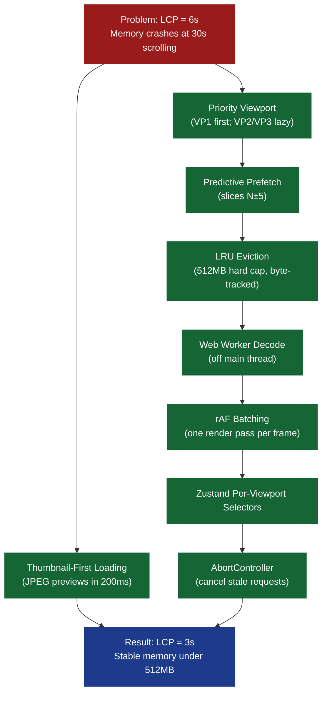
```mermaid
flowchart TD
    classDef green fill:#166534,stroke:#166534,color:#ffffff
    classDef darkBlue fill:#1e3a8a,stroke:#1e3a8a,color:#ffffff
    classDef red fill:#991b1b,stroke:#991b1b,color:#ffffff

    PROB["Problem: LCP = 6s\nMemory crashes at 30s scrolling"]:::red
    TH["Thumbnail-First Loading\n(JPEG previews in 200ms)"]:::green
    PV["Priority Viewport\n(VP1 first; VP2/VP3 lazy)"]:::green
    PRE["Predictive Prefetch\n(slices N±5)"]:::green
    LRU["LRU Eviction\n(512MB hard cap, byte-tracked)"]:::green
    WW["Web Worker Decode\n(off main thread)"]:::green
    RAF["rAF Batching\n(one render pass per frame)"]:::green
    SEL["Zustand Per-Viewport Selectors"]:::green
    ABORT["AbortController\n(cancel stale requests)"]:::green
    SOL["Result: LCP = 3s\nStable memory under 512MB"]:::darkBlue

    PROB --> TH & PV
    TH --> SOL
    PV --> PRE --> LRU --> WW --> RAF --> SEL --> ABORT --> SOL
```

**Preventing memory leaks — the full checklist:**

| Risk | Cause | Prevention |
|------|-------|-----------|
| Unbounded LRU growth | Never evicting decoded frames | Hard byte-limit; evict on every insert when over budget |
| Canvas GPU memory leak | Not releasing canvas on unmount | `canvas.width = 0` on unmount forces GPU deallocation |
| Worker memory leak | Keeping buffers in worker scope | Transfer `ImageData` back via `Transferable` (zero-copy ownership transfer) |
| In-flight request leak | Not aborting stale WADO-RS calls | `AbortController` keyed per (viewportId, sliceIndex) |
| Event listener leak | Not removing scroll handlers | Explicit cleanup in `useEffect` return |

| Optimization | Before | After | Technique |
|-------------|--------|-------|-----------|
| LCP | 6s | 3s | Thumbnail-first + priority viewport |
| Scroll FPS | 12fps | 60fps | Canvas + rAF + Web Worker decode |
| Memory | Unbounded crash | 512MB stable | LRU cache with byte tracking |
| Re-renders per scroll | All viewports | 1 viewport | Zustand per-viewport selectors |
| Initial payload | 50MB images | 2MB thumbnails | Progressive loading |

---

## 1.15 Edge Cases & Failure Handling

| Scenario | Problem | Solution |
|----------|---------|----------|
| Network timeout on DICOM frame | Viewport shows nothing | Loading skeleton; retry 3× with exponential backoff |
| Memory pressure >512MB | Browser OOM crash | LRU eviction — oldest frames ejected first |
| Corrupt DICOM frame | Worker throws decode error | Error overlay on that viewport only; other viewports unaffected |
| Fast scroll | Frames arrive out of order | 50ms debounce + AbortController cancels skipped-slice requests |
| Viewport resize | Canvas distortion | ResizeObserver triggers canvas re-init and re-render |
| Sync causes cascade loop | VP1 syncs VP2 which syncs VP1 | `isSync` flag on action; Sync Controller ignores it |
| PACS returns wrong transfer syntax | Decoder fails silently | Negotiate transfer syntax via `Accept` header in WADO-RS request |
| Multi-frame DICOM instance | Frame offset not found | Parse multi-frame metadata; seek to correct byte offset per frame index |

---

## 1.16 Image Viewer Tradeoffs

| Decision | Chosen | Alternative | Why |
|----------|--------|-------------|-----|
| Canvas vs DOM/SVG | Canvas | DOM image elements | DOM cannot handle per-pixel windowing or 16-bit data |
| WebGL vs Canvas 2D | Canvas 2D (WebGL optional) | WebGL-only | Canvas 2D is simpler; WebGL for GPU windowing when needed |
| Zustand vs Redux | Zustand | Redux Toolkit | Redux too verbose; Zustand selectors isolate per-viewport re-renders |
| LRU cap at 512MB | Fixed 512MB | Dynamic sizing | Predictable memory bound; dynamic sizing is complex to tune |
| Web Workers for decode | Workers | Main thread | Decode operations freeze the UI if on main thread |
| WADO-RS vs base64 | WADO-RS | Inline base64 | WADO-RS streams frames individually; base64 inflates payload 33% |
| Thumbnail-first | Yes | Wait for full-res | Reduces perceived LCP from 6s to <1s |

---

---

## PART B — DICOM DOCUMENT VIEWER SYSTEM

---

## 1.17 Document Viewer Overview

DICOM is not just for images. The standard defines **Encapsulated Document Storage SOP Classes** that embed non-image medical documents as DICOM files. These require an entirely different rendering pipeline.

| Document Type | DICOM SOP Class UID | Examples |
|--------------|--------------------|---------||
| Encapsulated PDF | 1.2.840.10008.5.1.4.1.1.104.1 | Radiology reports, discharge summaries |
| CDA Document | 1.2.840.10008.5.1.4.1.1.104.2 | Clinical Document Architecture |
| Structured Report | 1.2.840.10008.5.1.4.1.1.88.* | Coded radiology findings (SR) |
| Encapsulated STL | 1.2.840.10008.5.1.4.1.1.104.3 | 3D print models |

**How PDFs are embedded in DICOM:**
A DICOM Encapsulated PDF file contains standard DICOM metadata tags plus:
- Tag `(0042,0011)` Encapsulated Document — the raw PDF bytes
- Tag `(0042,0012)` MIME Type = `application/pdf`
- Tag `(0008,0016)` SOP Class UID = `1.2.840.10008.5.1.4.1.1.104.1`

The DICOMweb gateway extracts tag `(0042,0011)` and serves the PDF bytes directly to the browser.

---

## 1.18 Document Viewer vs Image Viewer: Core Differences

| Aspect | Image Viewer | Document Viewer |
|--------|-------------|----------------|
| Data format | 12–16 bit DICOM pixel data | PDF / CDA bytes |
| Rendering engine | Canvas/WebGL + custom decode | PDF.js page rasterizer |
| Primary navigation | Frame/slice scroll (1000s of slices) | Page navigation (10–500 pages) |
| Zoom model | Pixel interpolation (bilinear/nearest) | Vector/font scaling (lossless) |
| Full-text search | Impossible | Full-text via `getTextContent()` |
| Memory profile | 512MB+ per open study | ~20–50MB (virtualized pages) |
| GPU dependency | Yes (windowing shaders) | Rarely (text is vector) |
| Cache key | (studyUID, seriesUID, frameIndex) | (documentUID, pageNumber) |
| Rendering bottleneck | Pixel decode + windowing | PDF parse + page layout engine |
| Worker responsibility | DICOM decode, windowing | PDF.js parse + rasterization |

---

## 1.19 DICOM Encapsulated PDF Retrieval Sequence

```mermaid
sequenceDiagram
    participant UI as Document Viewer
    participant GW as DICOMweb Gateway
    participant PACS as PACS / Doc Store
    participant OBJ as Object Storage

    UI->>GW: WADO-RS GET /instances/{uid}
    Note right of GW: Accept: application/octet-stream
    GW->>PACS: Lookup instance by SOP UID
    PACS->>OBJ: Fetch encapsulated document blob
    OBJ-->>PACS: Raw DICOM file (PDF embedded in tag 0042,0011)
    PACS-->>GW: DICOM file bytes
    GW->>GW: Extract tag (0042,0011) — PDF bytes only
    GW-->>UI: PDF bytes (Content-Type: application/pdf)
    UI->>UI: Pass to PDF.js worker for parsing
    UI->>UI: Render page 1 immediately; virtualize rest
```

---

## 1.20 Backend Storage for Documents

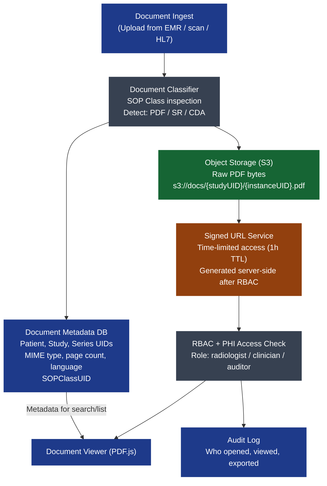
```mermaid
flowchart TD
    classDef darkBlue fill:#1e3a8a,stroke:#1e3a8a,color:#ffffff
    classDef green fill:#166534,stroke:#166534,color:#ffffff
    classDef gray fill:#374151,stroke:#374151,color:#ffffff
    classDef orange fill:#92400e,stroke:#92400e,color:#ffffff

    INGEST["Document Ingest\n(Upload from EMR / scan / HL7)"]:::darkBlue
    CLASSIFY["Document Classifier\nSOP Class inspection\nDetect: PDF / SR / CDA"]:::gray
    META["Document Metadata DB\nPatient, Study, Series UIDs\nMIME type, page count, language\nSOPClassUID"]:::darkBlue
    BLOB["Object Storage (S3)\nRaw PDF bytes\ns3://docs/{studyUID}/{instanceUID}.pdf"]:::green
    SIGNED["Signed URL Service\nTime-limited access (1h TTL)\nGenerated server-side after RBAC"]:::orange
    RBAC["RBAC + PHI Access Check\nRole: radiologist / clinician / auditor"]:::gray
    VIEWER["Document Viewer (PDF.js)"]:::darkBlue
    AUDIT["Audit Log\nWho opened, viewed, exported"]:::darkBlue

    INGEST --> CLASSIFY
    CLASSIFY --> META & BLOB
    BLOB --> SIGNED
    SIGNED --> RBAC
    RBAC --> VIEWER & AUDIT
    META -->|"Metadata for search/list"| VIEWER
```

**Signed URLs for document access:**
- Raw S3 bucket URLs must never be exposed — documents contain PHI
- Generate time-limited signed URLs server-side only after verifying RBAC
- URL TTL: 1 hour (configurable per document sensitivity level)
- Browser streams PDF directly from S3 via signed URL — no server bandwidth consumed

---

## 1.21 Document Rendering Pipeline Diagram

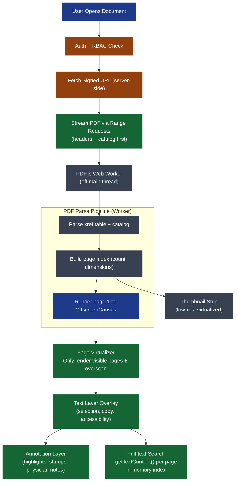
```mermaid
flowchart TD
    classDef darkBlue fill:#1e3a8a,stroke:#1e3a8a,color:#ffffff
    classDef green fill:#166534,stroke:#166534,color:#ffffff
    classDef gray fill:#374151,stroke:#374151,color:#ffffff
    classDef orange fill:#92400e,stroke:#92400e,color:#ffffff

    USER["User Opens Document"]:::darkBlue
    AUTH["Auth + RBAC Check"]:::orange
    SIGNED["Fetch Signed URL (server-side)"]:::orange
    STREAM["Stream PDF via Range Requests\n(headers + catalog first)"]:::green
    WORKER["PDF.js Web Worker\n(off main thread)"]:::gray

    subgraph PARSE["PDF Parse Pipeline (Worker)"]
        P1["Parse xref table + catalog"]:::gray
        P2["Build page index (count, dimensions)"]:::gray
        P3["Render page 1 to OffscreenCanvas"]:::darkBlue
    end

    VIRT["Page Virtualizer\nOnly render visible pages ± overscan"]:::green
    TEXTLAYER["Text Layer Overlay\n(selection, copy, accessibility)"]:::green
    ANNOT["Annotation Layer\n(highlights, stamps, physician notes)"]:::green
    THUMB["Thumbnail Strip\n(low-res, virtualized)"]:::gray
    SEARCH["Full-text Search\ngetTextContent() per page\nin-memory index"]:::green

    USER --> AUTH --> SIGNED --> STREAM --> WORKER
    WORKER --> P1 --> P2 --> P3
    P3 --> VIRT --> TEXTLAYER --> ANNOT
    P2 --> THUMB
    TEXTLAYER --> SEARCH
```

---

## 1.22 PDF Virtualization Flow

For large medical documents (50+ pages), rendering all pages at once causes:
- Memory spike: each rendered page ≈ 1–4MB canvas buffer
- Main thread block: rasterizing 50 pages before showing page 1
- DOM bloat: 50 canvas elements cause heavy layout recalculation

**Solution: Page Virtualization + Worker Rasterization**

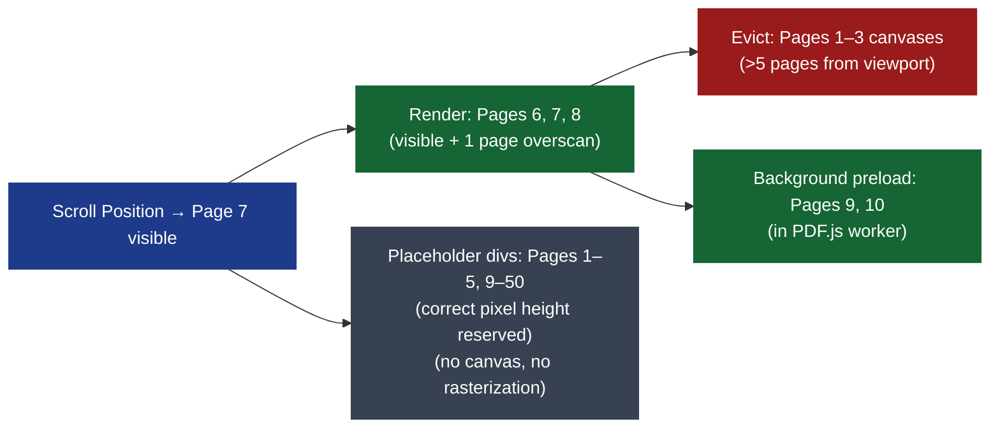
```mermaid
flowchart LR
    classDef darkBlue fill:#1e3a8a,stroke:#1e3a8a,color:#ffffff
    classDef green fill:#166534,stroke:#166534,color:#ffffff
    classDef gray fill:#374151,stroke:#374151,color:#ffffff
    classDef red fill:#991b1b,stroke:#991b1b,color:#ffffff

    SCROLL["Scroll Position → Page 7 visible"]:::darkBlue
    VISIBLE["Render: Pages 6, 7, 8\n(visible + 1 page overscan)"]:::green
    PLACEHOLDER["Placeholder divs: Pages 1–5, 9–50\n(correct pixel height reserved)\n(no canvas, no rasterization)"]:::gray
    EVICT["Evict: Pages 1–3 canvases\n(>5 pages from viewport)"]:::red
    PRELOAD["Background preload: Pages 9, 10\n(in PDF.js worker)"]:::green

    SCROLL --> VISIBLE & PLACEHOLDER
    VISIBLE --> EVICT & PRELOAD
```

**Worker-based rendering details:**
- PDF.js runs entirely in a `Worker` — parse and rasterize never block the main thread
- Each page renders to an `OffscreenCanvas` in the worker, transferred to main via `Transferable`
- `Transferable` objects (ArrayBuffer / ImageBitmap) allow zero-copy transfer — no memory doubling
- `getTextContent()` runs per page in the worker, building a searchable text index with position data

---

## 1.23 Document Viewer Performance

| Optimization | Technique | Impact |
|-------------|----------|--------|
| Lazy page loading | Virtualize; render only visible ± 1 overscan | 90% memory reduction for 50-page docs |
| Page virtualization | Placeholder divs maintain scroll height | Smooth scrollbar without rendering all pages |
| HTTP range requests | `Range: bytes=0-65535` — fetch headers first | Page 1 renders without waiting for full PDF download |
| Worker-based rendering | PDF.js in Web Worker | Main thread 0% blocked; UI stays at 60fps |
| Page canvas eviction | Drop canvases >5 pages from viewport | Stable memory <100MB for any document size |
| Thumbnail strip | Low-res page renders, separate queue | Fast overview navigation |
| Text content cache | Cache `getTextContent()` per page | Instant search after first load |

---

---

## PART C — UNIFIED HEALTHCARE VIEWER PLATFORM

---

## 1.24 Unified Platform Architecture

A production healthcare viewer exposes a single entry point that routes to the correct viewer based on the DICOM SOP Class of the content being requested.

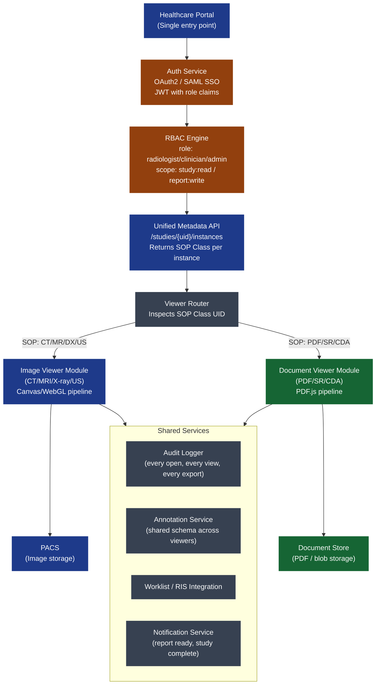
```mermaid
flowchart TD
    classDef darkBlue fill:#1e3a8a,stroke:#1e3a8a,color:#ffffff
    classDef green fill:#166534,stroke:#166534,color:#ffffff
    classDef gray fill:#374151,stroke:#374151,color:#ffffff
    classDef orange fill:#92400e,stroke:#92400e,color:#ffffff

    PORTAL["Healthcare Portal\n(Single entry point)"]:::darkBlue
    AUTH["Auth Service\nOAuth2 / SAML SSO\nJWT with role claims"]:::orange
    RBAC["RBAC Engine\nrole: radiologist/clinician/admin\nscope: study:read / report:write"]:::orange
    META["Unified Metadata API\n/studies/{uid}/instances\nReturns SOP Class per instance"]:::darkBlue
    ROUTER["Viewer Router\nInspects SOP Class UID"]:::gray
    IMG["Image Viewer Module\n(CT/MRI/X-ray/US)\nCanvas/WebGL pipeline"]:::darkBlue
    DOC["Document Viewer Module\n(PDF/SR/CDA)\nPDF.js pipeline"]:::green
    PACS2["PACS\n(Image storage)"]:::darkBlue
    DOCSTORE["Document Store\n(PDF / blob storage)"]:::green

    subgraph SHARED["Shared Services"]
        AUDIT2["Audit Logger\n(every open, every view, every export)"]:::gray
        ANNOT2["Annotation Service\n(shared schema across viewers)"]:::gray
        WORKLIST2["Worklist / RIS Integration"]:::gray
        NOTIFY["Notification Service\n(report ready, study complete)"]:::gray
    end

    PORTAL --> AUTH --> RBAC --> META --> ROUTER
    ROUTER -->|"SOP: CT/MR/DX/US"| IMG
    ROUTER -->|"SOP: PDF/SR/CDA"| DOC
    IMG --> PACS2 & SHARED
    DOC --> DOCSTORE & SHARED
```

---

## 1.25 Viewer Selection Routing Logic

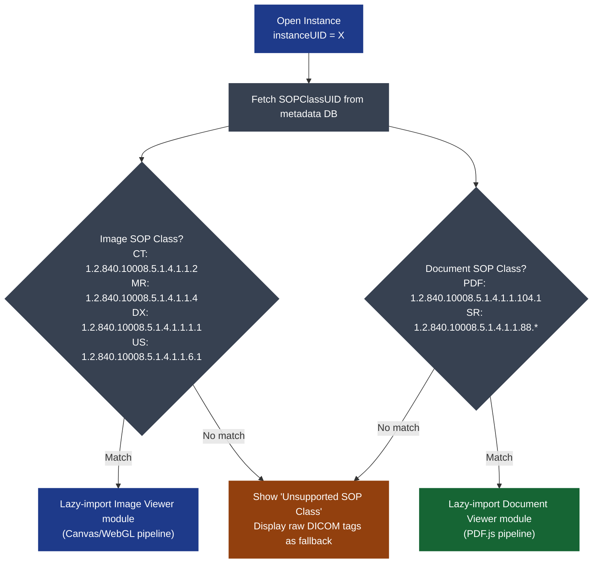
```mermaid
flowchart TD
    classDef darkBlue fill:#1e3a8a,stroke:#1e3a8a,color:#ffffff
    classDef green fill:#166534,stroke:#166534,color:#ffffff
    classDef gray fill:#374151,stroke:#374151,color:#ffffff
    classDef orange fill:#92400e,stroke:#92400e,color:#ffffff

    OPEN["Open Instance\ninstanceUID = X"]:::darkBlue
    FETCH["Fetch SOPClassUID from metadata DB"]:::gray
    IMG_CHECK{"Image SOP Class?\nCT: 1.2.840.10008.5.1.4.1.1.2\nMR: 1.2.840.10008.5.1.4.1.1.4\nDX: 1.2.840.10008.5.1.4.1.1.1.1\nUS: 1.2.840.10008.5.1.4.1.1.6.1"}:::gray
    DOC_CHECK{"Document SOP Class?\nPDF: 1.2.840.10008.5.1.4.1.1.104.1\nSR: 1.2.840.10008.5.1.4.1.1.88.*"}:::gray
    IV["Lazy-import Image Viewer module\n(Canvas/WebGL pipeline)"]:::darkBlue
    DV["Lazy-import Document Viewer module\n(PDF.js pipeline)"]:::green
    UNKNOWN["Show 'Unsupported SOP Class'\nDisplay raw DICOM tags as fallback"]:::orange

    OPEN --> FETCH --> IMG_CHECK & DOC_CHECK
    IMG_CHECK -->|"Match"| IV
    DOC_CHECK -->|"Match"| DV
    IMG_CHECK & DOC_CHECK -->|"No match"| UNKNOWN
```

---

## 1.26 Audit Logging & RBAC

HIPAA requires that every access to patient imaging data be logged in a tamper-proof audit trail.

**Required audit events:**
- `study_opened` — user, timestamp, patient ID, study UID
- `series_viewed` — which series was rendered (not just loaded)
- `frame_viewed` — for pixel-level audit (optional, high volume)
- `document_opened` — user, document UID, MIME type
- `export_attempted` / `export_denied` — whether export succeeded or was blocked by RBAC
- `annotation_created` / `annotation_deleted`

**RBAC roles:**

| Role | Study View | Report Write | Export | Delete | Manage Users |
|------|-----------|-------------|--------|--------|-------------|
| Radiologist | All | Yes | Yes | No | No |
| Clinician | Own patients | No | No | No | No |
| Technologist | All | No | No | No | No |
| Admin | All | No | Yes | Yes | Yes |
| Auditor | No | No | No | No | No (audit log read only) |

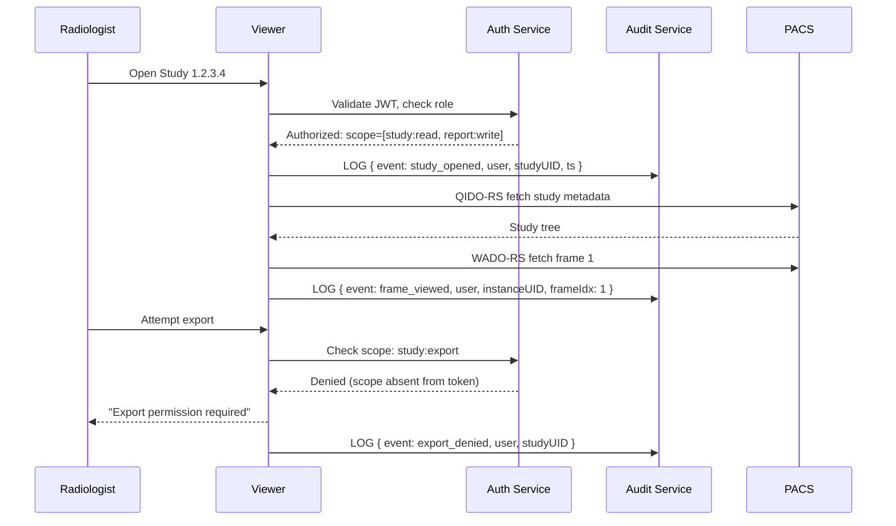
```mermaid
sequenceDiagram
    participant U as Radiologist
    participant VW as Viewer
    participant AUTH as Auth Service
    participant AUDIT as Audit Service
    participant PACS as PACS

    U->>VW: Open Study 1.2.3.4
    VW->>AUTH: Validate JWT, check role
    AUTH-->>VW: Authorized: scope=[study:read, report:write]
    VW->>AUDIT: LOG { event: study_opened, user, studyUID, ts }
    VW->>PACS: QIDO-RS fetch study metadata
    PACS-->>VW: Study tree
    VW->>PACS: WADO-RS fetch frame 1
    VW->>AUDIT: LOG { event: frame_viewed, user, instanceUID, frameIdx: 1 }
    U->>VW: Attempt export
    VW->>AUTH: Check scope: study:export
    AUTH-->>VW: Denied (scope absent from token)
    VW-->>U: "Export permission required"
    VW->>AUDIT: LOG { event: export_denied, user, studyUID }
```

---

## 1.27 Interview Discussion Points

### Image Viewer

**Q: Why use WebGL/Canvas instead of `` tags for medical images?**
> A: `` tags are fundamentally incompatible with medical imaging. DICOM pixel data is 12–16 bit grayscale — browsers cannot natively display it. Medical images require real-time windowing (adjusting contrast/brightness at a per-pixel level), which means processing every pixel value through a transform before display. Canvas 2D allows `ctx.putImageData()` with a custom `ImageData` buffer, while WebGL allows running GLSL shader programs on the GPU to apply windowing at GPU speed. With ``, none of this is possible — you'd see a blank or garbled image.

**Q: Why separate metadata from pixel data in the backend?**
> A: Access patterns are completely different. Metadata (patient name, study date, modality) is queried constantly for worklist display, search, and study tree rendering — it belongs in an indexed database. Pixel data is streamed on demand, one frame at a time, for potentially gigabytes per study — it belongs in object storage (S3) which supports HTTP byte-range requests and CDN caching. Storing pixel blobs in a database would be catastrophically expensive, block connection threads, and remove any possibility of CDN-layer caching. A CT study with 512 slices contains ~262MB of pixel data that should never touch a database row.

**Q: How would you stream a huge CT study (1000+ slices, 500MB+)?**
> A: Never load it all at once. Strategy: (1) Load only the study tree (metadata JSON ~50KB) first. (2) Render thumbnails from low-res JPEG instances — loads in under 1s. (3) Fetch the current slice via WADO-RS on demand. (4) Prefetch slices N±5 in background Web Workers. (5) Evict decoded frames from LRU cache when memory approaches 512MB. The user never sees a loading state for frames within the prefetch radius, but we never hold more than ~20–30 decoded frames in memory at any time.

**Q: How would you avoid memory crashes when a radiologist has 3 viewports open?**
> A: LRU cache with a hard byte-limit (e.g., 512MB total). Every cached `ImageData` has its size tracked in bytes. When inserting a new frame would exceed the budget, evict the least recently accessed frames first. Use `Transferable` objects when passing `ImageData` from Web Workers to the main thread — zero-copy ownership transfer prevents memory doubling. When a viewport unmounts, explicitly set `canvas.width = 0` to trigger GPU memory deallocation.

**Q: How do you sync multiple viewports without causing infinite update loops?**
> A: Single-source dispatch with an `isSync` flag. When the user scrolls VP1, it dispatches `setSlice(vp1, 100, { isSync: false })`. The Sync Controller reads this and dispatches `setSlice(vp2, mappedIdx, { isSync: true })` for other viewports. The Sync Controller only processes actions where `isSync === false` — so VP2's update never triggers a re-sync. The flag breaks the cascade.

**Q: What is PACS, and what does it do in a clinical workflow?**
> A: PACS (Picture Archiving and Communication System) is the enterprise backbone for medical imaging. It receives DICOM files from modality devices (CT scanners, MRI machines) via the DICOM C-STORE protocol, archives pixel data in object storage, indexes metadata in a database, and exposes studies to viewers and EMR systems via DICOMweb APIs. Without PACS, each modality would store images locally with no centralized access, no historical comparison, and no cross-department sharing. A large hospital network PACS may manage petabytes of imaging across millions of studies.

### Document Viewer

**Q: Why does a medical document viewer need page virtualization even for a 50-page PDF?**
> A: Each rendered PDF page = 1–4MB of canvas buffer memory. Rendering all 50 pages at mount = 50–200MB allocated instantly, blocking the main thread for seconds. Page virtualization maintains placeholder divs (with correct pixel heights for scrollbar accuracy) for off-screen pages and only rasterizes pages within the visible viewport ± 1–2 page overscan. This reduces memory to ~20–50MB regardless of document length, and time-to-first-page from seconds to milliseconds.

**Q: How would you implement full-text search inside a medical PDF?**
> A: PDF.js provides a `getTextContent()` method per page that returns extracted text with bounding box positions. We call this for all pages in the background worker (no rasterization needed — it's fast) and build an in-memory text index. Search queries filter this index and highlight matches by overlaying absolutely-positioned `<mark>` elements in the text layer that PDF.js renders on top of the page canvas.

### Common Interview Anti-Patterns for DICOM

- Suggesting `` tags for DICOM rendering — shows unfamiliarity with pixel data constraints
- "Just load all slices upfront" — crashes a browser tab within 30 seconds for any CT study
- Decoding DICOM on the main thread — completely freezes the UI during every frame load
- Conflating PACS with a simple file server — PACS is a clinical workflow system with DICOM protocol-level communication
- Forgetting HIPAA audit logging — every image access must be logged; this is a regulatory requirement, not optional

**Follow-up Questions an Interviewer May Ask:**
- How would you handle 10 viewports instead of 3?
- How would you implement a hanging protocol (auto-layout prior studies side-by-side)?
- How would you build real-time collaborative annotation where two radiologists mark the same study?
- How would you handle lossy vs lossless compression tradeoffs for archival storage?
- How would you build this viewer for mobile (limited memory, slower CPU, touch gestures)?
- How would you measure radiologist workflow efficiency using your viewer's telemetry?

---

---

# System 2: Real-time Collaborative Locking System

---

## 2.1 System Overview

A **Collaborative Locking System** prevents two users from editing the same record simultaneously in a multi-user healthcare workflow. Unlike simple "last-write-wins," healthcare requires strict ordering — two users editing the same diagnosis simultaneously is a patient safety issue.

**Core Requirements:**
- When User A opens a record for editing, User B should see it as locked in real-time
- Locks must auto-release if the user disconnects or becomes inactive
- Admin users can override locks (RBAC)
- System must handle 500+ concurrent sessions
- No polling — sub-500ms lock propagation to all users

**Why WebSockets over polling:**

| Approach | Latency | Server load | Connections |
|----------|---------|------------|-------------|
| Short polling (2s) | ~2s | High (500 × 30req/min) | HTTP |
| Long polling | ~500ms | Medium | HTTP hold |
| WebSockets | ~50ms | Low (persistent) | WS |
| SSE | ~100ms | Low | HTTP one-way |

---

## 2.2 Architecture Diagram

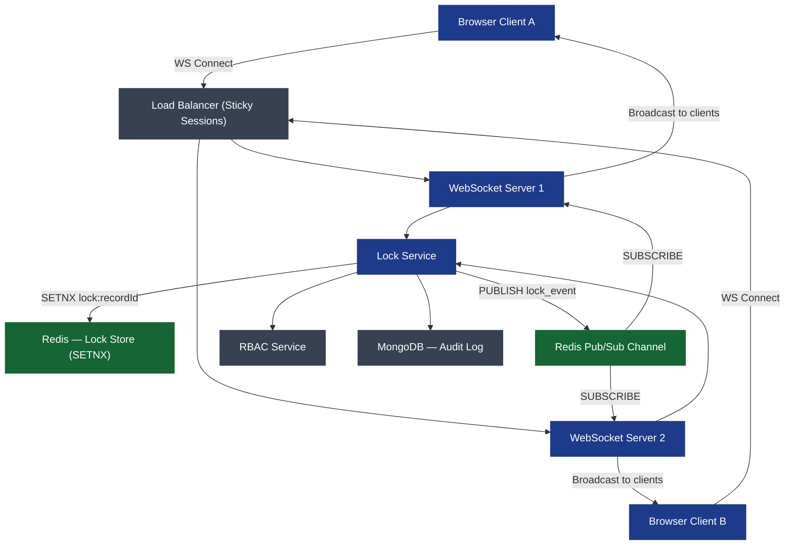
```mermaid
flowchart TD
    classDef darkBlue fill:#1e3a8a,stroke:#1e3a8a,color:#ffffff
    classDef green fill:#166534,stroke:#166534,color:#ffffff
    classDef red fill:#991b1b,stroke:#991b1b,color:#ffffff
    classDef gray fill:#374151,stroke:#374151,color:#ffffff

    CLIENT1["Browser Client A"]:::darkBlue
    CLIENT2["Browser Client B"]:::darkBlue
    LB["Load Balancer (Sticky Sessions)"]:::gray
    WSS1["WebSocket Server 1"]:::darkBlue
    WSS2["WebSocket Server 2"]:::darkBlue
    LS["Lock Service"]:::darkBlue
    REDIS["Redis — Lock Store (SETNX)"]:::green
    PUB["Redis Pub/Sub Channel"]:::green
    RBAC["RBAC Service"]:::gray
    DB["MongoDB — Audit Log"]:::gray

    CLIENT1 -->|"WS Connect"| LB
    CLIENT2 -->|"WS Connect"| LB
    LB --> WSS1
    LB --> WSS2
    WSS1 --> LS
    WSS2 --> LS
    LS -->|"SETNX lock:recordId"| REDIS
    LS -->|"PUBLISH lock_event"| PUB
    PUB -->|"SUBSCRIBE"| WSS1
    PUB -->|"SUBSCRIBE"| WSS2
    WSS1 -->|"Broadcast to clients"| CLIENT1
    WSS2 -->|"Broadcast to clients"| CLIENT2
    LS --> RBAC
    LS --> DB
```

---

## 2.3 Lock Acquire/Release Sequence Diagram

```mermaid
sequenceDiagram
    participant CA as Client A (Editor)
    participant CB as Client B (Viewer)
    participant WS as WebSocket Server
    participant LS as Lock Service
    participant RD as Redis

    CA->>WS: ACQUIRE_LOCK { recordId, userId, role }
    WS->>LS: acquireLock(recordId, userId)
    LS->>RD: SETNX lock:recordId userId EX 30
    alt Lock acquired
        RD-->>LS: OK (set successfully)
        LS-->>WS: Lock granted
        WS-->>CA: LOCK_GRANTED { recordId, expiresAt }
        WS-->>CB: RECORD_LOCKED { recordId, lockedBy: "User A" }
        CB->>CB: Show "Locked by User A" UI
    else Lock already held
        RD-->>LS: nil (key exists)
        LS-->>WS: Lock denied
        WS-->>CA: LOCK_DENIED { recordId, lockedBy, expiresAt }
    end

    Note over CA,RD: User A edits record...

    CA->>WS: RELEASE_LOCK { recordId, userId }
    WS->>LS: releaseLock(recordId, userId)
    LS->>RD: DEL lock:recordId (verify owner first)
    RD-->>LS: OK
    LS-->>WS: Lock released
    WS-->>CA: LOCK_RELEASED
    WS-->>CB: RECORD_UNLOCKED { recordId }
    CB->>CB: Show "Available" UI
```

---

## 2.4 Lock State Machine

```mermaid
stateDiagram-v2
    [*] --> AVAILABLE : Record created

    AVAILABLE --> LOCKED : ACQUIRE_LOCK (success)
    LOCKED --> RELEASING : RELEASE_LOCK sent
    LOCKED --> EXPIRED : Heartbeat timeout (30s)
    LOCKED --> ADMIN_OVERRIDE : Admin force-release
    RELEASING --> AVAILABLE : DEL confirmed in Redis
    EXPIRED --> AVAILABLE : TTL eviction + broadcast
    ADMIN_OVERRIDE --> AVAILABLE : Admin releases lock

    LOCKED --> LOCKED : Heartbeat received (reset TTL)

    note right of EXPIRED
        Auto-release after 30s
        if no heartbeat received
    end note

    note right of ADMIN_OVERRIDE
        RBAC role=admin only
        Audit logged
    end note
```

---

## 2.5 Frontend State Management Flow

```mermaid
flowchart LR
    classDef darkBlue fill:#1e3a8a,stroke:#1e3a8a,color:#ffffff
    classDef green fill:#166534,stroke:#166534,color:#ffffff
    classDef gray fill:#374151,stroke:#374151,color:#ffffff
    classDef red fill:#991b1b,stroke:#991b1b,color:#ffffff

    WS["WebSocket Client\n(useWebSocket hook)"]:::darkBlue
    LS["Local Lock State\n(Zustand/Context)"]:::darkBlue
    UI["UI Layer\n(Lock Indicators)"]:::darkBlue
    HB["Heartbeat Timer\n(setInterval 15s)"]:::green
    RC["Reconnect Handler\n(Exponential Backoff)"]:::green
    ERR["Error State\n(Connection Lost)"]:::red
    PRES["User Presence Map\n(who is viewing)"]:::gray

    WS -->|"onMessage: LOCK_EVENT"| LS
    LS --> UI
    WS --> HB
    HB -->|"PING every 15s"| WS
    WS -->|"onClose"| RC
    RC -->|"Reconnect + re-acquire"| WS
    WS -->|"Connection failed"| ERR
    ERR --> UI
    WS --> PRES
    PRES --> UI
```

---

## 2.6 Heartbeat & Reconnection Flow

```mermaid
sequenceDiagram
    participant C as Client
    participant WS as WebSocket Server
    participant RD as Redis

    loop Every 15 seconds
        C->>WS: PING { userId, heldLocks[] }
        WS->>RD: EXPIRE lock:recordId 30
        RD-->>WS: TTL reset
        WS-->>C: PONG { timestamp }
    end

    Note over C,WS: Connection drops

    C->>C: onClose triggered
    C->>C: Wait 1s (backoff round 1)
    C->>WS: Reconnect attempt
    alt Server available
        WS-->>C: Connected
        C->>WS: RE_ACQUIRE_LOCK { recordId, userId }
        WS->>RD: Check if lock still owned by userId
        RD-->>WS: Lock exists + owner matches
        WS-->>C: LOCK_REACQUIRED
    else Server down
        C->>C: Wait 2s → 4s → 8s (exponential)
        Note over C: Show "Reconnecting..." UI
    end
```

---

## 2.7 Scalability for 500+ Concurrent Sessions

```mermaid
flowchart TD
    classDef darkBlue fill:#1e3a8a,stroke:#1e3a8a,color:#ffffff
    classDef green fill:#166534,stroke:#166534,color:#ffffff
    classDef gray fill:#374151,stroke:#374151,color:#ffffff

    LB["Load Balancer\n(Sticky Sessions via IP hash)"]:::darkBlue
    WS1["WS Server 1\n(200 connections)"]:::darkBlue
    WS2["WS Server 2\n(200 connections)"]:::darkBlue
    WS3["WS Server 3\n(200 connections)"]:::darkBlue
    REDIS["Redis Cluster\n(Lock Store + Pub/Sub)"]:::green
    CHANNEL["Redis Pub/Sub Channels\n(per-record or broadcast)"]:::green

    LB --> WS1
    LB --> WS2
    LB --> WS3
    WS1 -->|"SETNX / DEL"| REDIS
    WS2 -->|"SETNX / DEL"| REDIS
    WS3 -->|"SETNX / DEL"| REDIS
    REDIS --> CHANNEL
    CHANNEL -->|"SUBSCRIBE"| WS1
    CHANNEL -->|"SUBSCRIBE"| WS2
    CHANNEL -->|"SUBSCRIBE"| WS3

    Note1["Sticky sessions ensure\nreconnects hit same server"]:::gray
    Note2["Redis Pub/Sub broadcasts\nlock events across servers"]:::gray
```

**Key Scalability Decisions:**
- **Sticky sessions** ensure the heartbeat handler on WS Server 1 keeps refreshing the lock TTL, even when other servers handle read requests
- **Redis pub/sub** decouples servers — any server can publish a lock event and all servers receive it to broadcast to their clients
- **SETNX (SET if Not eXists)** is atomic in Redis — no race condition on lock acquisition
- **TTL on Redis keys** handles auto-release without a cleanup job

---

## 2.8 Edge Cases & Failure Handling

| Scenario | Problem | Solution |
|----------|---------|----------|
| Client disconnects with lock held | Lock never released, record frozen | Redis TTL (30s) auto-expires lock; server broadcasts RECORD_UNLOCKED |
| Two clients acquire lock simultaneously | Race condition | Redis SETNX is atomic — only one wins |
| WS server crashes | Clients lose connection | Redis TTLs expire; clients reconnect to LB, route to new server |
| Admin force-releases lock | Owner still editing | Owner receives LOCK_REVOKED event, UI shows warning, save is blocked |
| Network partition (split brain) | Two servers think they own lock | Redis is single source of truth — servers don't hold lock state locally |
| Client reconnects but lock expired | Thinks it still has lock | On reconnect, server sends current lock state; client reconciles |

---

## 2.9 Tradeoffs

| Decision | Chosen | Alternative | Why |
|----------|--------|-------------|-----|
| WebSockets | WS | Polling | Sub-50ms propagation; polling adds 2s delay and server load |
| Redis for locks | Redis | DB-based locks | Redis operations are O(1); DB locks add query overhead |
| TTL-based expiry | 30s TTL | Explicit release only | Handles crash/disconnect automatically |
| Sticky sessions | IP hash | Random LB | Required for heartbeat reliability; trade: uneven load distribution |
| Pub/Sub broadcast | Redis Pub/Sub | Socket.IO rooms | Redis pub/sub works across processes; more scalable |

---

## 2.10 Interview Discussion Points

**Q: Why use WebSockets instead of polling for lock updates?**
> A: Polling introduces artificial latency equal to the poll interval. At 2s polling, User B sees a locked record 2 seconds after User A acquires it. In a medical workflow, that's enough time for both users to start editing. WebSockets deliver lock events in ~50ms. Also, 500 clients polling every 2s = 15,000 requests/minute. WebSockets reduce this to 500 persistent connections with heartbeats.

**Q: How do you prevent split-brain — two users both thinking they have the lock?**
> A: Redis `SETNX` (SET if Not eXists) is a single atomic operation — it either sets the key or fails. No two clients can both get `OK` from the same `SETNX` call. The lock is always in Redis, never in server memory, so server crashes don't create inconsistency.

**Q: What happens if the Redis instance goes down?**
> A: This is a genuine single point of failure. Mitigations: (1) Redis Sentinel or Redis Cluster for HA; (2) fall back to "no-lock mode" where edits are allowed but warnings are shown; (3) use Redlock algorithm for distributed Redis consensus.

**Common Candidate Mistakes:**
- Storing lock state in WebSocket server memory (fails when scaled horizontally)
- Not handling reconnection and TTL expiry together (user thinks they have lock after reconnect but it expired)
- Not using atomic operations — using GET + SET separately has a TOCTOU race condition

**Follow-up Questions:**
- How would you show a real-time cursor position of other users?
- How would you handle locks at field-level granularity instead of record-level?
- What if you need to support offline editing with eventual sync?

---

---

# System 3: ElasticSearch + MongoDB Search Architecture

---

## 3.1 System Overview

A **dual-database search architecture** where MongoDB serves as the authoritative source of truth for CRUD operations, and ElasticSearch handles all search queries. The core challenge is keeping them synchronized without compromising either database's reliability.

**Why not just query MongoDB for search?**
- MongoDB text search is limited — no relevance scoring, no fuzzy matching, limited aggregations
- ElasticSearch is purpose-built: inverted index, BM25 scoring, edge n-gram for autocomplete
- For healthcare datasets: 10M+ patient records, sub-100ms search requirement
- MongoDB's `$text` operator can't do autocomplete, typo tolerance, or complex filtering efficiently

---

## 3.2 Architecture Diagram

```mermaid
flowchart TD
    classDef darkBlue fill:#1e3a8a,stroke:#1e3a8a,color:#ffffff
    classDef green fill:#166534,stroke:#166534,color:#ffffff
    classDef red fill:#991b1b,stroke:#991b1b,color:#ffffff
    classDef gray fill:#374151,stroke:#374151,color:#ffffff

    APP["Application Layer\n(Node.js API)"]:::darkBlue
    MONGO["MongoDB\n(Source of Truth)"]:::darkBlue
    CS["MongoDB Change Streams\n(Oplog Tail)"]:::green
    SYNC["Sync Worker\n(Kafka Consumer / Direct)"]:::gray
    ES["ElasticSearch Cluster\n(Search Index)"]:::darkBlue
    CACHE["Redis Cache\n(Hot Queries — 5min TTL)"]:::green
    SEARCH["Search API\n(/search endpoint)"]:::darkBlue
    AUTO["Autocomplete API\n(/suggest endpoint)"]:::darkBlue

    APP -->|"Writes"| MONGO
    MONGO --> CS
    CS --> SYNC
    SYNC -->|"Index / Update / Delete"| ES
    APP -->|"Read queries"| SEARCH
    SEARCH -->|"Check cache first"| CACHE
    CACHE -->|"Cache miss"| ES
    ES -->|"Results"| CACHE
    CACHE -->|"Cached results"| SEARCH
    APP --> AUTO
    AUTO --> ES
```

---

## 3.3 MongoDB → ElasticSearch Sync Pipeline

```mermaid
flowchart LR
    classDef darkBlue fill:#1e3a8a,stroke:#1e3a8a,color:#ffffff
    classDef green fill:#166534,stroke:#166534,color:#ffffff
    classDef gray fill:#374151,stroke:#374151,color:#ffffff
    classDef red fill:#991b1b,stroke:#991b1b,color:#ffffff

    MDB["MongoDB Primary"]:::darkBlue
    OPLOG["Oplog (Change Stream)"]:::gray
    FILTER["Event Filter\n(insert/update/delete)"]:::gray
    TRANS["Transformer\n(MongoDB → ES Doc)"]:::green
    BULK["Bulk Indexer\n(Batch 100 docs / 500ms)"]:::green
    ES["ElasticSearch\n(_bulk API)"]:::darkBlue
    DLQ["Dead Letter Queue\n(Failed index ops)"]:::red
    RETRY["Retry Handler\n(3× exponential backoff)"]:::green

    MDB --> OPLOG
    OPLOG --> FILTER
    FILTER -->|"Relevant events"| TRANS
    TRANS --> BULK
    BULK -->|"Batch write"| ES
    ES -->|"Index failure"| RETRY
    RETRY -->|"3 retries failed"| DLQ
    DLQ -->|"Manual investigation"| DLQ
```

**Sync Mechanism: Change Streams vs Dual-Write**

| Approach | Consistency | Complexity | Failure Handling |
|----------|------------|-----------|-----------------|
| Dual-write (write to both) | Strong (if both succeed) | Simple code, hard failure modes | If ES write fails, data diverges silently |
| Change Streams (oplog tail) | Eventual (~100ms lag) | More setup | ES failure is isolated; retryable |
| Kafka (CDC pipeline) | Eventual | Complex | Best at scale; replayable events |

**Decision: Change Streams** — simpler than Kafka for this scale, and failures are isolated and retryable.

---

## 3.4 Search Query Flow

```mermaid
sequenceDiagram
    participant C as Client Browser
    participant API as Search API
    participant RD as Redis Cache
    participant ES as ElasticSearch

    C->>API: GET /search?q=john+doe&filters={...}&page=1
    API->>API: Build cache key (hash of query + filters)
    API->>RD: GET cacheKey
    alt Cache hit
        RD-->>API: Cached results (JSON)
        API-->>C: Return results (from cache)
    else Cache miss
        API->>ES: POST /patients/_search { query, filters, sort, search_after }
        ES-->>API: { hits, total, sort_values }
        API->>RD: SET cacheKey results EX 300
        API-->>C: Return results + sort_values for next page
    end
```

---

## 3.5 Autocomplete Architecture

```mermaid
flowchart TD
    classDef darkBlue fill:#1e3a8a,stroke:#1e3a8a,color:#ffffff
    classDef green fill:#166534,stroke:#166534,color:#ffffff
    classDef gray fill:#374151,stroke:#374151,color:#ffffff

    INPUT["User types: 'pat'"]:::darkBlue
    DEBOUNCE["Debounce 200ms"]:::green
    API["Autocomplete API"]:::darkBlue
    NGRAMIDX["Edge N-gram Index\n('p','pa','pat','pati','patie'...)"]:::green
    ES["ElasticSearch\nCompletion Suggester"]:::darkBlue
    RESULTS["Suggestions:\n'Patient John'\n'Patricia Smith'"]:::darkBlue

    INPUT --> DEBOUNCE
    DEBOUNCE --> API
    API --> NGRAMIDX
    NGRAMIDX --> ES
    ES --> RESULTS
```

**Edge N-gram tokenizer:** Indexes `"Patrick"` as tokens: `p, pa, pat, patr, patri, patric, patrick`. Any prefix query hits the index instantly.

**Index Mapping (simplified):**
```json
{
  "name": {
    "type": "text",
    "analyzer": "edge_ngram_analyzer",
    "search_analyzer": "standard"
  }
}
```

---

## 3.6 Pagination Strategy: search_after vs offset

```mermaid
flowchart LR
    classDef darkBlue fill:#1e3a8a,stroke:#1e3a8a,color:#ffffff
    classDef green fill:#166534,stroke:#166534,color:#ffffff
    classDef red fill:#991b1b,stroke:#991b1b,color:#ffffff
    classDef gray fill:#374151,stroke:#374151,color:#ffffff

    P1["Page 1 Request\n(from: 0, size: 20)"]:::darkBlue
    R1["Results + sort_values\n[1234567890, 'doe']"]:::darkBlue
    P2["Page 2 Request\nsearch_after: [1234567890, 'doe']"]:::green
    R2["Page 2 Results\n+ new sort_values"]:::darkBlue
    BAD["Offset Pagination\n(from: 10000)\nDeep scan = slow"]:::red

    P1 --> R1
    R1 --> P2
    P2 --> R2
    BAD -->|"Avoid for deep pages"| BAD
```

| Pagination Method | Page 1 | Page 100 | Page 10000 | Stable? |
|------------------|--------|----------|-----------|---------|
| `from/size` (offset) | Fast | Medium | Very slow (scans all) | No (insertions shift pages) |
| `search_after` | Fast | Fast | Fast | Yes (cursor-based) |
| Scroll API | Fast | Fast | Fast | Yes (but stateful, expensive) |

---

## 3.7 Scalability & Performance Optimizations

| Optimization | Implementation | Impact |
|-------------|---------------|--------|
| Redis cache for hot queries | 5min TTL on common searches | 90% cache hit rate; ES load drops 10× |
| Bulk indexing | Batch 100 docs per ES `_bulk` call | 10× faster than single doc indexing |
| Index aliases | Write to new index, flip alias atomically | Zero-downtime reindexing |
| Shard routing | Route by `patientId` field | Same patient's docs hit same shard |
| Source filtering | Only return `_source: ["name","id","dob"]` | Reduces response payload by 80% |
| Async sync worker | Change streams → queue → indexer | MongoDB writes never wait for ES |

---

## 3.8 Edge Cases & Failure Handling

| Scenario | Problem | Solution |
|----------|---------|----------|
| ES indexing lag | Search returns stale data | Accept eventual consistency; add "results may be delayed" note |
| ES cluster down | All searches fail | Fall back to MongoDB text search (degraded performance) |
| Sync worker crashes | ES diverges from MongoDB | Worker stores last processed oplog timestamp; resumes from there |
| Large document updates | Many fields change at once | Partial update via `_update` API; don't re-index unchanged fields |
| Deleted in MongoDB, not in ES | Ghost records in search | Change stream captures DELETE events; worker sends `_delete` to ES |
| Index mapping changes | Need to reindex all documents | Blue/green reindex: new index + alias swap |

---

## 3.9 Tradeoffs

| Decision | Chosen | Alternative | Why |
|----------|--------|-------------|-----|
| Change Streams | Change Streams | Dual-write | Dual-write silently fails if ES is down; Change Streams retry |
| Eventual consistency | Accept ES lag | Strong consistency | Strong consistency would require sync writes to ES in the write path |
| Edge n-gram autocomplete | ES edge n-gram | Application-level prefix search | ES handles millions of prefix queries efficiently |
| search_after pagination | search_after | offset/from | Offset degrades at deep pages; search_after is O(1) per page |
| Redis for query cache | Redis | Local memory cache | Local cache doesn't share across API instances |

---

## 3.10 Interview Discussion Points

**Q: How do you keep MongoDB and ElasticSearch in sync?**
> A: MongoDB Change Streams tail the oplog in real-time. Insert/update/delete events trigger the sync worker, which transforms and batches documents for ElasticSearch's `_bulk` API. There's ~100ms lag between a MongoDB write and it appearing in search results. We accept this eventual consistency as a tradeoff for decoupling the write path from ES reliability.

**Q: How do you handle pagination for 1 million records?**
> A: We use `search_after` pagination instead of offset-based `from/size`. Offset requires ElasticSearch to scan and discard N documents to find page N. With `search_after`, we pass the sort values of the last document as a cursor, and ES jumps directly there. Page 10,000 is just as fast as page 1.

**Q: What if ElasticSearch goes down?**
> A: Search falls back to MongoDB text search with reduced functionality. It's slower (no scoring, limited filtering) but keeps search available. We alert and prioritize ES recovery. The sync worker queues events and replays them when ES comes back.

**Common Candidate Mistakes:**
- Dual-write without failure handling — ES write failure silently desynchronizes
- Using `from/size` for deep pagination — crushes ES performance
- Not using index aliases — forces downtime for reindexing
- Forgetting to sync deletes — ghost records linger in search results

**Follow-up Questions:**
- How would you implement faceted search (e.g., filter by age range + hospital)?
- How would you handle multi-language medical terminology?
- What if the change stream consumer falls behind by 1M events?

---

---

# System 4: AI-driven Speech-to-Text Refinement Pipeline

---

## 4.1 System Overview

A **clinical documentation pipeline** where physicians dictate notes verbally, and the system:
1. Captures audio in-browser
2. Transcribes speech to raw text (via Whisper/STT API)
3. Refines transcription using a prompt-engineered OpenAI call
4. Validates and structures the output (ICD codes, medical terminology)
5. Streams results back to the UI in real-time

**Core Challenges:**
- Medical terminology is specialized — STT makes errors on drug names, dosages
- OpenAI can hallucinate medical facts (critical patient safety issue)
- Physicians expect real-time feedback — streaming is required
- API costs can spiral — token optimization and caching are essential

---

## 4.2 Pipeline Architecture Diagram

```mermaid
flowchart TD
    classDef darkBlue fill:#1e3a8a,stroke:#1e3a8a,color:#ffffff
    classDef green fill:#166534,stroke:#166534,color:#ffffff
    classDef red fill:#991b1b,stroke:#991b1b,color:#ffffff
    classDef gray fill:#374151,stroke:#374151,color:#ffffff

    MIC["Browser Microphone\n(MediaRecorder API)"]:::darkBlue
    CHUNK["Audio Chunker\n(3s rolling windows)"]:::gray
    STT["Speech-to-Text API\n(OpenAI Whisper)"]:::darkBlue
    RAW["Raw Transcript"]:::gray
    PE["Prompt Engineering Layer\n(System + Few-shot examples)"]:::green
    OAI["OpenAI GPT-4o\n(Refinement + Structure)"]:::darkBlue
    STREAM["Streaming SSE / WS\n(Token-by-token)"]:::green
    VAL["Validation Layer\n(Schema + Medical checks)"]:::green
    FINAL["Final Structured Output\n(ICD codes, SOAP format)"]:::darkBlue
    ERR["Error Handler\n(Retry + Fallback)"]:::red
    AUDIT["Audit Log\n(Inputs + Outputs)"]:::gray

    MIC --> CHUNK
    CHUNK --> STT
    STT --> RAW
    RAW --> PE
    PE --> OAI
    OAI -->|"Streaming tokens"| STREAM
    STREAM -->|"Live display"| FINAL
    OAI --> VAL
    VAL -->|"Valid"| FINAL
    VAL -->|"Invalid — hallucination detected"| ERR
    ERR -->|"Retry with stricter prompt"| OAI
    FINAL --> AUDIT
    ERR --> AUDIT
```

---

## 4.3 Streaming Response Flow

```mermaid
sequenceDiagram
    participant C as Client (Browser)
    participant API as Backend API
    participant OAI as OpenAI API

    C->>API: POST /refine { transcript, context }
    API->>API: Build system prompt + user message
    API->>OAI: POST /chat/completions { stream: true }
    OAI-->>API: Token 1: "The"
    API-->>C: SSE: data: {"token": "The"}
    OAI-->>API: Token 2: "patient"
    API-->>C: SSE: data: {"token": "patient"}
    OAI-->>API: Token N: ... (continues)
    API-->>C: SSE: data: {"token": "..."}
    OAI-->>API: [DONE]
    API->>API: Run validation on complete response
    alt Validation passed
        API-->>C: SSE: data: {"status": "complete", "icd_codes": [...]}
    else Validation failed
        API-->>C: SSE: data: {"status": "error", "message": "Review required"}
        API->>OAI: Retry with stricter constraints
    end
```

---

## 4.4 Prompt Engineering Strategy

```mermaid
flowchart TD
    classDef darkBlue fill:#1e3a8a,stroke:#1e3a8a,color:#ffffff
    classDef green fill:#166534,stroke:#166534,color:#ffffff
    classDef gray fill:#374151,stroke:#374151,color:#ffffff
    classDef red fill:#991b1b,stroke:#991b1b,color:#ffffff

    SYSP["System Prompt\n(Role + Constraints + Output Format)"]:::darkBlue
    FEW["Few-shot Examples\n(3–5 transcription → SOAP pairs)"]:::green
    USER["User Message\n(Raw STT transcript + patient context)"]:::darkBlue
    CONST["Constraints:\n- No invented symptoms\n- Flag uncertainty with [VERIFY]\n- Output JSON schema only"]:::green
    HALT["Hallucination Guard:\nIf AI adds symptoms not in transcript\n→ Validation fails"]:::red
    JSON["JSON Schema Validation\n(Zod / Ajv)"]:::green

    SYSP --> FEW
    FEW --> USER
    USER --> CONST
    CONST --> HALT
    HALT --> JSON
```

**Prompt Structure:**
```
System: You are a clinical documentation assistant.
        Convert raw speech transcripts to SOAP notes.
        Rules:
        - Only use information present in the transcript
        - Mark uncertain terms with [VERIFY]
        - Output valid JSON matching this schema: {...}
        - Never invent symptoms, diagnoses, or medications

Few-shot: [Example transcript → Example SOAP JSON]
[Example transcript → Example SOAP JSON]

User: Transcript: "patient has been having chest pain for 3 days..."
```

---

## 4.5 Error Handling & Retry State Machine

```mermaid
stateDiagram-v2
    [*] --> PROCESSING : Request received

    PROCESSING --> STREAMING : OpenAI responds (stream)
    PROCESSING --> RETRY : API error / timeout
    STREAMING --> VALIDATING : Stream complete
    VALIDATING --> COMPLETE : Schema valid + no hallucinations
    VALIDATING --> RETRY : Validation failed
    RETRY --> PROCESSING : Retry attempt (max 3)
    RETRY --> FALLBACK : 3 retries exhausted
    FALLBACK --> MANUAL_REVIEW : Human review queue
    COMPLETE --> [*]
    MANUAL_REVIEW --> [*]

    note right of RETRY
        Exponential backoff:
        1s → 2s → 4s
        Different prompt on retry
    end note

    note right of FALLBACK
        Raw transcript returned
        with warning flag
    end note
```

---

## 4.6 Cost Optimization & Performance

```mermaid
flowchart LR
    classDef green fill:#166534,stroke:#166534,color:#ffffff
    classDef darkBlue fill:#1e3a8a,stroke:#1e3a8a,color:#ffffff
    classDef gray fill:#374151,stroke:#374151,color:#ffffff

    CACHE["Prompt Caching\n(Same system prompt = cached tokens)"]:::green
    COMPRESS["Transcript Compression\n(Remove filler words before sending)"]:::green
    MODEL["Model Selection\n(GPT-4o-mini for simple, GPT-4o for complex)"]:::green
    BATCH["Request Batching\n(Accumulate 3s audio chunks)"]:::green
    LIMIT["Token Budget\n(max_tokens cap per request)"]:::green
    COST["Cost Reduction\n(~60% vs naive implementation)"]:::darkBlue

    CACHE --> COST
    COMPRESS --> COST
    MODEL --> COST
    BATCH --> COST
    LIMIT --> COST
```

| Optimization | Cost Impact | Quality Impact |
|-------------|------------|---------------|
| Prompt caching (repeated system prompt) | -40% tokens | None |
| Filler word removal from transcript | -15% tokens | None (they add no signal) |
| GPT-4o-mini for simple cases | -70% per call | Slight decrease in complex cases |
| max_tokens cap | Prevents runaway costs | None for typical notes |
| 3s audio chunks (not real-time per-word) | -80% API calls | Minimal latency increase |

---

## 4.7 Edge Cases & Failure Handling

| Scenario | Problem | Solution |
|----------|---------|----------|
| OpenAI API timeout | Stream hangs | 30s timeout; show partial output + retry indicator |
| Hallucinated medication | Patient safety risk | Validation checks that all medications in output appear in transcript |
| STT misrecognition ("propranol" vs "propranolol") | Wrong drug in output | [VERIFY] tag on uncertain medical terms; physician reviews |
| Context window overflow | Too much transcript | Chunk long transcriptions; summarize earlier sections |
| Rate limit (429) | Request dropped | Exponential backoff with jitter; queue requests in Redis |
| Model deprecation | API endpoint changes | Model version pinned in config; alert when new model available |

---

## 4.8 Tradeoffs

| Decision | Chosen | Alternative | Why |
|----------|--------|-------------|-----|
| Streaming SSE | SSE for streaming | Full response then display | Physicians see output immediately; feels responsive |
| Validation post-stream | Validate after complete | Validate during stream | Can't reliably validate partial JSON mid-stream |
| Few-shot in prompt | Static examples | Fine-tuning | Fine-tuning is expensive and slow to update; few-shot is fast to adjust |
| GPT-4o for medical | GPT-4o | GPT-3.5 | Medical accuracy too low with GPT-3.5 |
| Client-side audio chunking | 3s chunks | Full recording | Reduces latency; physician gets partial output faster |

---

## 4.9 Interview Discussion Points

**Q: How do you prevent the AI from hallucinating medical information?**
> A: Two layers. First, the prompt explicitly constrains the model: "only use information present in the transcript." Second, post-generation validation cross-references output against input — if a medication appears in the output but not the transcript, it's flagged as a potential hallucination and the call is retried with a stricter prompt. Critical fields go to a human review queue.

**Q: How do you handle streaming while also validating output?**
> A: We separate the concerns. The raw token stream goes directly to the UI for real-time display. Once the stream completes, we run validation on the full assembled response. If validation fails, we show an error indicator and the physician knows to review. We don't block the streaming display.

**Q: How do you optimize API costs?**
> A: The biggest win is prompt caching — OpenAI caches the system prompt when it's identical across requests, so we only pay for new input tokens. We also remove filler words from transcripts before sending (reduces ~15% tokens) and route simple cases to GPT-4o-mini.

**Common Candidate Mistakes:**
- Not handling streaming errors (connection drops mid-stream)
- Validating each streaming token instead of the complete response
- No rate limiting — API costs can spike in minutes
- Not logging inputs/outputs (critical for medical audit trails)

**Follow-up Questions:**
- How would you handle a physician who speaks in multiple languages?
- How would you measure model performance over time (drift detection)?
- How would you implement A/B testing between model versions?

---

---

# System 5: HTML → PDF Processing Pipeline

---

## 5.1 System Overview

A **document generation service** that accepts structured data, merges it with HTML templates, renders them to PDF using headless Chrome, stores the output in object storage, and returns a download URL — all asynchronously.

**Core Challenges:**
- PDF generation is CPU and memory intensive — cannot block HTTP request thread
- Puppeteer/Chromium instances are expensive to spin up per request
- Large documents (100+ pages) can cause OOM in worker nodes
- Requests spike during end-of-month reporting periods
- Failed generations must be retried without data loss

---

## 5.2 Queue Architecture Diagram

```mermaid
flowchart TD
    classDef darkBlue fill:#1e3a8a,stroke:#1e3a8a,color:#ffffff
    classDef green fill:#166534,stroke:#166534,color:#ffffff
    classDef red fill:#991b1b,stroke:#991b1b,color:#ffffff
    classDef gray fill:#374151,stroke:#374151,color:#ffffff

    CLIENT["Client Request\n(POST /generate-pdf)"]:::darkBlue
    API["API Server\n(Job submission)"]:::darkBlue
    QUEUE["BullMQ Job Queue\n(Redis-backed)"]:::darkBlue
    WP["Worker Pool\n(3–10 workers, autoscale)"]:::green
    W1["Worker 1\n(Puppeteer instance)"]:::green
    W2["Worker 2\n(Puppeteer instance)"]:::green
    W3["Worker 3\n(Puppeteer instance)"]:::green
    HTML["HTML Template Engine\n(Handlebars / Nunjucks)"]:::gray
    S3["S3 Object Storage\n(PDF output)"]:::gray
    DLQ["Dead Letter Queue\n(Failed after 3 retries)"]:::red
    WEBHOOK["Webhook / WS Notify\n(Job complete)"]:::green
    DB["MongoDB\n(Job status tracking)"]:::gray

    CLIENT -->|"POST /generate-pdf { data, templateId }"| API
    API -->|"jobId returned immediately"| CLIENT
    API -->|"Enqueue job"| QUEUE
    QUEUE --> WP
    WP --> W1
    WP --> W2
    WP --> W3
    W1 --> HTML
    W2 --> HTML
    W3 --> HTML
    HTML -->|"Rendered HTML"| W1
    HTML -->|"Rendered HTML"| W2
    HTML -->|"Rendered HTML"| W3
    W1 -->|"PDF bytes"| S3
    W2 -->|"PDF bytes"| S3
    W3 -->|"PDF bytes"| S3
    S3 -->|"Presigned URL"| WEBHOOK
    WEBHOOK -->|"Notify client"| CLIENT
    W1 -->|"Update status"| DB
    WP -->|"3× retry failed"| DLQ
```

---

## 5.3 Job Lifecycle State Machine

```mermaid
stateDiagram-v2
    [*] --> WAITING : Job enqueued
    WAITING --> ACTIVE : Worker picks up job
    ACTIVE --> COMPLETED : PDF generated + uploaded
    ACTIVE --> FAILED : Error during generation
    FAILED --> WAITING : Retry (attempt 1, 2, 3)
    FAILED --> DEAD : Max retries (3) exhausted
    COMPLETED --> [*]
    DEAD --> [*]

    note right of ACTIVE
        Worker renders HTML,
        generates PDF,
        uploads to S3
    end note

    note right of DEAD
        Job moved to Dead Letter Queue
        Alert + manual investigation
    end note
```

---

## 5.4 Worker Processing Sequence

```mermaid
sequenceDiagram
    participant Q as BullMQ Queue
    participant W as Worker
    participant T as Template Engine
    participant P as Puppeteer (Chrome)
    participant S3 as S3 Storage
    participant DB as Job Status DB

    Q->>W: Dequeue job { jobId, templateId, data }
    W->>DB: UPDATE job SET status=ACTIVE
    W->>T: render(templateId, data)
    T-->>W: HTML string (with CSS inlined)
    W->>P: page.setContent(html)
    P->>P: Render page (fonts, images, CSS)
    W->>P: page.pdf({ format: 'A4', printBackground: true })
    P-->>W: PDF Buffer
    W->>W: Check buffer size (warn if >50MB)
    W->>S3: s3.putObject(pdfBuffer, key)
    S3-->>W: { ETag, Location }
    W->>S3: generatePresignedUrl(key, expiresIn: 3600)
    S3-->>W: presigned URL
    W->>DB: UPDATE job SET status=COMPLETED, url=presignedUrl
    W->>W: Notify via webhook / WS
```

---

## 5.5 Worker Scaling Strategy

```mermaid
flowchart LR
    classDef darkBlue fill:#1e3a8a,stroke:#1e3a8a,color:#ffffff
    classDef green fill:#166534,stroke:#166534,color:#ffffff
    classDef gray fill:#374151,stroke:#374151,color:#ffffff
    classDef red fill:#991b1b,stroke:#991b1b,color:#ffffff

    METRICS["Queue Depth Monitor\n(jobs waiting)"]:::gray
    NORMAL["Normal Load\n(3 workers)"]:::green
    SPIKE["Spike Load\n(Queue > 50 jobs)"]:::darkBlue
    SCALE["Auto-scale\n(Add 5 more workers)"]:::green
    COOLDOWN["Cooldown Period\n(5 min, scale down)"]:::gray
    MEM["Memory Guard\n(>85% → pause new jobs)"]:::red

    METRICS --> NORMAL
    METRICS -->|"Queue depth > 50"| SPIKE
    SPIKE --> SCALE
    SCALE -->|"Queue drained"| COOLDOWN
    COOLDOWN --> NORMAL
    METRICS --> MEM
    MEM -->|"Memory pressure"| MEM
```

**Worker Memory Management:**
```
Each Puppeteer instance: ~300-500MB RAM
Max workers per node (8GB RAM): 10 workers
Memory guard: if process.memoryUsage().heapUsed > 85% → pause worker
After each PDF: browser.close() + force GC hint
```

---

## 5.6 Failure Handling Strategy

```mermaid
flowchart TD
    classDef darkBlue fill:#1e3a8a,stroke:#1e3a8a,color:#ffffff
    classDef green fill:#166534,stroke:#166534,color:#ffffff
    classDef red fill:#991b1b,stroke:#991b1b,color:#ffffff
    classDef gray fill:#374151,stroke:#374151,color:#ffffff

    FAIL["Job Fails"]:::red
    IS_RETRY["Retries < 3?"]:::gray
    BACKOFF["Exponential Backoff\n(1s → 2s → 4s)"]:::green
    REQUEUE["Re-enqueue to BullMQ"]:::green
    DLQ["Dead Letter Queue"]:::red
    ALERT["PagerDuty Alert\n(On-call notified)"]:::red
    LOG["Structured Error Log\n(jobId, error, attempt, stack)"]:::gray
    REPORT["Error Report\n(to client via webhook)"]:::gray

    FAIL --> LOG
    FAIL --> IS_RETRY
    IS_RETRY -->|"Yes"| BACKOFF
    BACKOFF --> REQUEUE
    IS_RETRY -->|"No"| DLQ
    DLQ --> ALERT
    DLQ --> REPORT
```

---

## 5.7 Edge Cases & Failure Handling

| Scenario | Problem | Solution |
|----------|---------|----------|
| Puppeteer OOM crash | Worker dies mid-generation | BullMQ marks job as failed; retry picks up |
| Template references missing image | PDF renders with broken assets | Pre-validate all assets before Puppeteer render |
| Very large document (500 pages) | OOM on PDF buffer | Stream PDF to temp file instead of memory buffer |
| S3 upload fails | PDF generated but not stored | Retry just the upload; don't re-render the PDF |
| Worker node goes down | Active jobs lost | BullMQ lock expires after 30s; other workers re-pick |
| Presigned URL expires | Client gets 403 | Re-generate presigned URL on demand via `/download/{jobId}` |

---

## 5.8 Tradeoffs

| Decision | Chosen | Alternative | Why |
|----------|--------|-------------|-----|
| BullMQ (Redis) | BullMQ | SQS / RabbitMQ | BullMQ is simpler ops; Redis already used elsewhere |
| Puppeteer | Puppeteer | PDFKit / WeasyPrint | Puppeteer renders pixel-perfect from existing HTML templates |
| Presigned S3 URL | Presigned URL | Direct download from server | Offloads bandwidth to S3; no server bottleneck |
| Webhook notification | Webhook | Polling `/status/{jobId}` | Push is more efficient; polling creates needless load |
| Worker pool (shared Chromium) | Shared browser pool | New browser per job | Startup cost of Chromium is 2-3s; pool amortizes this |

---

## 5.9 Interview Discussion Points

**Q: Why use a job queue instead of generating the PDF synchronously?**
> A: PDF generation with Puppeteer takes 3-15 seconds and uses 500MB RAM per job. Running it synchronously in the API server would block the HTTP thread, exhaust connections under load, and crash if requests spike. A queue decouples submission from execution — the API returns a jobId immediately, and the client polls or receives a webhook when done.

**Q: How do you handle worker crashes mid-job?**
> A: BullMQ acquires a lock on each job with a 30s TTL. The worker must renew this lock every few seconds. If the worker crashes, the lock expires, and another worker re-picks the job from the ACTIVE state. This makes the system resilient to node failures without any custom failure detection.

**Q: How do you scale for end-of-month reporting spikes?**
> A: Monitor queue depth in Redis. When it exceeds a threshold (e.g., 50 pending jobs), auto-scale the worker pool — spin up additional worker containers (Kubernetes HPA or ECS service scaling). Workers are stateless, so adding them is instant. Scale back down after the queue drains.

**Common Candidate Mistakes:**
- Generating PDFs synchronously in the request handler
- Not handling worker crashes (jobs stuck in ACTIVE forever)
- Loading all images into memory for large documents
- Not cleaning up Puppeteer browser instances after each job

**Follow-up Questions:**
- How would you support cancelling a job that's already in-progress?
- How would you implement PDF generation for 10,000 documents in a batch?
- How would you watermark PDFs dynamically per-user without re-generating?

---

---

# System 6: Micro-Frontend Architecture

---

## 6.1 System Overview

A **Micro-Frontend (MFE) architecture** allows multiple independently deployable React applications to compose into a single user-facing product. Each team owns their module end-to-end: codebase, deployment pipeline, and release schedule.

**Use Case:** A healthcare platform where:
- Team A owns the `Patient Management` module
- Team B owns the `Imaging Viewer` module
- Team C owns the `Reports` module
- Team D owns the `Shell App` (routing, auth, shared layout)

**Core Challenges:**
- Each module must deploy independently without requiring others to rebuild
- Auth token must be shared securely across all modules
- Shared UI components (design system) must not be duplicated or versioned-conflicted
- Routing must feel seamless across module boundaries

---

## 6.2 Module Federation Architecture

```mermaid
flowchart TD
    classDef darkBlue fill:#1e3a8a,stroke:#1e3a8a,color:#ffffff
    classDef green fill:#166534,stroke:#166534,color:#ffffff
    classDef gray fill:#374151,stroke:#374151,color:#ffffff
    classDef red fill:#991b1b,stroke:#991b1b,color:#ffffff

    SHELL["Shell App (Host)\n(Routing + Auth + Layout)"]:::darkBlue
    MFE1["Remote: Patient Module\npatients.cdn.com/remoteEntry.js"]:::darkBlue
    MFE2["Remote: Imaging Module\nimaging.cdn.com/remoteEntry.js"]:::darkBlue
    MFE3["Remote: Reports Module\nreports.cdn.com/remoteEntry.js"]:::darkBlue
    SHARED["Shared Libraries\n(React, React-DOM, Design System)"]:::green
    AUTH["Auth Store\n(Shared via window/event bus)"]:::green
    ROUTER["React Router v6\n(Shell controls top-level routes)"]:::gray
    CDN1["CDN — Patient Bundle"]:::gray
    CDN2["CDN — Imaging Bundle"]:::gray
    CDN3["CDN — Reports Bundle"]:::gray

    SHELL --> ROUTER
    ROUTER -->|"/patients/*"| MFE1
    ROUTER -->|"/imaging/*"| MFE2
    ROUTER -->|"/reports/*"| MFE3
    SHELL --> AUTH
    AUTH -->|"Token passed via event bus"| MFE1
    AUTH -->|"Token passed via event bus"| MFE2
    AUTH -->|"Token passed via event bus"| MFE3
    SHELL --> SHARED
    MFE1 --> SHARED
    MFE2 --> SHARED
    MFE3 --> SHARED
    MFE1 -->|"Lazy loaded"| CDN1
    MFE2 -->|"Lazy loaded"| CDN2
    MFE3 -->|"Lazy loaded"| CDN3
```

---

## 6.3 Module Federation Configuration

```mermaid
flowchart LR
    classDef darkBlue fill:#1e3a8a,stroke:#1e3a8a,color:#ffffff
    classDef green fill:#166534,stroke:#166534,color:#ffffff
    classDef gray fill:#374151,stroke:#374151,color:#ffffff

    HOST["Shell (Host)\nwebpack.config.js:\nremotes: { patients, imaging, reports }"]:::darkBlue
    R1["Patient Remote\nwebpack.config.js:\nexposes: { './App': './src/App' }"]:::darkBlue
    R2["Imaging Remote\nwebpack.config.js:\nexposes: { './App': './src/App' }"]:::darkBlue
    SHARED["Shared Deps\nsingleton: true\nreact: { singleton: true, requiredVersion: '^18' }\nreact-dom: { singleton: true }"]:::green

    HOST --> R1
    HOST --> R2
    HOST --> SHARED
    R1 --> SHARED
    R2 --> SHARED
```

**Webpack Module Federation key config:**
```js
// Shell (Host) webpack.config.js
new ModuleFederationPlugin({
  name: 'shell',
  remotes: {
    patients: 'patients@https://patients.cdn.com/remoteEntry.js',
    imaging: 'imaging@https://imaging.cdn.com/remoteEntry.js',
  },
  shared: {
    react: { singleton: true, requiredVersion: '^18.0.0' },
    'react-dom': { singleton: true, requiredVersion: '^18.0.0' },
    'design-system': { singleton: true },
  }
})
```

---

## 6.4 Authentication Sharing Flow

```mermaid
sequenceDiagram
    participant U as User
    participant SH as Shell App
    participant AUTH as Auth Service
    participant MFE as Patient Module (Remote)

    U->>SH: Login (credentials)
    SH->>AUTH: POST /auth/login
    AUTH-->>SH: { accessToken, refreshToken }
    SH->>SH: Store token in memory (NOT localStorage)
    SH->>SH: Dispatch AuthReady event on window

    U->>SH: Navigate to /patients
    SH->>MFE: Lazy import patients/App
    MFE->>MFE: Mount, listen for AuthReady event
    SH->>MFE: window.dispatchEvent(AuthReady { token })
    MFE->>MFE: Store token in module memory
    MFE->>MFE: Use token for API calls

    Note over SH,MFE: Token refresh handled by Shell,<br/>broadcast to all remotes via event bus
```

---

## 6.5 Independent Deployment Flow

```mermaid
flowchart LR
    classDef darkBlue fill:#1e3a8a,stroke:#1e3a8a,color:#ffffff
    classDef green fill:#166534,stroke:#166534,color:#ffffff
    classDef gray fill:#374151,stroke:#374151,color:#ffffff

    PR["PR merged to main\n(Patient Module)"]:::darkBlue
    CI["CI Pipeline\n(Build + Test)"]:::gray
    BUILD["Webpack Build\n(Generates remoteEntry.js)"]:::green
    DEPLOY["Deploy to CDN\n(patients.cdn.com)"]:::green
    SHELL["Shell App\n(No rebuild needed)"]:::darkBlue
    BROWSER["Browser\n(Fetches new remoteEntry.js on next load)"]:::darkBlue
    ROLLBACK["Rollback\n(Point CDN to previous build hash)"]:::gray

    PR --> CI
    CI --> BUILD
    BUILD --> DEPLOY
    DEPLOY -->|"Shell remotes URL unchanged"| SHELL
    SHELL -->|"Next user visit"| BROWSER
    BROWSER -->|"Fetches"| DEPLOY
    DEPLOY -->|"If broken"| ROLLBACK
```

---

## 6.6 State Sharing Between Modules

```mermaid
flowchart TD
    classDef darkBlue fill:#1e3a8a,stroke:#1e3a8a,color:#ffffff
    classDef green fill:#166534,stroke:#166534,color:#ffffff
    classDef gray fill:#374151,stroke:#374151,color:#ffffff
    classDef red fill:#991b1b,stroke:#991b1b,color:#ffffff

    SHAR["Shared State Approaches"]:::gray
    EB["Event Bus\n(window.CustomEvent)"]:::green
    QP["Query Params\n(Route-level state)"]:::green
    SH["Shell Store\n(Exposed via shared lib)"]:::green
    BAD["Direct Store Import\n(Zustand/Redux across remotes)"]:::red

    SHAR --> EB
    SHAR --> QP
    SHAR --> SH
    SHAR --> BAD

    EB -->|"Best for: auth tokens, notifications"| EB
    QP -->|"Best for: filters, navigation state"| QP
    SH -->|"Best for: user profile, preferences"| SH
    BAD -->|"Avoid: creates tight coupling"| BAD
```

| State Type | Sharing Mechanism | Why |
|-----------|------------------|-----|
| Auth token | Event bus (window.CustomEvent) | Avoids localStorage security risk; broadcast to all remotes |
| User profile | Shell store exposed as shared lib | Read-only data, changes rarely |
| Navigation state | URL / Query params | Bookmarkable, shareable |
| Feature flags | Shell fetches + passes via event | Centralized flag management |
| UI state (modals, drawers) | Keep local to each remote | No cross-module UI dependencies |

---

## 6.7 Performance Considerations

```mermaid
flowchart TD
    classDef darkBlue fill:#1e3a8a,stroke:#1e3a8a,color:#ffffff
    classDef green fill:#166534,stroke:#166534,color:#ffffff
    classDef gray fill:#374151,stroke:#374151,color:#ffffff
    classDef red fill:#991b1b,stroke:#991b1b,color:#ffffff

    LAZY["Lazy Loading\n(Remotes load only when route visited)"]:::green
    SHARE["Shared Singleton React\n(Only one copy of React loaded)"]:::green
    PREFETCH["Prefetch on hover\n(Preload remoteEntry before click)"]:::green
    CACHE["CDN Cache Headers\n(remoteEntry.js: no-cache, chunks: immutable)"]:::green
    DUP["Duplicate Dependencies"]:::red
    VERSION["Version Mismatch\n(react@17 vs react@18)"]:::red

    LAZY --> SHARE
    SHARE --> PREFETCH
    PREFETCH --> CACHE
    DUP -->|"Prevented by: singleton: true"| SHARE
    VERSION -->|"Prevented by: requiredVersion constraint"| SHARE
```

**Critical CDN caching strategy:**
- `remoteEntry.js`: `Cache-Control: no-cache` (must always be fresh for deployment to work)
- `chunk.[contenthash].js`: `Cache-Control: immutable, max-age=31536000` (content-addressed, safe to cache forever)

---

## 6.8 Edge Cases & Failure Handling

| Scenario | Problem | Solution |
|----------|---------|----------|
| Remote fails to load | User sees blank white screen | Error boundary wraps each remote; shows fallback UI |
| Version conflict (React 17 vs 18) | Two React instances = hooks broken | `singleton: true` + `requiredVersion` in shared config |
| Shell deploys breaking change | All remotes break | Contract testing between shell and remotes; versioned API surface |
| Remote takes 5s to load | Poor UX on first visit | Loading skeleton in Error Boundary fallback; prefetch on hover |
| Circular dependency between remotes | Build failure / runtime loop | Remotes must never import each other — only import shared libs |
| Remote A needs data from Remote B | Cross-team coupling | Use URL params or event bus — never direct import |

---

## 6.9 Tradeoffs

| Decision | Chosen | Alternative | Why |
|----------|--------|-------------|-----|
| Module Federation | Webpack 5 MF | iframes | iframes are isolated but have terrible UX (no shared routing, CSS, history) |
| Event bus for auth | Custom event bus | Shared Redux store | Shared store creates build-time coupling between remotes |
| Singleton shared React | singleton: true | Each remote bundles React | Without singleton, React hooks break (multiple React contexts) |
| No-cache on remoteEntry.js | No-cache | Versioned URL | Versioned URL requires shell rebuild on every remote deploy |
| Error boundaries per remote | Per-remote boundary | Global boundary | One failing remote shouldn't crash the entire app |

---

## 6.10 Interview Discussion Points

**Q: How do you share authentication between micro-frontends without coupling them?**
> A: The Shell App owns auth. After login, it stores the token in memory (not localStorage — XSS risk) and dispatches a custom event on `window`. Each remote listens for this event on mount and stores the token in its own module memory for API calls. When the token refreshes, Shell broadcasts again. No direct import between modules.

**Q: How do you prevent each remote from bundling its own copy of React?**
> A: Module Federation's `shared` configuration with `singleton: true`. All modules declare React as a singleton shared dependency. Only the highest-compatible version is loaded once and shared. If versions conflict beyond the `requiredVersion` constraint, MF logs a warning and falls back to loading a separate copy — which breaks hooks.

**Q: How does deployment work — can Team A deploy without coordinating with Teams B, C, D?**
> A: Yes. Team A builds and deploys their remote to a versioned CDN path. The Shell App's `remoteEntry.js` URL points to a stable URL (not versioned), which resolves to the latest build. The Shell never needs to rebuild. The tradeoff is that a bad remote deploy affects all users immediately — hence the need for contract tests and error boundaries.

**Q: How do you handle a remote that fails to load at runtime?**
> A: Each lazy-loaded remote is wrapped in a React Error Boundary with Suspense. If the remote fails to load (network error, JS error), the Error Boundary catches it and renders a fallback ("This module is temporarily unavailable") without crashing the rest of the application.

**Common Candidate Mistakes:**
- Having remotes import from each other (creates circular dependencies and coupling)
- Not using `singleton: true` for React — leads to "Invalid hook call" errors
- Using localStorage for token sharing — XSS vulnerability
- Forgetting error boundaries — one failing remote crashes the whole app
- Caching `remoteEntry.js` — old versions of remotes served after deploy

**Follow-up Questions:**
- How would you implement A/B testing where 50% of users get Remote A v1 and 50% get v2?
- How do you handle a design system breaking change across all remotes?
- How would you implement end-to-end testing when components span multiple remotes?

---

---

# Cross-System Patterns & Architecture Principles

---

## Observability Stack (Applied Across All Systems)

```mermaid
flowchart LR
    classDef darkBlue fill:#1e3a8a,stroke:#1e3a8a,color:#ffffff
    classDef green fill:#166534,stroke:#166534,color:#ffffff
    classDef gray fill:#374151,stroke:#374151,color:#ffffff

    APP["Application"]:::darkBlue
    LOG["Structured Logs\n(JSON, correlation IDs)"]:::green
    MET["Metrics\n(Response time, error rate, queue depth)"]:::green
    TRACE["Distributed Tracing\n(Request spans across services)"]:::green
    ALERT["Alerting\n(PagerDuty, Slack)"]:::gray
    DASH["Dashboards\n(Grafana, Datadog)"]:::gray

    APP --> LOG
    APP --> MET
    APP --> TRACE
    LOG --> ALERT
    MET --> ALERT
    MET --> DASH
    TRACE --> DASH
```

---

## Performance Decision Framework

| System | Primary Metric | Key Optimization | Measurement |
|--------|---------------|-----------------|-------------|
| DICOM Viewer | LCP, interaction FPS | Canvas + Web Workers + LRU | Lighthouse, custom FPS monitor |
| Locking System | Lock propagation latency | WebSockets over polling | P99 latency from lock event to all clients |
| Search System | Query response time | ES caching, search_after | P95 query time in Datadog |
| AI Pipeline | Time to first token | Streaming, prompt caching | TTFT metric logged per request |
| PDF Pipeline | Job completion time | Worker pool, queue depth | Queue depth + job duration histogram |
| Micro-Frontend | TTI (Time to Interactive) | Lazy loading, singleton React | Core Web Vitals per route |

---

## Common Interview Anti-patterns to Avoid

| Anti-pattern | What it shows | Better answer |
|-------------|--------------|--------------|
| "I'd use Redis for everything" | Cargo-culting | Choose storage based on access pattern |
| "I'd use microservices" | Complexity bias | Start monolith, extract only when team/scale demands |
| "I'd add a CDN" without explaining why | Surface-level | Explain what content is cacheable and cache TTL |
| Ignoring frontend in backend design questions | Narrow thinking | Always connect backend choices to frontend UX impact |
| "I'd use WebSockets everywhere" | Trend-following | SSE for server-push only; WS for bidirectional |
| Not discussing failure modes | Inexperience | Always pair each design choice with its failure mode |

---

*Generated for interview preparation based on production system experience.*
*Each diagram represents real architectural decisions with production tradeoffs.*
